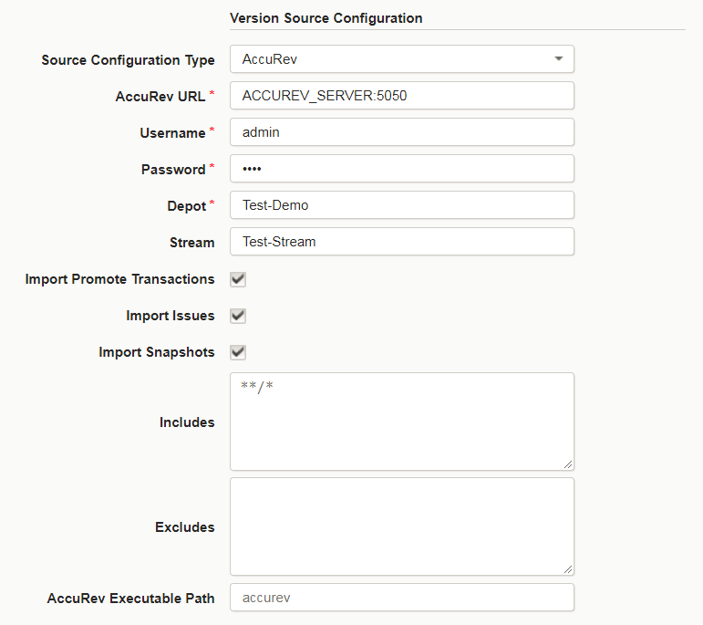
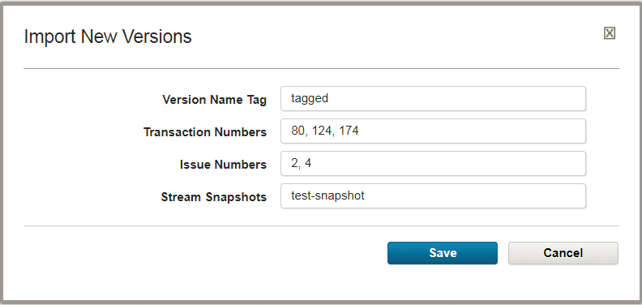

# AccuRev SCM - Usage

The AccuRev source configuration plug-in is capable of importing various artifact sets from AccuRev SCM. It is important to understand each of the properties to grab the correct artifact sets as component versions.

## Import Properties

* **AccuRev URL**: (Required) The IP/Hostname and port of the AccuRev server. Run `accurev info` on the command line to identify the correct address. The importing agent must have access to the AccuRev server.
* **Username**: (Required) User with permissions to access the AccuRev server.
* **Password**: (Required) The password of the specified user.
* **Depot**: (Required) The Depot name from where the artifacts are retrieved.
* **Stream**: If the desired artifact sets are located in a child Stream of the specified Depot. If empty, the Depot name will be used as the Stream. Note: If a Workspace is specified, the current artifact set will be imported as component version with a timestamped name. The following Import \* checkboxes will be ignored.
* **Import Promote Transactions**: Select to import the latest Promote transaction in the given Stream.
* **Import Issues**: Select to import the latest Issue with artifacts contained in the given Stream.
* **Import Snapshots**: Select to import the latest Snapshot contained in the given Stream.
* **Includes**: Supply a list of files or regex of artifacts that should be imported.
* **Excludes**: Supply a list of files or regex of artifacts that should not be imported.
* **AccuRev Executable Path**: If the `accurev` cli is not available on the Agents PATH environment, specify the full executable location.

## Manual Import Properties

* **Version Name Tag**: Specify a value to identify specific imports.
* **Transaction Numbers**: One or more Promote transaction numbers to import. Values specified here, will override the default import latest functionality.
* **Issue Numbers**: One or more Issue numbers to import. Values specified here, will override the default import latest functionality.
* **Stream Snapshot**: One or more snapshots to import. Values specified here, will override the default import latest functionality.

## Import Options

The AccuRev plug-in enables version imports of various artifact sets. Configure your desired component versions through the **Import \*** checkboxes. The **Import Promote Transactions**, **Import Issues**, and **Import Snapshots** properties will enable the import of their specified artifact set based on the Depot and Stream specified. Any combination of the three properties can be enabled. However, if you are importing a Workspace, specified in the **Stream** property, these **Import \*** properties will be ignored. In a Workspace, artifacts have not been saved to a Stream, and thus, promote transactions, issues, and snapshots will not exist.

If using the automatic import feature, the latest identified artifact set will be imported for each type.

Otherwise, if using the manual import feature, you can specify a transaction, issue, or stream value to import a desired version. You can specify one or more values for each property.

|Back to ...||Latest Version|AccuRev SCM ||||
| :---: | :---: | :---: | :---: | :---: | :---: | :---: |
|[All Plugins](../../index.md)|[Deploy Plugins](../README.md)|[9.1100795](https://raw.githubusercontent.com/UrbanCode/IBM-UCD-PLUGINS/main/files/AccuRevSourceConfig/AccuRevSourceConfig-9.1100795.zip)|[Readme](README.md)|[Overview](overview.md)|[Steps and Roles](steps and roles.md)|[Downloads](downloads.md)|
