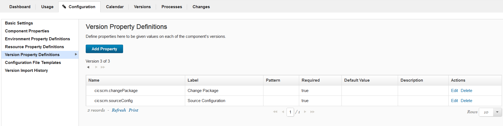
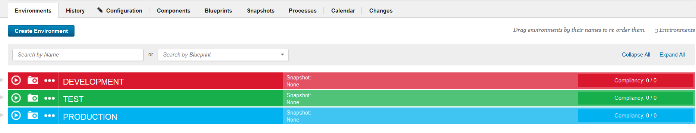
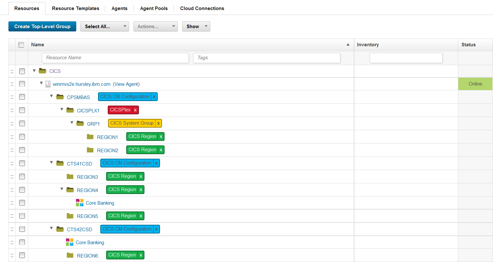
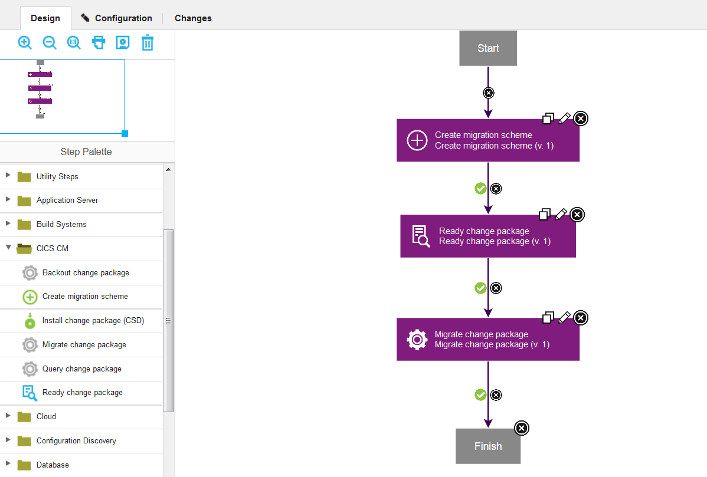
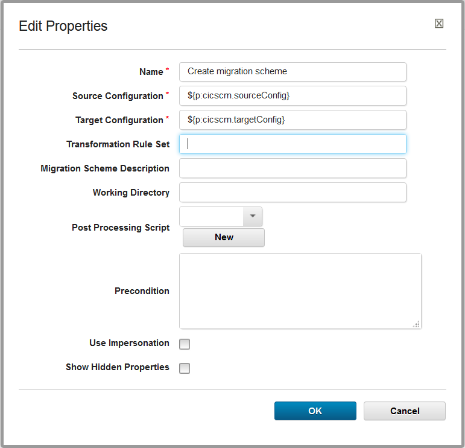
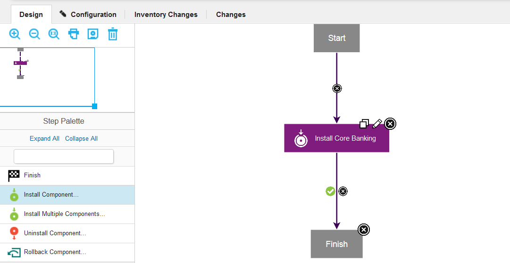
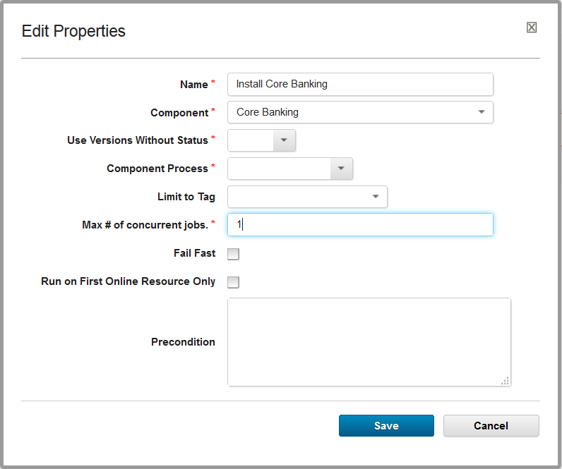

# CICS CM (Beta) - Usage


## Migrating resource definitions

To deploy specific resource definitions to selected target configurations, complete the following steps:

1. Create a migration scheme and specify the Source, Target, and Transformation Rule.
2. Mark the migration package as ready for use with the specified migration scheme.
3. Create a change package and add the resources that you want to migrate to this change package.
4. Send the *change package name* and *source configuration name* by using metadata to the DevOps Deploy server. You can use either the DevOps Deploy client or the REST API.
5. Migrate (deploy) the change package to an environment in DevOps Deploy.

\_\_\_\_\_\_\_\_\_\_\_\_\_\_\_\_\_\_\_\_\_\_\_\_\_\_\_\_\_\_\_\_\_\_\_\_\_\_\_\_\_\_\_\_\_\_\_\_\_\_\_\_\_\_\_\_\_\_\_\_\_\_\_\_\_\_\_\_\_\_\_\_\_\_\_\_\_\_\_\_\_\_\_\_\_\_\_\_\_\_\_\_\_\_\_\_\_\_\_\_\_\_\_\_\_\_\_\_\_\_\_\_\_\_\_\_\_\_\_\_\_\_\_\_\_\_\_\_\_\_

## Dynamic migration example

In the following example, the component that is going to be deployed is called *Core Banking*.

## Before you deploy

You need to have an existing version or create a version in the component that you want to use for the change package. Each version includes the change package name and the source configuration name.

The following screen capture shows the defined version properties. [](media/version.png)

In Environments, select which environment you want to target. In this example, we have DEVELOPMENT, TEST, and PRODUCTIONenvironments defined.

[](environments.png)

Expand the environment that you want to target and click **Add Base Resources** to see the resource tree.

From the resource tree, select one or more target configurations to add to the environment. The target configuration can be a CICS CSD or a BAS configuration. Select the component that you want to deploy to the target configurations.

In the following screen capture, the Core Banking component will be deployed to the CTS41CSD and CTS42CSD configurations. The change package will be dynamically migrated to these two CSDs.

[](media/cmresourcetree.png)

The component consists of different processes. In the Core Banking example, we are using the *Dynamic Migration*process.

You can create your own processes or you can use the CICS CM component template, which contains re-configured processes.

Under CICS CM, in the Design Step Palette, drag and drop the relevant steps for your migration process. For each step, an *Edit Properties* window opens, which shows the data the step needs to run. The fields contain variables because the information is inherited from different locations. For example, inherited from the selected version and target configuration.

The following screen captures show the dynamic migration steps and the properties for the **Create migration scheme** step. [](dynamic_migration_processbigger-image.png) [](create_migration_scheme_properties.png)


## Install component step

The **Install Component** step is a **Process** within an **Application**. You can choose which process within the component that you want to install or deploy to your target environment. In this example, the **Dynamic Migration Process** is selected for the Core Banking component.

The following screen captures show the install component step and properties for Core Banking. When you include an install step in your deployment process, set the Max # of concurrent jobs to 1 because it is a sequential process. [](installcomponent.png)

## Deploy the component

Ensure that the version you want to use exists, that you have added the base resources to your environment, included your component, and created a process for your application.

Now, click the play icon for the environment within your application and select the component version and application process for the deployment to start the migration process.

The **Applications** view changes to show the progress of the migration. You can expand the process to view the different process steps. As each step completes, the status is updated to show whether the step was successful. A log file for each step is created if you need to view the contents.


## CICS CM properties


## CICS CM properties

When you add a new CICS CM step to a process, the step contains a number of default values that refer to properties.

For the CICS CM steps, you can create a resource tree and define properties at the following resource levels:


| Resource Property | Resource with tag | Description |
| --- | --- | --- |
|
```
cicscm.host
```
| Agent | The host name of the CICS CM server to connect to |
|
```
cicscm.port
```
| Agent | The CICS CM port number to connect to |
|
```
cicscm.username
```
| Agent | The user name authorized to connect to CICS CM |
|
```
cicscm.password
```
| Agent | The password for the user name to connect to CICS CM |
|
```
cicscm.targetConfig
```
| Configuration | The name of the target configuration |
|
```
cicscm.csdConnection
```
| Region | The name of the connection from the CSD to a specific CICS region |

For the CICS CM versions, the following properties can be defined:


| Version Property | Description |
| --- | --- |
|
```
cicscm.changePackage
```
| The name of the change package to be deployed |
|
```
cicscm.sourceConfig
```
| The name of the source configuration. |

By default, the Transformation Rule property is blank. If you want to use a Transformation Rule property, define the property at the environment level. For more information, see [Referring to properties](https://www.ibm.com/docs/en/urbancode-deploy/7.2.3?topic=deployment-properties).

