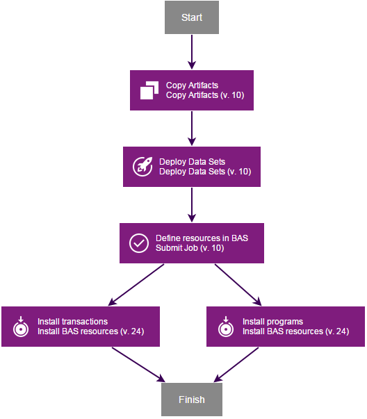

# CICS TS - Component Templates

* [Overview](#overview)
* [Using a component template](#using-a-component-template)
* [Updating a component template](#updating-a-cics-supplied-component-template)
* [More information](#more-information)

## Overview

You can use component templates to reuse component processes and properties across similar deployment scenarios. The CICS TS plug-in provides the CICS TS component template.

## Using a component template

To use a component template, you should first create a new component from the component template:

1. From the **Components**tab, click **Create Component**.
2. In the dialogue box that opens, select the relevant template from the****Template****list. For example,**CICS TS.**
3. Fill in the other *required* fields, and click **Save**.

## Updating a CICS supplied component template

The component template will be updated when the CICS TS plug-in is updated.

You can bind your component to a specific version of the template to avoid automatically using newer versions. If you wish to modify the template processes, you should copy the process and make changes to the copy.

## More information

For more information about creating, using, and editing component templates, see the [Component Templates](https://www.ibm.com/support/knowledgecenter/SS4GSP_7.1.1/com.ibm.udeploy.doc/topics/comp_template.html "Component Templates") section of the DevOps Deploy documentation or watch the introductory video, [Component Templates in IBM DevOps Deploy v6.0](https://mediacenter.ibm.com/media/Component+Templates+in+IBM+UrbanCode+Deploy+v6.0/0_m7rucqyz "Component Templates in IBM DevOps Deploy v6.0").

## CICS TS template

The *CICS TS template* contains the following processes:

**Install new programs and transactions (BAS)**

Copy program load modules, define program and transaction resources in BAS, then install the resources.

**Install new programs and transactions (CSD)**

Copy program load modules, define program and transaction resources in CSD, then install the resources.

**New copy installed programs**

Copy program load modules, then new copy installed programs.

**Discard files**

Disable, close, then discard files.

**Rollback programs**

Rollback program load modules, then new copy installed programs.

Image showing the installing a new programs and transactions (BAS) process.

