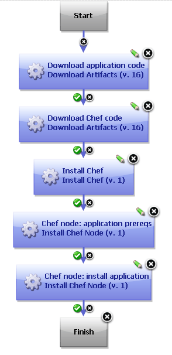

# Chef - Usage

The following generic process runs Chef automation code on a node. You can use Chef in component processes like this one to configure an environment, such as installing prerequisites or installing applications.

The Install Chef step searches for the Chef code in the same folder as the working directory for the step. Therefore, in most cases, you download the Chef code to the process working directory and then run the Install Chef Node step in the same working directory. For example, if you specify the`install_java` value for the **Node name** parameter, the step looks for a role file named `nodes/install_java_node.json`, which is relative to the working directory for the step.

The following process downloads the application code and the Chef code. Then, it installs Chef. Finally, it installs two Chef nodes: one that installs prerequisites and another that installs the application.

A simple process that downloads code, installs Chef, and installs two Chef nodes

