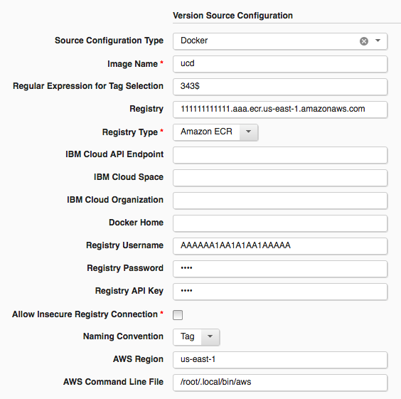
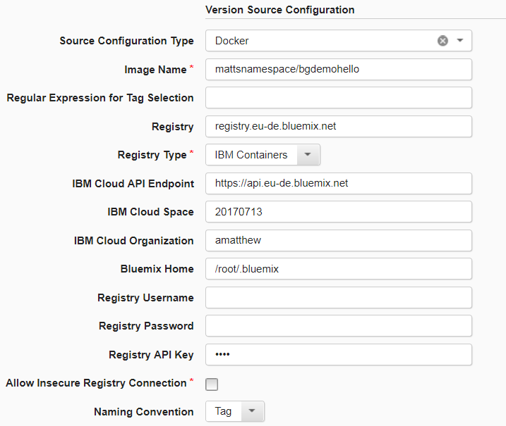
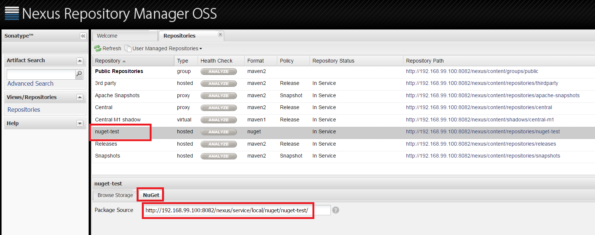
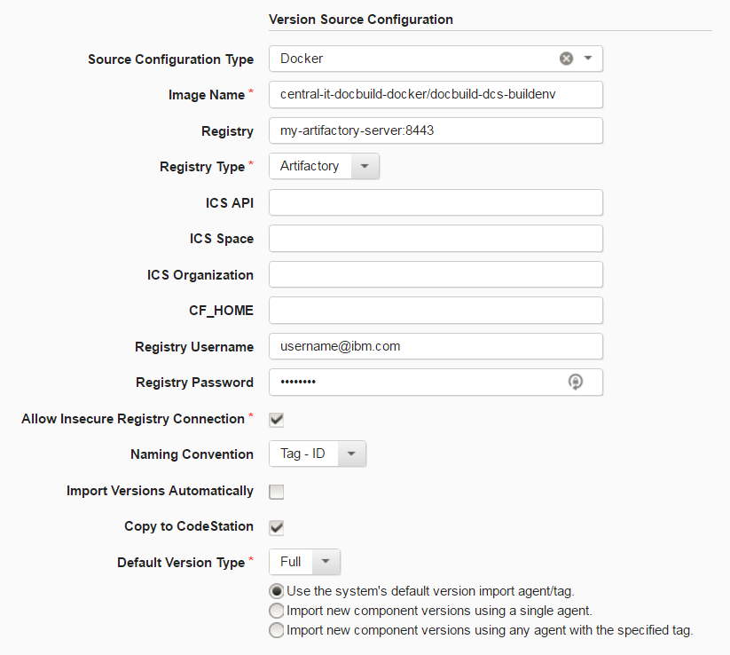
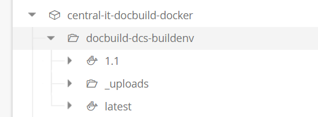

# Docker Registry - Usage

The Docker Registry plug-in supports a number of container registries:

- [Docker Registry - Usage](#docker-registry---usage)
  - [Usage](#usage)
    - [Nexus container registry](#nexus-container-registry)
      - [Properties](#properties)
    - [Amazon EC2 Container Registry](#amazon-ec2-container-registry)
      - [Properties](#properties-1)
      - [Sample Configuration](#sample-configuration)
    - [IBM Container Registry](#ibm-container-registry)
      - [Properties](#properties-2)
      - [Sample Configuration](#sample-configuration-1)
      - [Image and Registry Properties](#image-and-registry-properties)
    - [IBM Cloud Properties](#ibm-cloud-properties)
    - [Bluemix Home](#bluemix-home)
    - [Basic Workflow](#basic-workflow)
    - [Artifactory Configuration](#artifactory-configuration)
      - [Properties](#properties-3)
      - [Sample Configuration](#sample-configuration-2)
      - [Image Name](#image-name)
      - [Registry](#registry)
      - [Other Properties](#other-properties)
    - [General Source Config Specification](#general-source-config-specification)

## Nexus container registry

The Docker Registry source configuration plug-in supports Nexus as a container registry when selecting the Docker Registry Type.

For information on using Nexus as a container registry, see the [Secure Docker Registries for Repository Manager 3](https://guides.sonatype.com/repo3/technical-guides/secure-docker-registries/) guide from Sonatype.

### Properties

The following properties must be specified to configure an Nexus hosted Docker registry.

* **Image Name:** The namespace or repository of the image in the Docker registry.
* **Registry:** The host name of the Nexus server or the reverse proxy of the Docker registry.
* **Registry Type:** Select the `Docker` option.
* **Registry Username:** If the Docker registry is secure, specify a user name to authenticate.
* **Registry Password:** If the Docker registry is secure, specify the password associated with the user name to authenticate.

## Amazon EC2 Container Registry

DevOps Deploy can be used to import Docker images from an Amazon EC2 Container Registry (ECR) using the Docker Registry source configuration plug-in. Before using this plug-in to create or import versions from Amazon ECR, Docker and AWS CLI must be installed on the DevOps Deploy agent used for version imports. See the [Docker](https://docs.docker.com/) and [Amazon ECS](http://docs.aws.amazon.com/AmazonECS/latest/developerguide/Welcome.html) documentation for details about how to install these requirements.

### Properties

The following properties are used when connecting to Amazon Elastic Container Service (ECS).

* **Image Name**: Use an Elastic Container Registry (ECR) repositoryName without namespace as the image name. To see the list of available repositories, run the command: `Aws ecr describe-repositories`
* **Regular Expression for Tag Selection**: Optional. Provide regular expression to select tags to create component versions for.
* **Registry**: The URL of the Amazon registry to connect to.
* **Registry Type**: Select the **Amazon ECR** option.
* **Registry Username**: The user name used to login to the Docker registry. For the Amazon ECR, use an access key.
* **Registry Password**: The password used to login to the Docker registry. For Amazon ECR, use a secret key.
* **Registry API Key**: Not used with Amazon ECS
* **Allow Insecure Registry Connection**: default is false. Select this option to allow insecure connections to the Docker registry.
* **Naming Convention**: The naming convention for component versions. The three options are Tag id, **Tag id**, and **Tag**. Docker tags can be changed. If component versions need to be immutable, select a naming convention that includes the ID.

* **AWS Region**: The region to use when importing images from Amazon ECR.
* **AWS Command Line File**: the complete path of the AWS command line runtime file. The default is `aws`.

### Sample Configuration

(media/aecs.png)

## IBM Container Registry

Support for the latest IBM Cloud container registries was changed in version 20 of the Docker Registry plug-in to remove dependencies on the IBM Cloud (Bluemix) Cloud Foundry plug-in and the depreciated Bluemix IBM Containers plug-in (bx ic). Support for OAuth protected IBM Cloud container registries was also introduced in version 20.

The IBM Cloud (Bluemix) command line interface, the IBM Cloud container registry plug-in, and IBM Cloud container service plug-in are required to be installed on your DevOps Deploy agent machine to access IBM Cloud container registries. Docker itself must also be installed on the agent machine.

### Properties

The following properties are used when connecting to an IBM Cloud container registry.

* **Image Name:** The name of the image in the format [namespace/][repository].
* **Registry:** The name of registry to connect to (for example, registry.ng.bluemix.net).
* **Registry Type:** Select the `IBM Containers` option.
* **IBM Cloud API Endpoint:** The IBM Cloud API endpoint to use (for example, api.ng.bluemix.net)
* **IBM Cloud Space:** The space to use when connected to IBM Cloud.
* **IBM Cloud Organization:** The organization to use when connected to IBM Cloud.
* **Bluemix Home:** Specify the location of your Bluemix config.json file
* **Registry Username:** The username to use when connecting to IBM Cloud. Specified if not using an API key to connect.
* **Registry Password:** The password to use when connecting to IBM Cloud. Specified if not using an API key to connect.
* **Registry API Key:** The API key to use when connecting to IBM Cloud. Specified if not using a username/password to connect.

### Sample Configuration

### Image and Registry Properties

Running the `bx cr images` command will return something like this:

In the example above, the REPOSITORY column shows a name made of three pieces. Take `registry.ng.bluemix.net/mynamespace2/bgdemohello` as an example. The text `registry.ng.bluemix.net` refers to the container registry. The text `mynamespace2` refers to a namespace which is used for personal or private images for a specific organization or user. The text `bgdemohello` refers to the image name itself.

Following our example, in DevOps Deploy, the Image Name field would contain the value `mynamespace2/bgdemohello` and the Registry filed would contain `registry.ng.bluemix.net`.

The Registry Type field should be set to IBM Containers, as that instructs the plug-in to connect to an IBM Cloud container registry.

## IBM Cloud Properties

There are several properties used when connecting to IBM Cloud (Bluemix). The IBM Cloud API Endpoint, IBM Cloud Space, and IBM Cloud Organization field may be set to values used when connecting to IBM Cloud. For authentication, the Registry Username and Registry Password fields may be filled out, or users may specify an API key using the Registry API Key field.

## Bluemix Home

The location of your Bluemix config.json file is needed to pull image tags from the IBM Cloud container registry. After connecting to Bluemix, an IAMRefreshToken is placed in the Bluemix config.json file. This token is required when the Docker registry DevOps Deploy plug-in makes a REST call to pull image tags from the container registry.

## Basic Workflow

Below is the general approach the Docker Registry plug-in takes when connecting to an IBM Cloud container registry:

1. Run a command line command to connect to IBM Cloud (Bluemix)
2. Run a command line command to log into the container registry
3. Make a REST call to the container registry to pull image tags using a token found in the Bluemix config.json file
4. If the REST call returns 401-Unauthroized, OAuth may be enabled. Request an OAuth token via a REST call, then make a REST call to pull images using the OAuth token.

## Artifactory Configuration

DevOps Deploy began supporting Artifactory hosted Docker registries starting with version 16 of the Docker Registry plug-in.

### Properties

The following properties must be specified to configure an Artifactory hosted Docker registry.

* **Image Name:** The namespace or repository of the image in the Docker registry.
* **Registry:** The host name of the Artifactory server or the reverse proxy of the Docker registry.
* **Registry Type:** Select the `Artifactory` option.
* **Registry Username:** If the Docker registry is secure, specify a user name to authenticate.
* **Registry Password:** If the Docker registry is secure, specify the password associated with the user name to authenticate.

### Sample Configuration

### Image Name

Specify the complete repository path to the Docker registry. Do not specify a version. The source configuration identifies all image versions and create new component versions for each. If you were importing the below sample repository, you would specify `central-it-docbuild-docker/docbuild-dcs-buildenv` as the Image Name. Following version import, there will be 2 new component versions: `1.1` and `latest`. If the `_uploads` folder had other docker images for import, the Image Name would be `central-it-docbuild-docker/docbuild-dcs-buildenv/_uploads`. A new component should be made for the each registry. Its important to recognize that the first string separated by the back slash is considered the `namespace (central-it-docbuild-docker)` while everything following is the `repository (docbuild-dcs-buildenv/_uploads)`.

### Registry

The plug-in supports two Artifactory Docker Registry scenarios:

- Artifactory servers hostname
- Reverse proxy to the Docker registry

On import, the plugin will ping the server and determine which type of URL is specified. While this process is taken care of within the plug-in, its important to understand that the REST calls paths vary slightly. The reverse proxy provides direct access to a specific Docker Registry namespace. For example, if we pretend that from the above example `my-artifactory-server.com:8443` is the Artifactorys hostname, the plug-in connects to the registry using the following constructed URL: `https://my-artifactory-server.com:8443/artifactoy/api/docker/central-it-docbuild-docker`. However, one could specify a reverse proxy that would route all calls to that URL and therefore, simplify REST calls and mirror Dockers supported API. While a small point that is resolved by the plug-in, it is important to understand the difference in case debugging is required. Further information and directions on setting up your own reverse proxy can be found on [Artifactorys documentation page](https://www.jfrog.com/confluence/display/RTF/Configuring+a+Reverse+Proxy).

### Other Properties

The **Registry Type** property must be set to `Artifactory` otherwise a different Docker connection method is used. The incorrect specification results in an immediate failure. The user name and password properties are required, if your Docker registry is secured.

## General Source Config Specification

To create a component by importing from Docker, complete the following steps. For more information, see [Creating components](https://www.ibm.com/docs/en/urbancode-deploy/7.2.3?topic=components-creating "Creating components") in the product help.

1. On the **Components** page in IBM DevOps Deploy, click **Create New Component**.
2. In the **Source Config Type** list, select **Docker**.
3. Provide all of the necessary information, such as the **Image Name**.
4. Click **Save**.
5. Click the **Versions** tab for the component.
6. Click **Import New Versions**.
