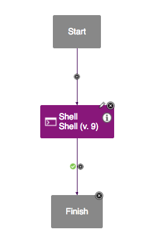
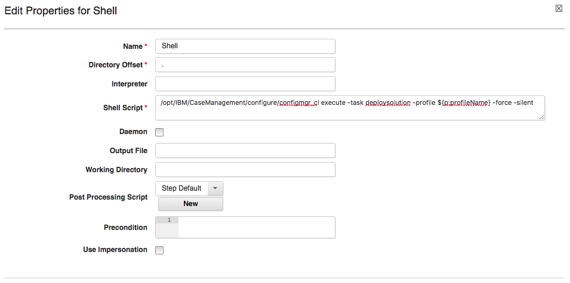

# FileNet - IBM Case Manager - Usage

The IBM Case Manager plug-in for DevOps Deploy utilizes the Case Manager command-line interface provided [here](https://www.ibm.com/support/knowledgecenter/en/SSCTJ4_5.2.1/com.ibm.casemgmt.design.doc/acmac024.htm).

For a detailed outlining of the step input properties, see the [Steps](#steps) page.

* [Available Commands](#available)
* [Using Additional Commands](#additional)

## Available Commands

Below shows the command that will be run based on each step. Notice, the -silent and -force flags are always present, because the plug-in must be able to assume the default values for command-line prompts if they appear.Brackets ([]) indicate that the parameter is optional. For issues with the outcome of plug-in steps, consider running the command manually on the target Case Manager machine, and determining the proper input.

### Deploy Solution

The deploy solution task runs the execute command against the Deploy Solution task of a production environment. Prior to running to the step, it is important that the deploysolution.xml located at */opt/IBM/CaseManagement/configure/profiles/``${profileName}``/deploysolution.xml* is configured with the proper target environment and solution to deploy. This can be generated via the UI, or on the command line with [generateConfig](https://www.ibm.com/support/knowledgecenter/SSCTJ4_5.2.1/com.ibm.casemgmt.design.doc/acmac003.htm) command.

`configmgr_cl execute -task deploysolution -profile ``${p:profileName}`` -force -silent`

### Export Solution

`configmgr_cl exportSolution -profile ``${p:profileName}`` -solutionName ``${p:solutionName}`` [-solutionPackage ``${p:solutionPackage}``] -force -silent`

### Export Security Manifest

For exporting security configurations, specify each manifestName on a new line and the plugin will automatically run the command to include each manifest separately. `configmgr_cl exportSolutionSecurityManifest -profile ``${p:profileName}`` -manifestNames ``${p:manifestNames}`` [-manifestPackage ``${p:manifestPackage}``] -solutionName ``${p:solutionName}`` -force -silent`

### Import Solution

`configmgr_cl importSolution -profile ``${p:profileName}`` -solutionPackage ``${p:solutionPackage}`` [-projectAreaName ``${p:projectAreaName] [-serviceDataMap ``${p:serviceDataMap}``] [-objectStoreDataMap ``${p:objectStoreDataMap}``] -force -silent`

### Import Security Manifest

`configmgr_cl importSolutionSecurityManifest -profile ``${p:profileName}`` -manifestPackage ``${p:manifestPackage}`` -force -silent`

### Apply Security Manifest

`configmgr_cl applySolutionSecurityManifest -profile ``${p:profileName}`` [-targetEnvName ``${p:targetEnvName}``] -solutionName ``${p:solutionName}`` -manifestName ``${p:manifestName}`` -force -silent`

## Using Additional Commands

If needed command-line capabilities exist that are not available in the plug-in steps, consider requesting the functionality, or running in an DevOps Deploy Shell step.The Shell Step syntax looks similar to the command-line examples.See the following example:

Shell Step in Process Editor

Example Shell step configuration for calling Case Manager commands

