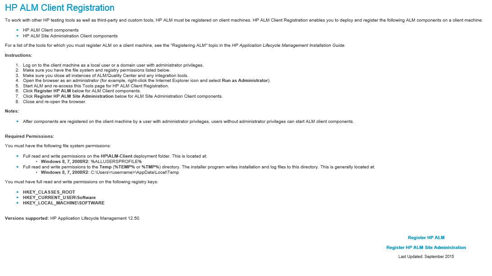

# MicroFocus ALM (formerly HP Quality Center) - Usage

* [Before you begin](#before-you-begin)
* [Step Palette](#step-palette)
* [Tips](#tips)

## Before you begin

To use this plug-in, the HP Quality Center server 11.0 or 11.5 and agent must be installed. The HP Quality Center plug-in can be installed on any operating system that the IBM Rational Urban Code Deploy server supports.The HP Quality Center agent must be installed on a Windows operating system.

## **Step palette**

To access this plug-in in the palette, click **Quality** > **Suite**.

## **Tips**

To expedite process design and execution, store frequently used values for the HP Quality Center Plug-in such as these values:

* The URL of the HP Quality Center server, which is defined in the **Server URL** field.
* The user name for the HP Quality Center user, which is defined in the **Username** field.
* The password for the HP Quality Center user or a script to set the password, which is defined in the **Password** and  fields. Use only one of these fields.
* The domain in which the HP Quality Center project is saved, which is defined in the **Domain** field.
* The name of the HP Quality Center project, which is defined in the **Project** field.

Ensure that the HP Quality Center client files are located on the same system that the DevOps Deploy agent is installed on.

## Register an Agent with HP ALM

## The OTAClient.dll

All steps except the Run Test Sets step of the HP ALM plugin are executed using the HP ALM REST API. Therefore they do not require access to the OTAClient.dll. Due to the fact that the REST API does not offer an endpoint to run a test set, the ALM Open Test Architecture API must be utilized for the step instead. To use the OTAClient.dll, you must register the agent machine with HP ALM.

## HP ALM Client Registration

To register your agent with HP ALM, you must visit the HP ALM Client Registration page from the Tools menu of your HP ALM Server. This process must be executed using an Internet Explorer 10 or 11 browser from the agent machine. This page is located at *http://<hp-alm-server-name>:<port>/qcbin/CommonMode\_index.html*. You can also find the client registration page in the Tools menu of you HP Application Lifecycle Management home page at *http://<hp-alm-server-name>:<port>/qcbin*.

After visiting the HP ALM Client Registration page, you will be greeted with the following instructions on how to register your machine:

Follow the instructions, and then click Register HP ALM.

## Downloading the OTAClient.dll Library

The process of HP ALM Client Registration downloads the OTAClient.dll and places it into the following path: *C:\Users\<client user name>\AppData\Local\HP\ALM-Client\<server name>\OTAClient.dll*. This will allow the UCD agent machine to access the OTAClient.dll, and execute the Run Test Sets step of the HP ALM plugin.

## More Information

For more information on the ALM Open Test Architecture API, please visit [HP ALM API References Page](http://alm-help.saas.hpe.com/en/12.50/online_help/Content/api_guides_main_page.htm) in the HP ALM Help Center.

|Back to ...||Latest Version|MicroFocus ALM (formerly HP Quality Center) |||||
| :---: | :---: | :---: | :---: | :---: | :---: | :---: | :---: |
|[All Plugins](../../index.md)|[Deploy Plugins](../README.md)|[16.1011648](https://raw.githubusercontent.com/UrbanCode/IBM-UCD-PLUGINS/main/files/HPQualityCenter/HPQualityCenter-16.1011648.zip)|[Readme](README.md)|[Overview](overview.md)|[Troubleshooting](troubleshooting.md)|[Steps](steps.md)|[Downloads](downloads.md)|
