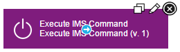
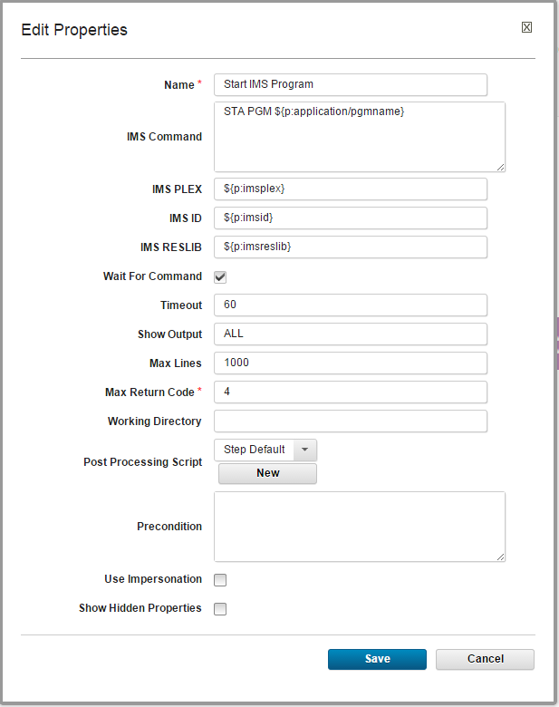
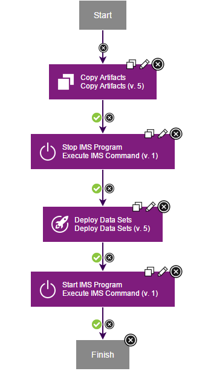
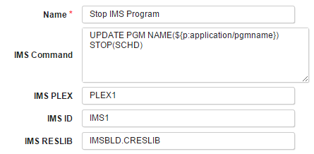
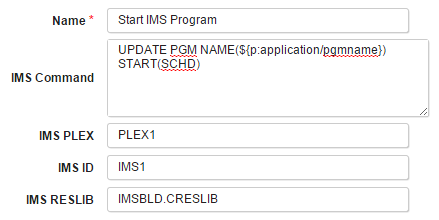

# IBM IMS - Usage

## Using the IMS plug-in in DevOps Deploy

This IMS plug-in allows execution of IMS type-1 and type-2 commands. You can use this plug-in for various scenarios where IMS commands are traditionally used, but a common scenario that takes advantage of DevOps Deploy is IMS application deployment. See [Deploying IMS application programs](#deploy_application) below for an example.

The following information assumes basic knowledge of DevOps Deploy and its user interface.

## Before you begin

* Ensure the IBM DevOps Deploy server and the z/OS deployment tools are installed.
* Ensure the IMS plug-in is installed.

## Setting up resources for IMS application programs

In DevOps Deploy:

1. In the **Resources** tab, create a top-level group.
2. Within the top-level group, create agents for each IMS subsystem.
3. Under each agent, add the components that correspond to your application programs. For more information about how components are used in Urban Code Deploy, see [Creating components.](https://www.ibm.com/docs/en/urbancode-deploy/7.2.3?topic=deployment-components)

## Process development using the IMS plug-in

To start using the IMS plug-in, create a new or edit an existing DevOps Deploy process.

In order to include IMS plug-in steps in the process, locate the IMS entry in the Steps Palette:

Drag and drop the Execute IMS Command step onto the process editing screen.

## Configuring IMS plug-in properties

When the Execute IMS Command step is added to a process, the Edit Properties dialog opens. Provide the following required parameters specific to the IMS plug-in:

| Name | Description |
| --- | --- |
| IMS Command | The IMS command to issue, followed by parameters. For example:
`UPDATE PGM NAME(*name*) START(SCHD)` |
| IMSID | IMS ID is used to identify the target IMS system the command is directed to within a given IMSplex. It consists of four alphanumeric characters (for example, IMS1). An easy way to find the IMSID is to access a z/OS console (MCS or EMCS) and look for the following message:
`DFS996I *IMS READY*IMS1`  In this example, IMS1 is the IMSID. |
| IMS PLEX | The 1-to-5 character suffix of the IMSplex name. An IMSplex is defined as multiple IMS systems that cooperate with each other in a z/OS Parallel Sysplex environment to process a common shared workload.The following QUERY command can be used to determine the IMSPLEX name suffix (last 5 characters under the IMSPLEX field), assuming you have access to an authorizedIMS SPOC console:
`QUERY IMSPLEX SHOW (ALL)` To verify that your IMS application can be executed in this IMS environment, enter the command:
`/DISPLAY PGM STLIVP1` |
| IMS RESLIB | Name of a z/OS library that contains the IMS nucleus and all the action modules necessary to run IMS and its utilities. The RESLIB name is usually identified in the JCL that is used for starting an IMS procedure with the DD named DFSRESLB or in the parm RESLIB= in the IMS procedure used to start IMS. |
|

*Example properties for the Execute IMS Command step:*

## Deploying IMS application programs

For the deployment processes to work, it is assumed that the DevOps Deploy agents are installed in the UNIX System Services side of IMS.

There are many possible ways to create processes for IMS application deployment. Process steps may differ depending on IMS environment setup, application details, and others. For example, under certain conditions, an existing application can be redeployed by a process that stops the run-time application, deploys a new version of application data sets, and restarts the application. The following example demonstrates how an DevOps Deploy process might look like for such a scenario:

In this example, the IMS Plug-in is used twice. First, it is used to stop existing application by executing the `UPDATE PGM NAME(*name*) STOP(SCHD)` command. The plug-in parameters for this step might look as follows (the actual parameter values will be specific to your environment):

Then, after the data sets for the new version of the application are copied into the system, the IMS plug-in is used to start the application by executing the `UPDATE PGM NAME(*name*) START(SCHD)` command. The plug-in parameters for this step might look as follows (the actual parameter values will be specific to your environment):

## Related information

[IMS command: UPDATE PGM](http://www-01.ibm.com/support/knowledgecenter/SSEPH2_13.1.0/com.ibm.ims13.doc.cr/imscmds/ims_updatepgm.htm)

