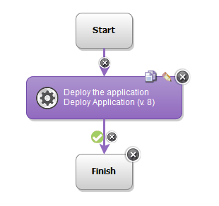

# JBoss Application Server - Usage

## Example: Deploying an application on JBoss Application Server

Typically, when you deploy an application by using the JBoss Application Server plug-in, you only need to use the [Deploy Application](https://urbancode.github.io/IBM-UCx-PLUGIN-DOCS/UCD/JBoss/steps.html#deploy_application) step:

|Back to ...||Latest Version|JBoss Application Server ||||
| :---: | :---: | :---: | :---: | :---: | :---: | :---: |
|[All Plugins](../../index.md)|[Deploy Plugins](../README.md)|[25.1155393](https://raw.githubusercontent.com/UrbanCode/IBM-UCD-PLUGINS/main/files/JBoss/ucd-JBoss-25.1155393.zip)|[Readme](README.md)|[Overview](overview.md)|[Steps](steps.md)|[Downloads](downloads.md)|
