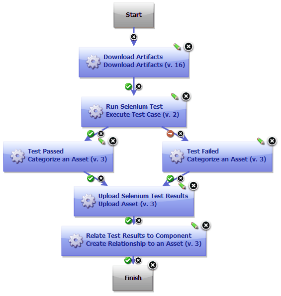
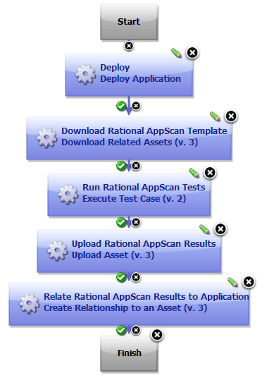

# IBM Rational Asset Manager - Usage

* [Before you begin](#before_you_begin)
* [Deploying an application and running Selenium test](#example1)
* [Running Rational AppScan tests](#example2)

## **Before you begin**

To use this plug-in, a supported version of Rational Asset Manager must be installed.

## **Example: Deploying an application and running Selenium test**

The following example is a component process that completes three actions:

* The process deploys an application.
* The process runs an associated Selenium test on the deployment.
* The process updates the status of the asset in the library server, baseing the status on the test results.

The following diagram shows this process.

This example requires that the application binary files are in the component and the Selenium test cases are part of the component.

1. The **Download Artifacts** step retrieves the binary files.
2. The **Execute Test Case** step runs tests against the application. To learn more about running test cases, see the Rational Quality Manager plug-in.
3. Based on the outcome of the **Execute Test Case** step, the **Categorize an Asset** step is used to mark the status of the component asset as Test Passed or Test Failed.
4. The **Upload Asset** step publishes the Selenium test results to the Rational Asset Manager server.
5. The **Create Relationship to an Asset** step creates a relationship between the Selenium test results and the application component. The step uses the environment properties that were stored when the application was deployed to access the correct application component and version.

## **Example: Running Rational AppScan tests**

In this example, the component process deploys an application, runs an associated IBM Security AppScan test on the deployment, and updates the status of the asset in the library server, basing the status on the test results.

This example requires that the application binary files are in the component.

1. The **Deploy** step deploys the application by using the process that was created in an earlier step in the scenario.
2. The **Download Related Assets** step downloads the IBM Security AppScan test template that is associated with the component asset.
3. The **Execute Test Case** step runs the specified IBM Security AppScan tests.
4. The **Upload Asset** step publishes the IBM Security AppScan test results to the Rational Asset Manager server.
5. The **Create Relationship to an Asset** step creates a relationship between the IBM Security AppScan test results and the application component. The step uses the environment properties that were stored when the application was deployed to access the correct application component and version.
