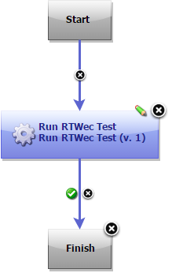
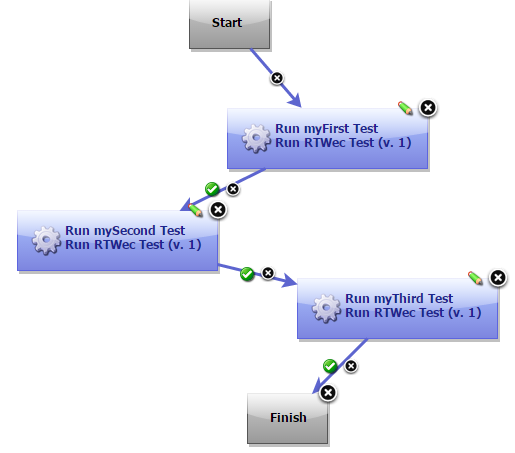
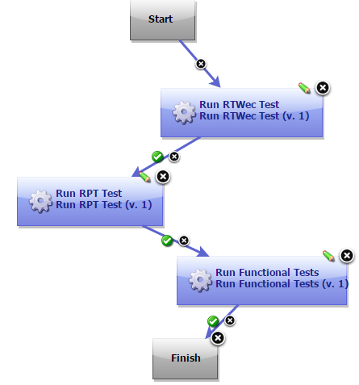

# IBM Rational Test Workbench Web UI Tester - Usage

Use the Rational Test Workbench Web UI Tester plugin to continuously initiate the test and compound test run from IBM DevOps Deploy.From version 9.0, Rational Test Workbench Web UI Tester is the new name for Rational Test Workbench Eclipse Client. **Before you begin**

* Install IBM Rational Test Workbench Web UI Tester version 8.7 or later and DevOps Deploy agent on the computer where the tests will be run.
* Install DevOps Deploy server and deploy the plugin on the server. For information about installing DevOps Deploy, see its [documentation](https://www.ibm.com/docs/en/urbancode-deploy/7.2.3?topic=installing).
* Install DevOps Deploy Agent and connect it to DevOps Deploy server. See the [documentation](https://www.ibm.com/docs/en/urbancode-deploy/7.2.3?topic=installing-agents).
* Ensure that Rational Test Workbench Web UI Tester is not running.
* To initiate the mobile test runs, ensure that all the devices are set to the passive mode and the playback-ready apk files are installed.

**About the task** As a tester, you might have a large number of regression tests to run on the latest build of the product. Instead of manually running the tests on every new build, you can install the latest build on the DevOps Deploy Agent computer and let DevOps Deploy launch the tests for you.

After deploying the Rational Test WorkbenchWeb UI Tester plugin on the server, create the component and its processes, applications and its processes, the environments, and the resources. For information about how to create these different pieces, see DevOps Deploy [documentation](http://www.ibm.com/support/knowledgecenter/SS4GSP/ucd_welcome.html).

**Procedure to create a workflow**

1. To create a workflow for the newly created component process, click the component process. The Tools view displays the available plugin steps.
2. From Rational Test Workbench > Eclipse Client, drag the **Run RTWec Test** step to the design space.
3. Specify the properties for the step. For information about the properties, see the [Steps](https://urbancode.github.io/IBM-UCx-PLUGIN-DOCS/UCD/RFT-WebUI-UCD/steps.html) page.
4. After you configure the step properties, save the step by clicking Save.

A typical process for the Rational Test Workbench Web UI Testerplugin will look like the following snapshot:

A process with multiple tests will look like the following snapshot:

If you have installed multiple products on one target machine, either in the same or different package groups, you can use a single process that includes steps from different products. You must install the plugins of all of the products that you want to use. The process will look like the following snapshot:

