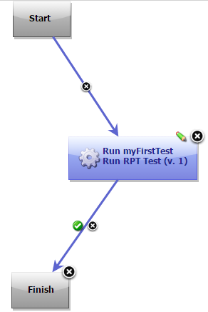
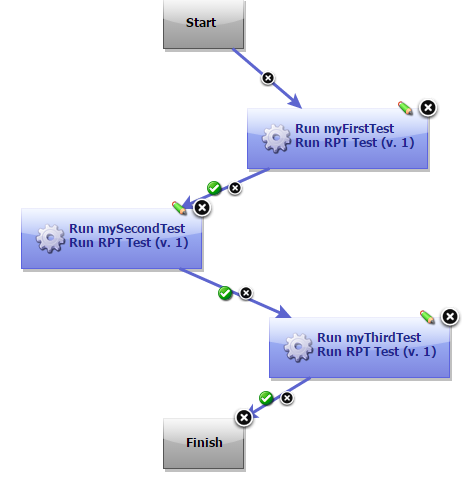
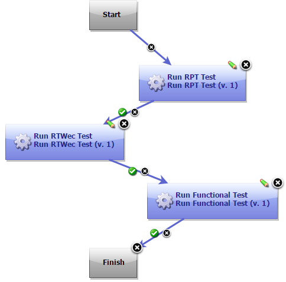

# IBM Rational Performance Tester (RPT) - Usage

Use the Performance Tester plugin to continuously initiate the launch of tests, compound tests, and schedules from IBM DevOps Deploy.

**Before you begin**

* Install IBM Rational Performance Tester version 8.7 or later and DevOps Deploy agent on computers where the tests will be run.
* Install DevOps Deploy server and deploy the Performance Tester plugin in the server.
For information about installing DevOps Deploy, see its [documentation](http://www.ibm.com/support/knowledgecenter/SS4GSP/ucd_welcome.html).

* To initiate a service test run, you must install either the SOA extension as part of Rational Performance Tester or install Rational Service Tester for SOA Quality on the target computer.

**About the task** As a tester, you might have a large number of regression tests to run on the latest build of the product. Instead of manually running the tests on every new build, you can just install the latest build on the DevOps Deploy Agent computer and let DevOps Deploy launch the tests for you.

After deploying the Performance Tester plugin on the server, you must create the component and its processes, the applications and its processes, the environments, and the resources. For information about how to create these different pieces, see DevOps Deploy [documentation](http://www.ibm.com/support/knowledgecenter/SS4GSP/ucd_welcome.html).

After creating these pieces, you must create the testing workflow.

**Procedure to create a workflow**

1. To create a workflow for the newly created component process, click the component process. The Tools view displays the available plugin steps.
2. From Rational Test Workbench > Performance Tester, drag the **Run RPT Test** step to the design space.
3. Specify the properties for the step. For information about the properties, see the [Steps](https://urbancode.github.io/IBM-UCx-PLUGIN-DOCS/UCD/RPT-UCD/steps.html) page.
4. After you configure the step properties, save the step by clicking Save.

A typical process for the Performance Tester plugin will look like the following snapshot:

A process with multiple tests will look like the following snapshot:

If you have multiple products installed on one target machine, either in the same or different package groups, you can use a single process that includes steps from different products. The process will look like the following snapshot:

|Back to ...||Latest Version|IBM Rational Performance Tester (RPT) ||||
| :---: | :---: | :---: | :---: | :---: | :---: | :---: |
|[All Plugins](../../index.md)|[Deploy Plugins](../README.md)|[9.3](https://raw.githubusercontent.com/UrbanCode/IBM-UCD-PLUGINS/main/files/RPT-UCD/RPT-UCD-9.3.zip)|[Readme](README.md)|[Overview](overview.md)|[Steps](steps.md)|[Downloads](downloads.md)|
