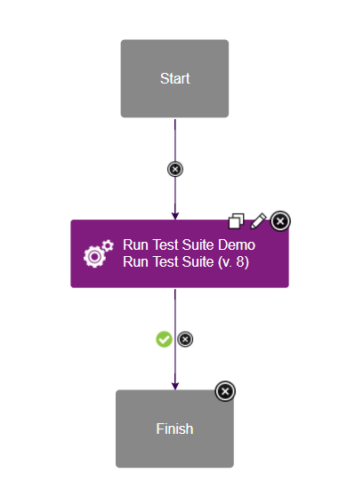
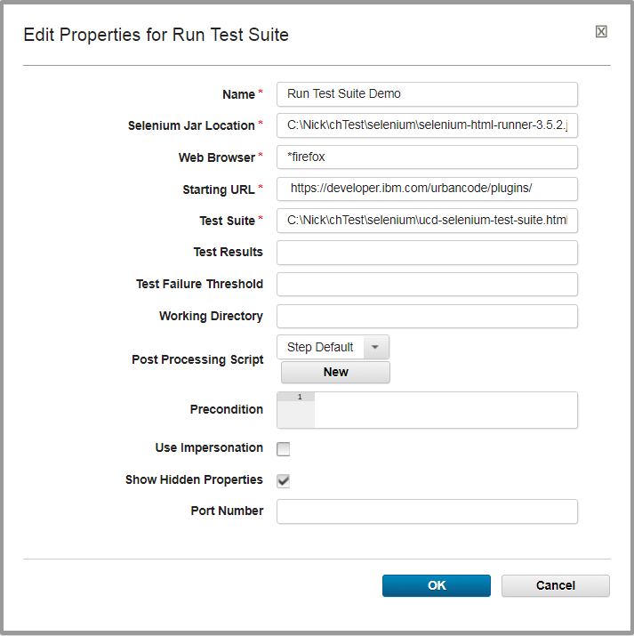
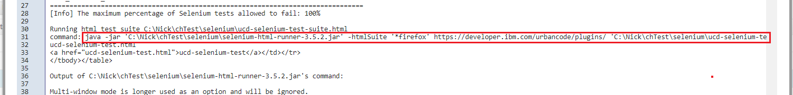

# Selenium - Usage

## **Summary**

The **Run Test Suite** step automates running of a Selenium test suite in an IBM Urban Code Deploy process. The step starts a temporary Selenium server and passes the specified test suite, which contains one or more tests, to be processed. The test suite can be created using [Seleniums IDE](http://www.seleniumhq.org/docs/02_selenium_ide.jsp) and is written in a format called `Selenese`. The prior link is to documentation about Seleniums IDE and instructions on how to create a test and test suite. If this is your first time using Selenium, we recommend you start here. Once you have a firm understanding of Selenium and its uses, we encourage you to replicate the short tutorial below.

## **Selenium Support**

In older versions of the Selenium plug-in, we only supported Selenium RC (1.0) which was exposed in Seleniums WebDriver v2.0 through `selenium-server-standalone-2.XX.X.jar`. While currently deprecated, this version of the jar is still compatible with the plug-in today. We began support of Selenium v3 in version 8 of the Selenium plug-in. However, Selenium v3 can not run Selenium RC directly and therefore must run it through emulation. This forces a change to use the `selenium-html-runner-3.XX.X.jar`. it is possible to use the `selenium-server-standalone-3.XX.X.jar` to run tests, however, additional environment configuration is required. For simplicity, we recommend using the `selenium-html-runner-3.XX.X.jar` if running against Selenium v3. Current and previous releases of these jars can be found on [Seleniums download page](http://www.seleniumhq.org/download/).

## **Find the Run Test Suite step**

To access this plug-in in the palette, click **Quality** > **Functional Testing** > **Selenium**.

## **Sample Artifacts and Downloads**

In this tutorial, we will show how to run a simple Selenium test through the Run Test Suite plug-in step. In the test suite, shown below, we will run a single test called `ucd-selenium-test` which will start at the [IBM DevOps Plugins page](https://urbancode.github.io/IBM-UCx-PLUGIN-DOCS/) and navigate to this Selenium usage page. Along with version 8 of the Selenium plug-in, both below .html files and a browsers matching driver are required for this demo.

**Download the tutorials Selenium Test Suite file**: [ucd-selenium-test-suite](/selenium/ucd-selenium-test-suite.html)

**Download the tutorials Selenium Test file**: [ucd-selenium-test](/selenium/ucd-selenium-test.html)

The appropriate browsers driver must be downloaded and installed the Selenium test suite. A list of 3rd party driver can be found on [Seleniums download page](http://www.seleniumhq.org/download/). Follow the drivers instructions to configuration on your own environment.

The last artifact is the Selenium standalone or runtime jar. As described above, this jar is the real workhorse of the plug-in. If you do not have a local copy of the Selenium jar, follow the directions above to determine which jar version to download.

Once the jar and .html files have been downloaded, place them in the same folder for simplicity and ensure they are accessible by the IBM DevOps Deploy agent.

## **Configuration**

The Selenium plug-in is a simple automation plugin with the `Run Test Suite` step. To demo its functionality, create a simple generic process with this step. The entire generic process should look as simple as this:

Simple generic process containing the Run Test Suite step.

In my local environment, the `Run Test Suite` has the following configuration:

Sample configuration of the Run Test Suite step.

### **Input and Output Properties**

The Run Test Suite step has four required properties.

* **Selenium Jar Location**: This is the full path to the `selenium-server-standalone-2.XX.X.jar` or `selenium-html-runner-3.XX.X.jar` files. This file is found on Seleniums download page.
* **Web Browser**: This is the type of browser the test suite should run against. There are too many browsers to list here, but they all start with a start (\*) character followed by some variation of the browser name. Each browser requires its own separate driver. `*firefox` is a common option that requires the GeckoDriver. Many 3rd party browser drivers can be found on [Seleniums download page](http://www.seleniumhq.org/download/).
* **Starting URL**: The specified URL is the page where all Selenium tests should start. Because we are running a search test against the IBM DevOps Plugins page, we should start at https://urbancode.github.io/IBM-UCx-PLUGIN-DOCS/.
* **Test Suite**: This file is created and exported using Seleniums IDE. A sample test suite can be found above. Within each suite, is the listing of the tests to run. The full path must be specified.

The Run Test Suite step has three optional properties.

* **Test Results**: Similar to the Test Suite property, this is the path to where the test results will be saved. If left blank, a default location will be created in the working directory. Its important to note that this property is used differently in Selenium v2 and v3. In version 2, the CLI expects this value to be a full file path. In v3, the CLI expects this value to be a folder name. To make your process configuration easier, the final output file will be set as an output property.
* **Test Failure Threshold**: Set a percentage of the maximum number of failed tests to allow. For example, if a value of `20` is supplied, then the step will fail if more than 20% of the tests fail. This value can provide additional success logic during plug-in runtime. However, many other values are set as output properties to help define personalized process logic.
* **Port Number (Hidden Property)**: The port number is a legacy property maintain for `selenium-server-standalone-2.XX.X.jar.` Specifying a value changes the Selenium servers default port of 4444 to the specified value. It is not valid for Selenium v3.

On completion, the Run Test Suite step creates output properties. These properties are pulled directly from the test results file:

* **testResultsFile**: The full path to the generated test results file.
* **result**: The actual PASS or FAIL value of the test suite.
* **totalTime**: How long the test suite took to run.
* **numTestTotal**: The total number of tests.
* **numTestPasses**: The total number of successful tests.
* **numTestFailures**: The total number of failed tests.
* **numCommandPasses**: The total number of successful test commands. Each test is made up of multiple commands. For example, the above sample `ucd-github-test.html` test has 7 commands.
* **numCommandFailures**: The total number of failed test commands.
* **numCommandError**: The total number of test commands that failed likely caused by a configuration error.
* **seleniumVersion**: The version of Selenium, such as 2.XX or 3.XX.
* **seleniumRevision**: The revision of the Selenium, which marks the specific build version.
The Version and Revision properties are very helpful for debugging and error reports.

## **Completion**

After the process completes, view the step logs for important information. First in the logs, you should see the output from the Selenium jar. If your tests are failing immediately, then this section of the log may be particularly helpful. As you scroll down, you should see many lines of XML/HTML text. This is the test results file. If you are familiar with the file, then this can help you pinpoint exactly what passed or failed. Next is the Test Suite Results Summary. This displays the a readable version of the results from the above test results file. All of the data here is available in the output properties. Finally, the task of the plug-in is to check the failure threshold and confirm it met your specified standard and display the actual failure rate. This calculation will be displayed here.

## **Troubleshooting**

Occasionally, you may find instances where the test suite runs successfully through Seleniums IDE, but fails when run through the plug-in. Before you create a PMR or devWorks questions, one quick check you can do locally is running the CLI manually. As you may recall, the plug-in is based on the Selenium standalone or runner jar, so the problem may be caused by the CLI itself. To identify the command to run, look in the logs for the outlined command snippet:

The Selenium steps runtime command

The command outlined here is the actual Selenium command the plug-in is running. For easy testing, this command can be copied and pasted into a terminal and run on your UCD agent. (The command must still have access to the selenium jar and test .html files.) By running the same command outside of the plug-in, you can confirm quickly if the root of your problem is related to the Selenium plug-in or jar.

Finally, nearly all CLI commands, including Seleniums, can be run through a IBM DevOps Deploy Shell step. If there are other configuration settings that the current plug-in does not support, running the command through a Shell step may provide a viable workaround.

## Testing In Headless Environments

## Web Drivers

Testing web applications with Selenium requires automated browser-based interactions. This task can be accomplished by the Selenium web driver API. However, the web driver requires a display on which to open the web browser. Most often Selenium tests are run in a headless Linux environment, where there is no such display. For this reason, there must be some additional configuration before the web application test can properly execute.

## Virtual Frame Buffer

One option is to configure a virtual frame buffer (such as xvfb) to act as a dummy display. This type of display can perform graphical operations in memory without actually displaying output to the screen. The following article by Elemental Selenium does a great job of explaining the aforementioned problem, and explains how to configure a virtual frame buffer to solve this problem ([How To Run Your Tests Headlessly With Xvfb](http://elementalselenium.com/tips/38-headless))

## Headless Web Drivers

There exists a second option to solve the headless environment dilemma. As an alternative to the virtual frame buffer option, you may update your tests to use headless web drivers. The following guide from DevOps Zone covers headless web drivers in detail ([Headless Execution of Selenium Tests in Jenkins](https://dzone.com/articles/headless-execution-of-selenium-tests-in-jenkins)). The guide mentions Jenkins specifically, but most of the content covers Selenium tests as a whole. See the section entitled *Quick Solution* for information on headless web drivers.

