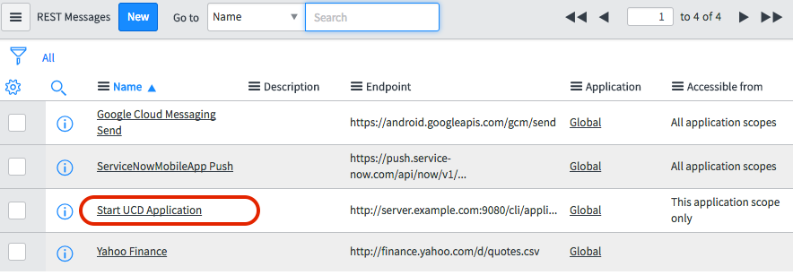

# ServiceNow - Usage

* [Orchestrating Deployments with ServiceNow Using IBM DevOps Deploy](https://community.ibm.com/community/user/wasdevops/blogs/osman-burucu/2022/08/02/orchestrating-deployments-with-servicenow-using-ib)
* [Component and Agent Configuration](#component-and-agent-configuration)
* [Example: Check the status of a child change task of a change request](#example-check-the-status-of-a-change-request)
* [Configuring Service Now to Trigger Deployments in UCD](#configuring-service-now-to-trigger-deployments-in-ucd)

## Configuring Service Now to Trigger Deployments in UCD

Service Now can be configured so that making a change to a Change Request, Incident, or any other table can kick off a deployment in DevOps Deploy automatically.This can be done by the following steps:

1. Under **System Web Services** -> **Outbound** -> **REST Message**, Create a new REST Message for calling your UCD Application Process.

Screenshot showing a new outbound UCD REST Message Object

2. Name the message, and set up the Endpoint field to direct to your DevOps Deploy server, using the proper path for requesting an Application Process. This can also be used with any other UCD REST Endpoint if desired.

3. Create a New HTTP Method. Define the parameters based on the [DevOps Deploy REST API reference](https://www.ibm.com/docs/en/urbancode-deploy/7.2.0?topic=function-rest-api-reference) for your rest call. For this case of requesting an application process, the HTTP Method will look something like this using [Run an application process template](https://www.ibm.com/docs/en/urbancode-deploy/7.2.0?topic=resource-run-application-process):

Example HTTP Method for Requesting Application Process

4. Now that we have our Outbound REST Message, we need to configure a Business Rule.In the side panel, under **System Definition** -> **Business Rules**.Here we can configure a table that we want to trigger the REST Call from, as well as the conditions to do so.This depends on user preferences.For this case, the following parameters are set to trigger a deployment when a Change Request table has its approval status set to Approved.

Business Rule for Deployment to UCD

5. To reference the REST Message within the Business Rule, ensure that the Advanced box is checked.Now, under the Advanced tab, a Script box can be seen.To retrieve the script required to call our REST Message, we must return to our Http Method, scroll down to Related Links, and select Preview Script Usage.From here, we copy and paste the script as is, and paste it over the `// Add your code here` text.

6. Now our settings are complete.We can go into a Change Request item, change its approval status to Approved using the proper roles, and we can see that our REST call was made and our Deployment started in DevOps Deploy.

## Example: Check the status of a Change Request

***Note:** For checking records in the change\_request table, this process was combined into one step in Version 18 of the ServiceNow plug-in, in the step Check Change Request Fields.*

1. Open the change record that contains the child change tasks to check.
2. Right-click the child task to check, and then click **Show Matching**.
3. Copy the query. Right-click the end of the query and then select **Copy Query**.

5. In the process editor, add a Run Encoded Query step.
6. Paste the query into the step.

8. Add a Check Records step.
9. Enter {p:EncodedQueryStepName/recordSystemIDs}`` in the Record System IDs field.

11. For Check Fields, enter status=1.

The final process design should look like this: 

**Note:** The status value in the last step is an integer key that corresponds to the state value-key pair that is used by ServiceNow. By default, -5 is Pending, 1 is Open, 2 is Work in Progress, 3 is Closed Complete, 4 is Closed Incomplete, and 7 is Closed Skipped. To find your specific key-value pairs, open a task in ServiceNow. Click **Additional actions** next to the task title, then click **Configure > Form Design**. Click **edit this field**, which is displayed when you select the state field.

## Component and Agent Configuration

Defining the ServiceNow plug-in as a separate component to interface your ServiceNow environment allows you to reuse the ServiceNow steps in other processes. You can map components to an agent or agent pool that has access to the ServiceNow environment.

* Agent pools distribute work among all pool members and reduce congestion that can occur when using a single agent.
* Agent pools are also used to limit access to specific agents. For example, agents that are associated with a different owner or agents used for production deployment.

Additional information on agent pools can be found on the [Creating and managing agent pools](https://www.ibm.com/docs/en/urbancode-deploy/7.2.3?topic=configuration-creating-managing-agent-pools) topic in IBM Documentation.

We will use the JPetStore Application in the graphic below to demonstrate the use of the ServiceNow agent pool in a deployment. The JPetStore Application example represents a project deployment strategy with three environments. The environments are shown on the **Applications** tab: Dev, QA, and Prod. The **Components** tab contains the various deployable items and concepts, that make up the application. In this example, it contains the ServiceNow component. The **Processes** tab contains deployment flows, when combined with the other component processes used to make dynamic decisions based on ServiceNow queried responses.

The **Resource Tree** tab shows a typical design for an agent pool. Notice the high-level folder called ServiceNow Agents. The folder contains three agent pools: Dev Pool, Prod Pool and QA Pool.Agents are assign to a pool and configured for the environment.

The **Environments** page for a specific environment displays the agent pools associated with the environment.As shown in the graphic below, the agent pool named Dev Pool is mapped to the Dev environment. With this configuration, the application process runs only on the available agents in the Dev Pool agent pool associated with the environment.

|Back to ...||Latest Version|ServiceNow |||||
| :---: | :---: | :---: | :---: | :---: | :---: | :---: | :---: |
|[All Plugins](../../index.md)|[Deploy Plugins](../README.md)|[40.1168551](https://raw.githubusercontent.com/UrbanCode/IBM-UCD-PLUGINS/main/files/ServiceNow/ucd-ServiceNow-40.1168551.zip)|[Readme](README.md)|[Overview](overview.md)|[Troubleshooting](troubleshooting.md)|[Steps](steps.md)|[Downloads](downloads.md)|