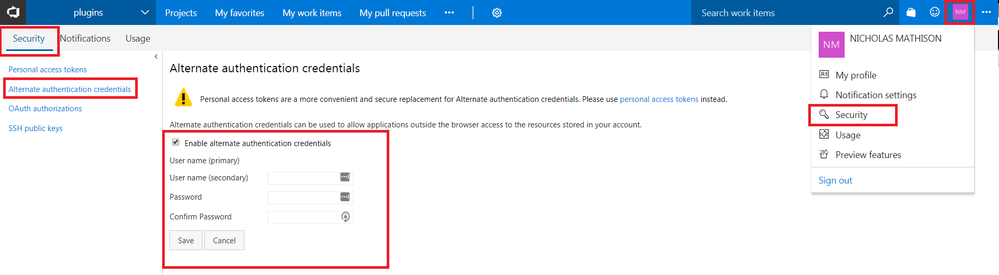
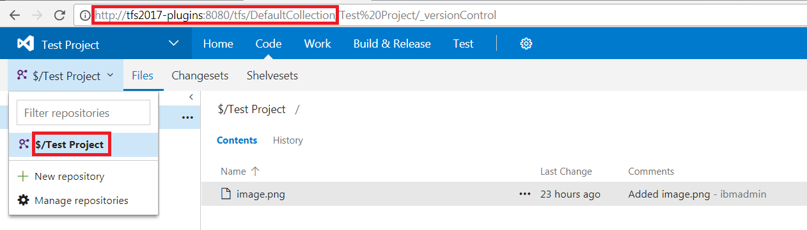
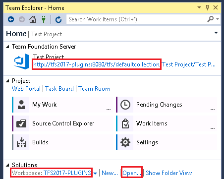
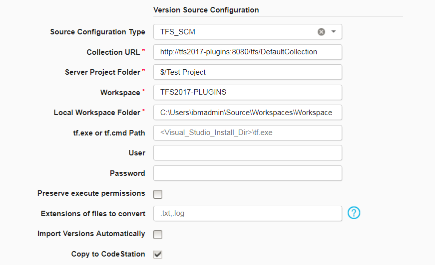

# Microsoft TFS_SCM (Team Foundation Server) - Usage

## Summary

The Microsoft TFS\_SCM (Team Foundation Server) source configuration plug-in can be used to import artifacts from a TFS projects repository. This plug-in will retrieve artifacts from Team Foundation Version Control (TFVC), not compiled code or built .zip files from a TFS build process. Visual Studio Online and all TFS versions up to 2017 to are supported by the TFS\_SCM v6 plug-in. The plug-in requires the agent to have access to the `tf` tool. More information about this tool is documented below.

Details for using the plug-in are located in the [Creating components from Microsoft Team Foundation Server SCM](https://www.ibm.com/docs/en/urbancode-deploy/7.2.3?topic=ccfscms-creating-components-from-microsoft-team-foundation-server-scm) topic. When creating the component, youll supply information described on the [Import Version](https://urbancode.github.io/IBM-UCx-PLUGIN-DOCS/UCD/FileSystemSourceConfig/steps.html#import_version) step. After the component is created use the **Components** page in the user interface to import a version of the artifacts if automatic import was not selected.

## Requirements

### tf Tool Executable

The agent must have access to the tf.exe or tf.cmd executable. This file is critical for retrieving all artifacts from TFS. It must either be located on the PATH environment variable or supplied via a direct path in the plug-ins configuration. The tf executable is located in the install directory of Visual Studio or Team Explorer Everywhere. The tf tool is not located in the TFS install directory. [Full documentation for the tf command line interface.](https://www.visualstudio.com/en-us/docs/tfvc/use-team-foundation-version-control-commands)

### Visual Studio Online Connection

Visual Studio Online, which is an SaaS offering of Team Foundation Server, requires enabling the alternate authentication credentials option. To learn how to enable alternate authentication credentials, login to VSO and navigate to your Settings page. Under the sidebar to the left, there will be an **Alternate authentication credentials**. Enable and create new alternate authentication credentials. These credentials should then be supplied in theplug-ins configuration. Because these credentials will likely be used by many deployments, we recommend creating a functional VSO account that is used for these types of automated process. The below screenshot shows where to create alternate authentication credentials.

Visual Studio OnlineAlternative Authentication Credentials

## Configuration

The TFS\_SCM plug-in contains four required properties that support the default use case of an unsecured or local TFS server with the tf tool available on the PATH environment variable. By default, the most recent changeset will be imported.

### Required Properties

1. **Collection URL**: The URL of the TFS or VSO team project collection (Example: https://{username}``.visualstudio.com/DefaultCollection). The desired project artifacts will be located underneath this collection. This URL is a subset of the projects URL.
2. **Server Project Folder**: The variable assigned to the project folder on your VSO or the TFS server. By default, this value begins with `$/` and is followed by the name of the project.

Team Foundation ServerCollection URL and Server Project Folder
3. **Workspace**: The name of the local TFS or VSO workspace. This value can be identified in Visual Studios **Team Explorer** side bar. All possible Workspaces can be found under the **Solution** section.
4. **Local Workspace Folder**: The full path to the local Workspace folder. This folder contains local code resolved by Visual Studio. The easiest way to identify the workspace is by clicking the **Open** link in the **Team Explorer** side bar. This will bring you directly to the workspace folder. Default Location: `C:\Users\\Source\Workspaces\Workspace`

Team Foundation ServerWorkspace and Local Workspace Folder

Note: You may also notice the Collection URL can be identified from Visual Studio as well.

### Optional Properties

* **Username**: The Username to authenticate with TFS or VSO.
* **Password**: The Password to authenticate with TFS or VSO. The Username and Password properties are not required if the agent is installed on the TFS server. Follow the alternate authentication credentials if using VSO.
* **tf.exe or tf.cmd Path**: The canonical path to the `tf.exe` or `tf.cmd` file. This file is located in the Visual Studio installation directory and the path is not standardized between Visual Studio versions. Example for Visual Studio 2017: `C:\Program Files (x86)\Microsoft Visual Studio\2017\Community\Common7\IDE\CommonExtensions\Microsoft\TeamFoundation\Team Explorer\tf.exe`
If this property is empty, the plug-in will try to reach the `tf` command via the environment PATH variable. If not set, this will appear as a `Error Creating New Version: Cannot run program "tf": CreateProcess error=2, The system cannot find the file specified` error.

### Manual Import Properties

By default, the TFS\_SCM plug-in will import the latest changeset. If the import is initiated manually, you can import specific changesets. If a `label` value is given, the plug-in will ignore the `changeset`

- **Label**: The label assigned to a past changeset.

- **Changeset**: The number assigned to a past changeset.

## Sample Plug-in Configuration

Sample TFS\_SCM Plug-in Configuration

## Create a New Component

To create a component by importing from Microsoft Team Foundation ServerSCM, complete the following steps. For more information, see [Creating components](https://www.ibm.com/docs/en/urbancode-deploy/7.2.3?topic=components-creating "Creating components").

1. On the **Components** page in IBM DevOps Deploy, click **Create New Component**.
2. In the **Source Config Type** list, select **TFS\_SCM**.
3. Provide all of the necessary information, such as the **Collection URL** and the **Path to TF.exe or TF.cmd**.
4. Click **Save**.
5. Click the **Versions** tab for the component.
6. Click **Import New Versions**.
