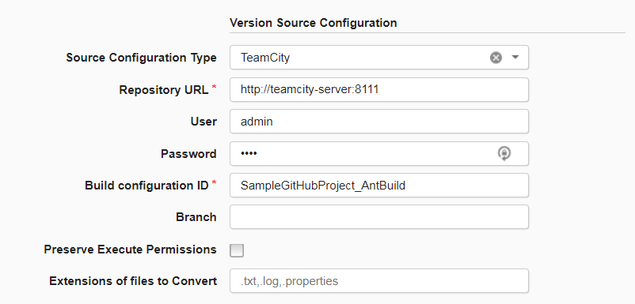
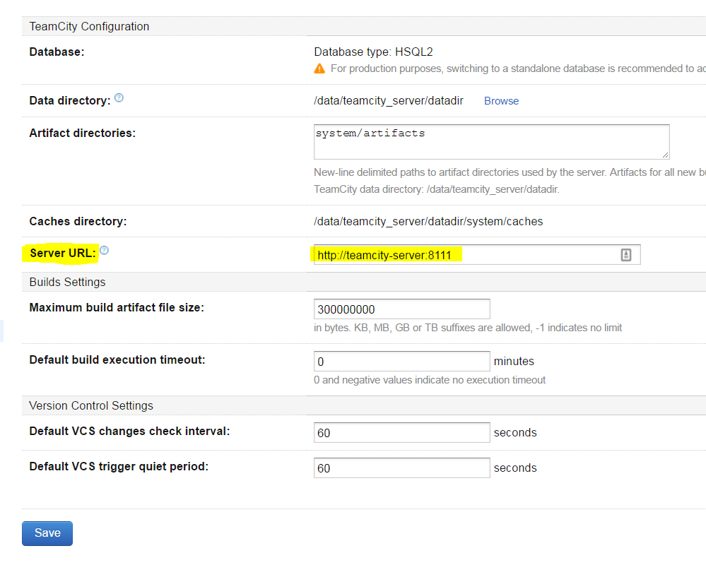
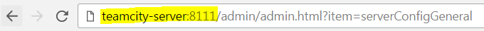
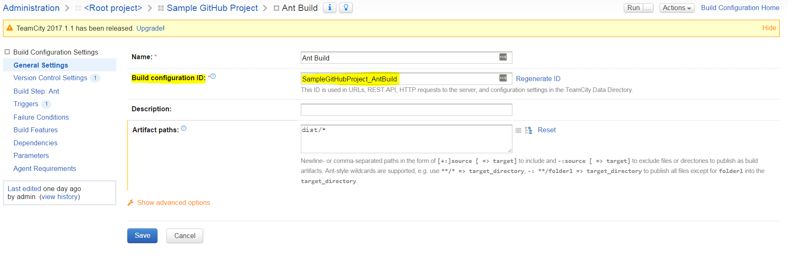

# TeamCity

## Usage

You will need to define an DevOps Deploy component which defines the source and processes for the Maven repository. The component contains the information for importing the artifacts and any processes to implement on the artifacts.

When creating the component, youll supply information described on the [Import Version](steps.md#import-version) step. After the component is created, use the **Components** page in the user interface to import a version of the artifacts if automatic import is not selected.

To create a component, complete the following steps. For more information about creating a component, see [Creating components](http://www-01.ibm.com/support/knowledgecenter/SS4GSP_7.0.2/com.ibm.udeploy.doc/topics/comp_create.html "Creating components") in the product documentation.

1. In DevOps Deploy, click **Components** and then click **Create Component**.
2. In the Create Component window, specify a name and description for the component.
3. In the **Teams** fields, specify the access information for the new component.
4. To use a template for the new component, select a template from the Template list. In this case, the component inherits source configuration, properties, and processes from the template.
5. In the **Source Config Type** list, select **Teamcity**.
6. Specify the properties for the component. See [Steps](steps.md#teamcitycomponentproperties) for property descriptions.
7. Click **Save**.

## Import a version

When the artifacts are imported, a component version is created using the version of the package. You can specify to import a specific package version or import all versions. If importing all versions, a component version is created for each version.

1. Click the **Versions** tab for the component.
2. Click **Import New Versions**.
3. Specify a specific version of the package to import, or leave blank to import the latest version of the package available in the repository. Additionally, enable **Import All Versions** to import all versions of a package.
4. Click **Save**.

### Sample Configuration

The TeamCity Source version 10 plug-in contains a number of changes that affect usage. Specifically, the **Build Configuration** and **Project** properties have been removed. The **Build Type** property is renamed to **Build Configuration ID** to match the intended functionality and to easily identify the Build Project.

The last build from the `default` branch is imported on each run. If the latest version exists as a component version, no import occurs.

Below are a few screenshots that show a simple configuration of the TeamCity plug-in with properties pulled from the TeamCity Server.

### Properties

The following two properties must be specified to configure a TeamCity source configuration plug-in.

* **Repository URL:** The base TeamCity server hostname and port.
* **Build Configuration ID:** The Build Configuration ID that identifies the build project in TeamCity.

The following four properties are optional.

* **Branch:** The branch to import artifacts from. Empty value will import default branch. `default-any` will import all artifacts regardless of branch.
* **User:** The username to authenticate with TeamCity.
* **Password:** The password to authenticate with TeamCity.
* **Preserve Execute Permissions:** Select to retain file permissions. Linux and UNIX operating systems only.
* **Extensions of files to Convert:** Specify extensions to convert files to local charset.

## Manual Import Properties

Two optional properties are available on manual import.

* **Target Build ID:** Specify a build id to import a specific build version. This property can be used to import older builds.
* **Version Name:** Rename the component version if imported.

### Sample Configuration

### Repository URL

The Repository URL points the source configuration to the TeamCity server. This property is likely the same hostname specified in the internet browser to reach the TeamCity instance. It is important to note that this Server URL is also configurable ([JetBrains Documentation](https://confluence.jetbrains.com/display/TCD10/Configuring+Server+URL)). The URL can be found by either going into TeamCitys `Administration > Global Settings` and viewing the Server URL property or using the URL in your browser.

### Administration > Global Settings

### Internet Browser

### Build Configuration ID

The Build Configuration ID specifies the exact build project to import as component versions. At the time of this writing, only the default branch can be imported.Within TeamCitys REST API, this property is referred to as buildType or buildTypeId, but labeled as the the **Build Configuration ID** in the build configuration settings. The ID referred to as its REST API name can be found as a URL query parameter while viewing the build project in a browser.

### Build Configuration Settings > General Settings

### Authentication

While some TeamCity servers are open to the public to view, realistically your TeamCity server will be protected with a username and password. Specify any username and password that has access to a particular project build. The same credentials used to login manually are used here.
