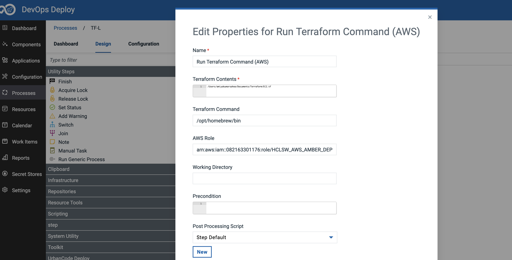
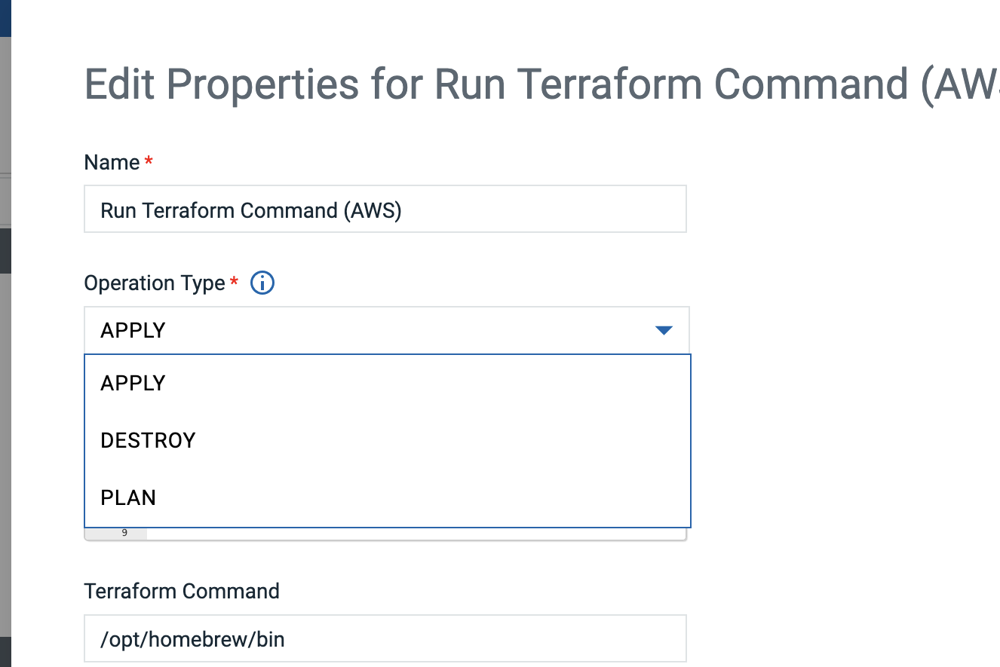
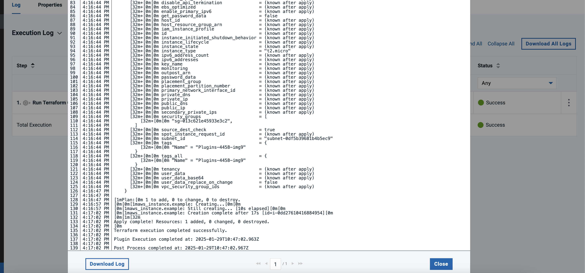
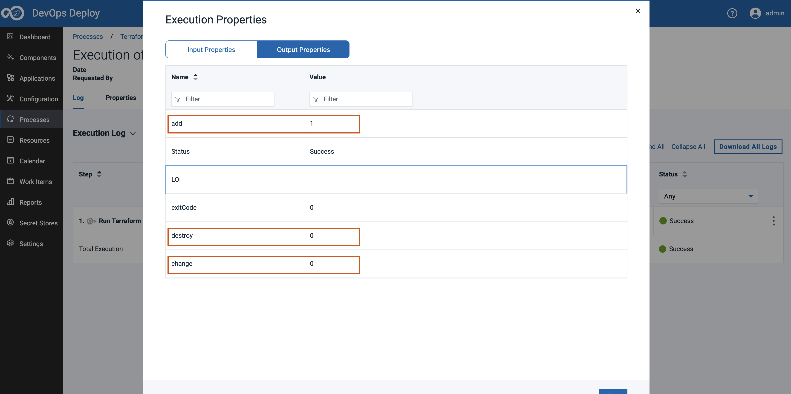

# Usage

---
You can use the Terraform plug-in to execute any terraform script related to the AWS cloud services.

## **Prerequisites:**

User should have Terraform and AWS CLI installed in their DevOps Deploy Agent's machine.

## **Example 01 : AWS **

You can use this plug-in to create an EC2 instance.

You can have a terraform script as below that has all the specifications to create an EC2 instance in a file named EC2.tf.

```
provider "aws" {
region = "us-east-1"
}

resource "aws_instance" "example" {
ami           = "ami-01816d07b1128cd2d"
instance_type = "t2.micro"
subnet_id     = "subnet-id*******"

tags = {
Name = "instance-name-xyz"
}

associate_public_ip_address = false
security_groups = ["sg-id******"]
}
```
You need to provide the full path of the script as shown in the image below.
You need to provide the path of the Terraform executable command and the AWS role that is needed to assume.




Users can select the operation type which they want to run for their terraform script as shown in the image below.





Once the plugin step is run it will automatically assume the AWS role and run the essential Terraform commands according to the operation selected. 
which are **_"terraform init"_** and **_"terraform (apply/destroy) -auto-approve"_** or **_terraform plan_** to launch an ec2 instance.


While running Apply operation users can verify if the EC2 instance got created in the AWS console by searching the Tag name **_"instance-name-xyz"_**.





While running Plan operation users can expect our plugin step to generate 3 output properties which are add, change and destroy.
Users can use the values of these properties to run any other step in their process.





## **Example 02 : GCP**

You can use this plug-in to create vm inside GCP .

You can have a terraform script as below that has all the specifications to create a vm inside GCP.

```
provider "google" {
  project     = var.project_id
  region      = var.region
  zone        = var.zone
}

resource "google_compute_instance" "example_vm" {
  name         = "example-vm-2"
  machine_type = "e2-medium"
  zone         = var.zone

  boot_disk {
    initialize_params {
      image = "debian-cloud/debian-11"
    }
  }

  network_interface {
    subnetwork   = "projects/${var.project_id}/regions/${var.region}/subnetworks/${var.subnetwork_name}"
    access_config {}
  }
}

# ----------------------------
# Variables
# ----------------------------

variable "project_id" {
  default = "<your-project-id>"
}

variable "region" {
  default = "<your-region>"
}

variable "zone" {
  default = "<your-zone>"
}

variable "subnetwork_name" {
  default = "hclsw-amber-data-subnet-us-central1"
}
```
