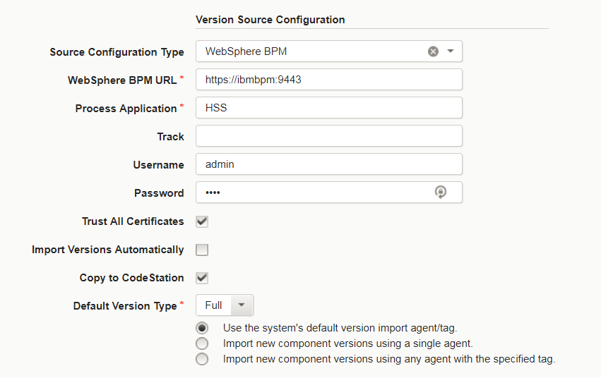
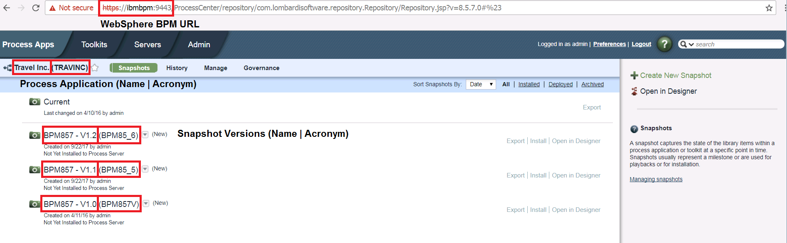
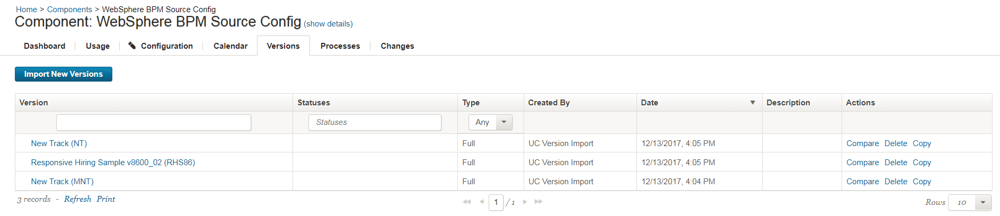
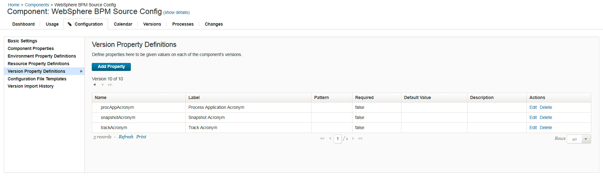
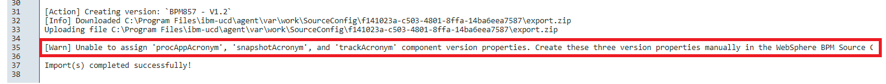

# IBM Business Process Manager (WebSphere BPM) - Usage

## Summary

The IBM WebSphere BPM source configuration plug-in for IBM DevOps Deploy creates component versions from Process Application snapshots originating from the Process Center. The component versions are made up of a single file called `export.twx` that contains the snapshots `.twx` file. This file is directly used in the [IBM WebSphere BPM automation plug-in](https://urbancode.github.io/IBM-UCx-PLUGIN-DOCS/UCD/WebSphereBPM/). Manual import and export of the Process Application snapshots artifact can be found on [IBM WebSphere BPMs knowledge center](https://www.ibm.com/support/knowledgecenter/SSFPJS_8.5.5/com.ibm.wbpm.admin.doc/topics/managing_process_applications_E.html). Specifically, this plug-in creates a file identical to the [BPMExport command](https://www.ibm.com/support/knowledgecenter/SSFTBX_8.5.7/com.ibm.wbpm.ref.doc/topics/rref_bpmexport.html). Therefore, it should be used in conjunction with the [BPMImport command](https://www.ibm.com/support/knowledgecenter/SSFTBX_8.5.7/com.ibm.wbpm.ref.doc/topics/rref_bpmimport.html) or the [Import Process Application plug-in step](https://urbancode.github.io/IBM-UCx-PLUGIN-DOCS/UCD/WebSphereBPM/steps.html#import_process_application) in a component process.

In general, we suggest using a continuous integration or build tool to push artifacts from the main tool, such as IBM WebSphere BPM, into IBM DevOps Deploy. However, in some scenarios this approach is cumbersome and can cause significant headache. In those instance, you use its associated source configuration plug-in to import artifacts easily. In this source configuration model, you must abide by the architecture requirement of mapping one Process Application to one IBM DevOps Deploy component. There are ways to get around this requirement, however, additional scripting or personalized processes will be required.

## Agent Model

The IBM WebSphere BPM source configuration plug-in utilizes the REST API. This allows the IBM DevOps Deploy agent to be placed anywhere with network access to the Process Center that contains your Process Application snapshots. However, any agent located on the BPM server will be required to perform deployments as the automation plug-in uses the `wsadmin` command line interface.

## Sample Configuration

This source configuration plug-ins base configuration contains five properties.

* **WebSphere BPM URL** (required): This is the base IBM WebSphere BPM Process Center server URL. All REST API endpoints are constructed from the specified URL. Example: https://ibmbpm:9443
* **Process Application** (required): The name or acronym of the Process Application that contains the snapshots to import.
* **Track**: The Track, or Branch, name from where to retrieve Snapshots. If empty, Snapshots from all tracks will be imported.
* **Username**: The username to authenticate with IBM WebSphere BPM.
* **Password** : The password to authenticate with IBM WebSphere BPM.
* **Trust All Certificates**: Select to accept all SSL certificates when authenticating with the IBM WebSphere BPM. If you receive a `SSLHandshakeException` error, selecting this check box is a temporary solution to get around the issue.

There is also one optional property on manual import.

* **Snapshot Name**: Specify a single Snapshot name or acronym to import.

Sample configuration IBM WebSphere BPM source config plug-in

Many of these properties are pulled directly from the Process Application snapshots page. The picture below illustrates where to find the the URL, Process Application and snapshots names in a browser.

Sample Application Process snapshots page

If the above list of screenshots was imported successfully, the components versions tab may look like the below screenshot. Regardless of the snapshot value specified for the manual import, the versions name will be the Snapshots name and its acronym in parenthesis. Note in the below screenshot that two versions may first look like duplicates. However, they are actually from two different tracks, hence the different acronyms.

Sample Component Version tab

## Component Version Properties

In the IBM WebSphere BPM automation plug-in, many steps require a combination of three values: Process Application, Snapshot, and Track names. In an attempt to make process creation easier, these three component version properties are assigned to each version on creation. However, security changes were made to IBM DevOps Deploy to minimize unwarranted property creation. Therefore, to take full advantage of the source configuration plug-in, create the following three Version Property Definitions under the components Configuration tab.

* procAppAcronym
* snapshotAcronym
* trackAcronym

On configuration, the tab should resemble the below screenshot:

Sample Version Property Definitions

The error explained above will manifest itself in the standard output logs as the outlined string: 

