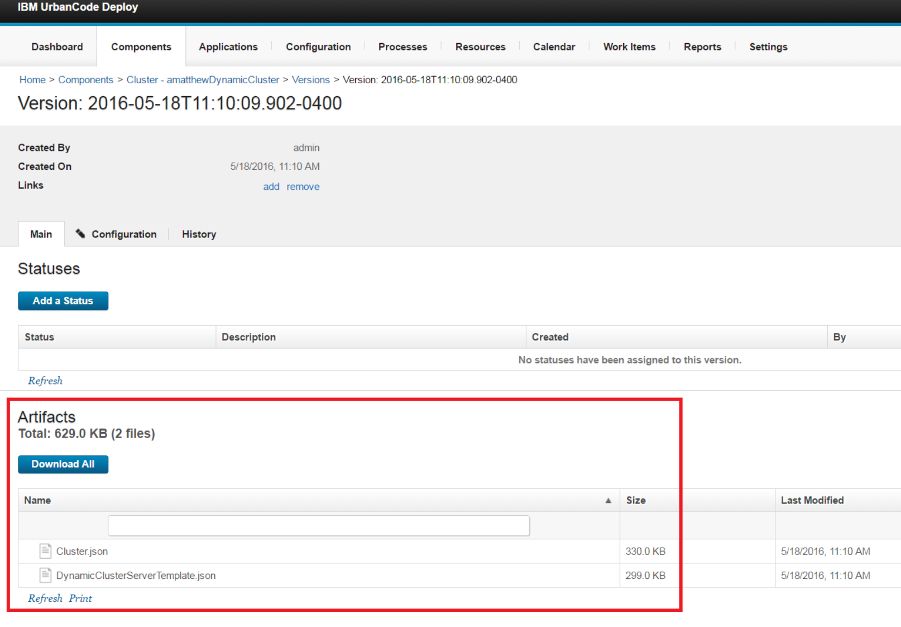
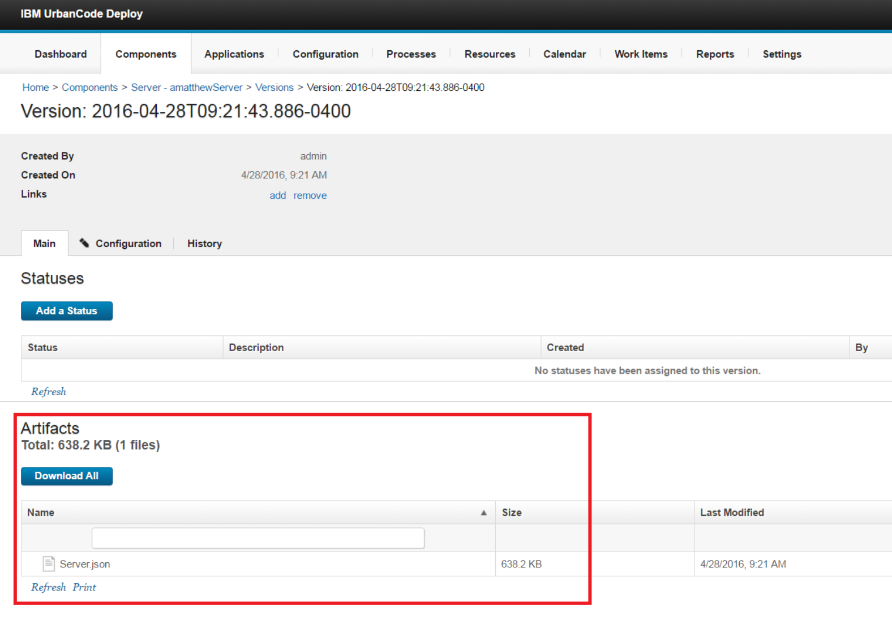
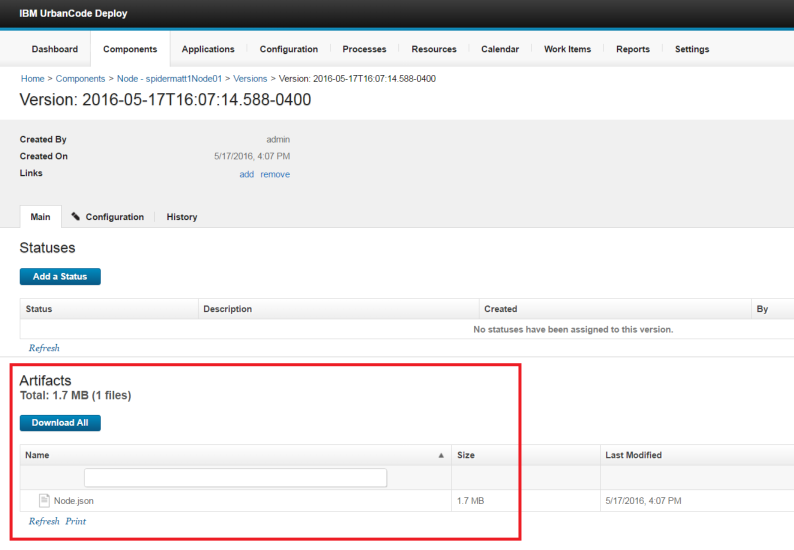
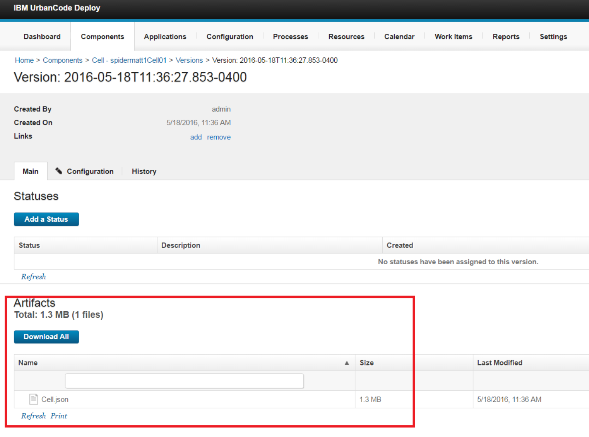
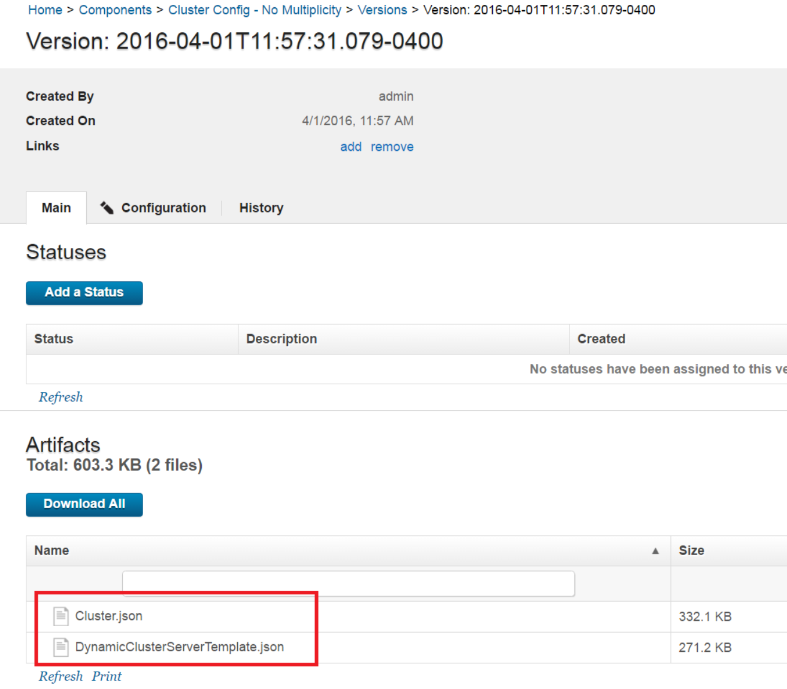
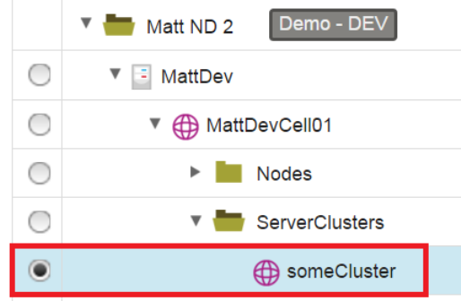

WebSphere Application Server - Configure - Example Processes
============================================================

# Example Processes


## Example Processes


The WebSphere Application Server Configure plug-in includes several processes that you can use as examples for managing WebSphere Application Server configurations. Some example processes are automatically installed in IBM DevOps Deploy when you install the plug-in. Other example processes are available for download. You must manually import the processes that are not included in the plug-in.

These processes are only examples. Tailor these processes for your environment.

**Important:** The provided sample processes use the ampersand (@) as the start and end delimiters. For example, the templatize steps create tokens that look like this example: @websphere.cell@. If the templatize steps are modified to use different delimiters, the Replace Tokens steps in the Apply component processes must be updated to use the correct delimiters.

**[WebSphere Example 1 Discover & Templatize Configuration Data (WAS ND with Cluster)](#websphere--example-1--discover--templatize-configuration-data-was-nd-with-cluster)**

This process converts configuration data from a WebSphere Application Server Network Deployment instance into templates that can be applied to other WebSphere Application Server Network Deployment instances. Use this process if your environment contains a WebSphere Application Server cluster and you want to use the multiplicity feature.

**[WebSphere Example 2 Discover & Templatize Configuration Data (WAS ND with standalone server)](#websphere--example-2--discover--templatize-configuration-data-was-nd-with-standalone-server)**

This process converts configuration data from a WebSphere Application Server Network Deployment instance into templates that can be applied to other WebSphere Application Server Network Deployment instances. Use this process if your environment contains a non-clustered (stand-alone) installation of WebSphere Application Server.

**[WebSphere Example 3 Discover & Templatize Configuration Data (WAS Base)](#websphere--example-3--discover--templatize-configuration-data-was-base)**

This process converts configuration data from a WebSphere Application Server Base instance into templates that can be applied to other WebSphere Application Server Base instances. Use this process if you are using WebSphere Application Server Base.

**[WebSphere Example 4 Discover & Templatize Configuration Data (WAS ND with Cluster No Multiplicity)](#websphere--example-4--discover--templatize-configuration-data-was-nd-with-cluster--no-multiplicity)**

This process converts configuration data from a WebSphere Application Server Network Deployment instance into templates that can be applied to other WebSphere Application Server Network Deployment instances. Use this process if your environment contains clusters and you do not want to use the cluster multiplicity feature.

**[WebSphere Example 5 Discover & Templatize Cluster Configuration Data Only (Multiplicity)](#websphere--example-5--discover--templatize-cluster-configuration-data-only-multiplicity)**

This process converts configuration data for a single cluster from a WebSphere Application Server Network Deployment instance into templates that can be applied to other WebSphere Application Server Network Deployment instances. Use this process if your WebSphere Application Server Network Deployment environment contains clusters, you want to use the cluster multiplicity feature, and you want to templatize configuration information for one cluster only. Cells, nodes, and additional servers and clusters are not discovered and templatized. You can use this process in large WebSphere Application Server Network Deployment environments where discovering the cell and all nodes, servers, and clusters might take a long time.

**[WebSphere Example 6 Discover & Templatize Cluster Configuration Data Only (No Multiplicity)](#websphere--example-6--discover--templatize-cluster-configuration-data-only-no-multiplicity)**

This process converts configuration data for a single cluster from a WebSphere Application Server Network Deployment instance into templates that can be applied to other WebSphere Application Server Network Deployment instances. Use this process if your WebSphere Application Server Network Deployment environment contains clusters, you do not want to use the cluster multiplicity feature, and you want to templatize configuration information for one cluster only. Cells, nodes, and additional servers and clusters are not discovered and templatized. You can use this process in large WebSphere Application Server Network Deployment environments where discovering the cell and all nodes, servers, and clusters might take a long time.

**[WebSphere Example 7 Discover & Templatize Configuration Data (WAS ND with Dynamic Cluster)](#websphere--example-7--discover--templatize-configuration-data-was-nd-with-dynamic-cluster)**

This process converts configuration data for a WebSphere Application Server Network Deployment instance with a dynamic cluster into templates that can be applied to other WebSphere Application Server Network Deployment instances. Use this process if your WebSphere Application Server Network Deployment environment contains a dynamic cluster.

**[WebSphere Example 8 Discover & Templatize Cell Configuration Data](#websphere--example-8--discover--templatize-cell-configuration-data)**

This process converts configuration data from a WebSphere Application Server cell into a template that can be applied to other WebSphere Application Server instances.

**[WebSphere Example 9 Discover & Templatize Node Configuration Data](#websphere--example-9--discover--templatize-node-configuration-data)**

This process converts configuration data from a WebSphere Application Server node into a template that can be applied to other WebSphere Application Server instances.

**[WebSphere Example 10 Discover & Templatize Server Configuration Data](#websphere--example-10--discover--templatize-server-configuration-data)**

This process converts configuration data from a WebSphere Application Server server into a template that can be applied to other WebSphere Application Server instances.

**[WebSphere Example 11 Discover & Templatize Cluster Configuration Data](#websphere--example-11--discover--templatize-cluster-configuration-data)**

This process converts configuration data from a WebSphere Application Server cluster into a template that can be applied to other WebSphere Application Server instances.


## WebSphere – Example 11 – Discover & Templatize Cluster Configuration Data


This process converts configuration data from a WebSphere Application Server cluster into a template that can be applied to other WebSphere Application Server instances. This process is not installed with the WebSphere Application Server Configure plug-in. You must manually import this process into IBM DevOps Deploy. [Download the process (JSON file)](https://github.com/UrbanCode/IBM-UCD-PLUGINS/blob/main/files/WebSphereConfiguration/SampleProcesses/GenericProcessSample11.json).

Use this process if you want to capture and templatize WebSphere Application Server configuration at the cluster scope only.

**Important:** This sample process uses the ampersand (@) as the start and end delimiters. For example, the templatize steps create tokens that look like this example: @websphere.cell@. If the templatize steps are modified to use different delimiters, the Replace Tokens steps in the Apply component processes must be updated to use the correct delimiters.

**WebSphere Application Server environment**

This process is designed for all WebSphere Application Server environments that the plug-in supports.

**Process flow**

The steps in this process follow this general flow:

1. Run the WebSphere Configuration Discovery step against a WebSphere cluster to generate a configuration data file that contains configuration data for the cluster.
2. Run the WebSphere Templatize Cluster Configuration Data step to convert the configuration data of the cluster into a reusable template.
3. Create a component version that contains the cluster configuration data as a component version artifact.

**Process properties to set**

**Configuration File:** The location and name of the configuration data file. This file is created by a WebSphere Configuration Discovery step, and contains configuration data for the entire instance of WebSphere Application Server.

**Output Directory:** The directory for storing the template that is created by the process.

**User Defined Tokenization:** A list of values and their replacements, separated by newline characters. Use this list to change values or create tokens in the configuration data. Use the following format: *stringToReplace*->*newValue*. For example, if you specify abcd1234->@NewToken@, every occurrence of abcd1234 in the configuration file is replaced with @NewToken@.

**Resource:** The name of the cluster resource to templatize.

**Considerations**

* For static clusters, manage and templatize the server members separately. See [WebSphere Example 10 Discover & Templatize Server](#websphere--example-10--discover--templatize-server-configuration-data)
* For dynamic clusters, this process creates a dynamic cluster server template in the component version artifacts.
* This process creates a component with the following naming convention: Cluster - *cluster\_name*. The cluster configuration data is stored as a component version artifact, as shown in the following screen capture.[](media/process11.png)


## WebSphere – Example 10 – Discover & Templatize Server Configuration Data


This process converts configuration data from a WebSphere Application Server server into a template that can be applied to other WebSphere Application Server instances. This process is not installed with the WebSphere Application Server Configure plug-in. You must manually import this process into IBM DevOps Deploy. [Download the process (JSON file)](https://github.com/UrbanCode/IBM-UCD-PLUGINS/blob/main/files/WebSphereConfiguration/SampleProcesses/GenericProcessSample10.json).

Use this process if you want to capture and templatize WebSphere Application Server configuration at the server scope only.

**Important:** This sample process uses the ampersand (@) as the start and end delimiters. For example, the templatize steps create tokens that look like this example: @websphere.cell@. If the templatize steps are modified to use different delimiters, the Replace Tokens steps in the Apply component processes must be updated to use the correct delimiters.

**WebSphere Application Server environment**

This process is designed for all WebSphere Application Server environments that the plug-in supports.

**Process flow**

The steps in this process follow this general flow:

1. Run the WebSphere Configuration Discovery step against a WebSphere server to generate a configuration data file that contains configuration data for the server.
2. Run the WebSphere Templatize Server Configuration Data step to convert the configuration data of the server into a reusable template.
3. Create a component version that contains the server configuration data as a component version artifact.

**Process properties to set**

**Configuration File:** The location and name of the configuration data file. This file is created by a WebSphere Configuration Discovery step, and contains configuration data for the entire instance of WebSphere Application Server.

**Output Directory:** The directory for storing the template that is created by the process.

**User Defined Tokenization:** A list of values and their replacements, separated by newline characters. Use this list to change values or create tokens in the configuration data. Use the following format: *stringToReplace*->*newValue*. For example, if you specify abcd1234->@NewToken@, every occurrence of abcd1234 in the configuration file is replaced with @NewToken@.

**Resource:** The name of the server resource to templatize.

**Considerations**

* This process creates a component with the following naming convention: Server - *server\_name*. The server configuration data is stored as a component version artifact, as shown in the following screen capture.[](media/process10.png)


## WebSphere – Example 9 – Discover & Templatize Node Configuration Data


This process converts configuration data from a WebSphere Application Server node into a template that can be applied to other WebSphere Application Server instances. This process is not installed with the WebSphere Application Server Configure plug-in. You must manually import this process into IBM DevOps Deploy. [Download the process (JSON file)](https://github.com/UrbanCode/IBM-UCD-PLUGINS/blob/main/files/WebSphereConfiguration/SampleProcesses/GenericProcessSample9.json).

Use this process if you want to capture and templatize WebSphere Application Server configuration at the node scope only.

**Important:** This sample process uses the ampersand (@) as the start and end delimiters. For example, the templatize steps create tokens that look like this example: @websphere.cell@. If the templatize steps are modified to use different delimiters, the Replace Tokens steps in the Apply component processes must be updated to use the correct delimiters.

**WebSphere Application Server environment**

This process is designed for all WebSphere Application Server environments that the plug-in supports.

**Process flow**

The steps in this process follow this general flow:

1. Run the WebSphere Configuration Discovery step against a WebSphere node to generate a configuration data file that contains configuration data for the node.
2. Run the WebSphere Templatize Node Configuration Data step to convert the configuration data of the node into a reusable template.
3. Create a component version that contains the node configuration data as a component version artifact.

**Process properties to set**

**Configuration File:** The location and name of the configuration data file. This file is created by a WebSphere Configuration Discovery step, and contains configuration data for the entire instance of WebSphere Application Server.

**Output Directory:** The directory for storing the template that is created by the process.

**User Defined Tokenization:** A list of values and their replacements, separated by newline characters. Use this list to change values or create tokens in the configuration data. Use the following format: *stringToReplace*->*newValue*. For example, if you specify abcd1234->@NewToken@, every occurrence of abcd1234 in the configuration file is replaced with @NewToken@.

**Resource:** The name of the node resource to templatize.

**Considerations**

* This process retrieves configuration information from the node only. This process does not retrieve configuration information from the node agent or from servers on the node.
* This process creates a component with the following naming convention: Node - *node\_name*. The node configuration data is stored as a component version artifact, as shown in the following screen capture.[](media/process9.png)


## WebSphere – Example 8 – Discover & Templatize Cell Configuration Data


This process converts configuration data from a WebSphere Application Server cell into a template that can be applied to other WebSphere Application Server instances. This process is not installed with the WebSphere Application Server Configure plug-in. You must manually import this process into IBM DevOps Deploy. [Download the process (JSON file)](https://github.com/UrbanCode/IBM-UCD-PLUGINS/blob/main/files/WebSphereConfiguration/SampleProcesses/GenericProcessSample8.json).

Use this process if you want to capture and templatize WebSphere Application Server configuration at the cell scope only.

**Important:** This sample process uses the ampersand (@) as the start and end delimiters. For example, the templatize steps create tokens that look like this example: @websphere.cell@. If the templatize steps are modified to use different delimiters, the Replace Tokens steps in the Apply component processes must be updated to use the correct delimiters.

**WebSphere Application Server environment**

This process is designed for all WebSphere Application Server environments that the plug-in supports.

**Process flow**

The steps in this process follow this general flow:

1. Run the WebSphere Configuration Discovery step against a WebSphere cell to generate a configuration data file that contains configuration data for the cell.
2. Run the WebSphere Templatize Cell Configuration Data step to convert the configuration data of the cell into a reusable template.
3. Create a component version that contains the cell configuration data as a component version artifact.

**Process properties to set**

**Configuration File:** The location and name of the configuration data file. This file is created by a WebSphere Configuration Discovery step, and contains configuration data for the entire instance of WebSphere Application Server.

**Output Directory:** The directory for storing the template that is created by the process.

**User Defined Tokenization:** A list of values and their replacements, separated by newline characters. Use this list to change values or create tokens in the configuration data. Use the following format: *stringToReplace*->*newValue*. For example, if you specify abcd1234->@NewToken@, every occurrence of abcd1234 in the configuration file is replaced with @NewToken@.

**Resource:** The name of the cell resource to templatize.

**Dmgr/Application Server Node:** If **Did Discovery Collect Cell Configuration Only** is selected and you want to tokenize the node name value, enter the node name in this field. Some security settings can include the name of the node that hosts the deployment manager (WebSphere Application Server Network Deployment) or an application server (WebSphere Application Server Base).

**Dmgr/Application Server Node Host Name:** If **Did Discovery Collect Cell Configuration Only** is selected and you want to tokenize the node host name value, enter the node host name in this field. Some security settings can include the host name of the node that hosts the deployment manager (WebSphere Application Server Network Deployment) or an application server (WebSphere Application Server Base).

The following example code shows a node name (`NODE_NAME`) and node host name (`NODE_HOST_NAME`) in the cell configuration data:


```
{
"path": "/@websphere.cell@/Securities/Security/Property Attributes/com.ibm.ssl.defaultCertReqSubjectDN",
"teamMappings": [

],
"inheritTeam": "true",
"roleProperties": {
"websphere.property.value": "cn=NODE\_HOST\_NAME,ou=@websphere.cell@,ou=NODE\_NAME,o=IBM,c=US",
"websphere.property.name": "com.ibm.ssl.defaultCertReqSubjectDN",
"websphere.property.required": "false"
}``,
"name": "com.ibm.ssl.defaultCertReqSubjectDN",
"roleName": "WebSphereProperty",
"description": "Discovered WebSphereProperty"
}``,

```

**Considerations**

* This process retrieves configuration information from the cell scope only. This process does not retrieve configuration information from the node, server, or cluster scopes. If your environment includes a Deployment Manager, this process does not retrieve information for the Deployment Manager.
* This process creates a component with the following naming convention: Cell - *cell\_name*. The cell configuration data is stored as a component version artifact, as shown in the following screen capture.[](media/process8.png)


## WebSphere – Example 7 – Discover & Templatize Configuration Data (WAS ND with Dynamic Cluster)


This process retrieves configuration data from a WebSphere Application Server Network Deployment instance with a dynamic cluster and converts the data into templates that can be applied to other WebSphere Application Server Network Deployment instances. This process is not installed with the WebSphere Application Server Configure plug-in. You must manually import this process into IBM DevOps Deploy. [Download the process (JSON file)](https://github.com/UrbanCode/IBM-UCD-PLUGINS/blob/main/files/WebSphereConfiguration/SampleProcesses/GenericProcessSample7.json).

Use this process if your WebSphere Application Server Network Deployment environment contains a dynamic cluster.

**Important:** This sample process uses the ampersand (@) as the start and end delimiters. For example, the templatize steps create tokens that look like this example: @websphere.cell@. If the templatize steps are modified to use different delimiters, the Replace Tokens steps in the Apply component processes must be updated to use the correct delimiters.

**WebSphere Application Server environment**

This process is designed for a WebSphere Application Server Network Deployment environment that contains a dynamic cluster.

**Process flow**

The steps in this process follow this general flow:

1. Run the WebSphere Configuration Discovery step to generate a configuration data file that contains configuration data for the cell, nodes, servers, and clusters.
2. Run the WebSphere Extract Configuration Data step to split the single configuration data file into multiple files for cell, node, server and cluster configuration data.
3. Run the WebSphere Templatize Cell Configuration Data step to convert the configuration data of the cell and Deployment Manager into reusable templates.
4. Run the WebSphere Templatize Node Configuration Data step to convert the configuration data of a node into a reusable template. To convert data for more than one node, add more WebSphere Templatize Node Configuration Data steps.
5. Run the WebSphere Templatize Cluster Configuration Data step to convert the configuration data of the cluster into a template.
6. Create a component version for the provided Cell Config component that contains the cell and Deployment Manager configuration data as component version artifacts.
7. Create a component version for the provided Node Config component that contains the node and node agent configuration data as component version artifacts.
8. Create a component version for the provided Cluster Config component that contains the dynamic cluster configuration data as component version artifacts.

**Process properties to set**

**Configuration File:** The location and name of the configuration data file. This file is created by a WebSphere Configuration Discovery step, and contains configuration data for the entire instance of WebSphere Application Server.

**Cluster Name:** The name of the cluster to templatize.

**Output Directory:** The directory for storing templates that are created by the process.

**Node Name:** The name of the node to templatize.

**Dynamic Cluster Name:** The name of the dynamic cluster to templatize.

**Considerations**

* This process creates component versions for components that are provided with the plug-in. To create other components, which might be based on the provided component templates, you must update the steps that create component versions.
* The dynamic cluster configuration data is stored as component version artifacts in the provided Cluster Config No Multiplicity component.
* The dynamic cluster server template configuration data is stored as a separate file in the Cluster Config No Multiplicity component version artifacts, as shown in the following screen capture.[](media/process7.png)


## WebSphere – Example 6 – Discover & Templatize Cluster Configuration Data Only (No Multiplicity)


This process retrieves configuration data of a single cluster from a WebSphere Application Server Network Deployment instance and converts the data into templates that can be applied to other WebSphere Application Server Network Deployment instances. This process is not installed with the WebSphere Application Server Configure plug-in. You must manually import this process into IBM DevOps Deploy. [Download the process (JSON file)](https://github.com/UrbanCode/IBM-UCD-PLUGINS/blob/main/files/WebSphereConfiguration/SampleProcesses/GenericProcessSample6.json).

Use this process if your WebSphere Application Server Network Deployment environment contains clusters, you do not want to use the cluster multiplicity feature, and you want to templatize only configuration information for one cluster. Cells, nodes, and additional servers and clusters are not discovered and templatized. Use this process in large WebSphere Application Server Network Deployment environments where discovering the cell and all nodes, servers, and clusters might take a long time.

**Important:** This sample process uses the ampersand (@) as the start and end delimiters. For example, the templatize steps create tokens that look like this example: @websphere.cell@. If the templatize steps are modified to use different delimiters, the Replace Tokens steps in the Apply component processes must be updated to use the correct delimiters.

**WebSphere Application Server environment**

This process is designed for a WebSphere Application Server Network Deployment environment that contains a WebSphere Application Server cluster with two cluster members.

**Process flow**

The steps in this process follow this general flow:

1. Run the WebSphere Configuration Discovery step to generate a configuration data file that contains configuration data for the cluster.
2. Run the WebSphere Configuration Discovery step to generate a configuration data file that contains configuration data for the first cluster member.
3. Run the WebSphere Configuration Discovery step to generate a configuration data file that contains configuration data for the second cluster member.
4. Run the WebSphere Templatize Cluster Configuration Data step to convert the configuration data of a cluster into a reusable template. The **Use Multiplicity** property is cleared and the **Was Discovery Run On a Cluster Only?** property is selected.
5. Run the WebSphere Templatize Server for Cluster Configuration Data step to convert the configuration data of the first cluster member server into a template. The **Was Discovery Run On a Server Only?** property for this step is selected.
6. Run the WebSphere Templatize Server for Cluster Configuration Data step to convert the configuration data of the second cluster member server into a template. The **Was Discovery Run On a Server Only?** property for this step is selected.
7. Create components for each of the servers using the provided WebSphere Server Config component template.
8. Create a component version for the provided Cluster Config component that contains the cluster configuration data as component version artifacts.
9. Create a component version for each of the server components that contains the server configuration data as component version artifacts.

**Process properties to set**

**Cluster Name:** The name of the cluster to templatize.

**Cell Name:** The name of the cell that contains the cluster to templatize.

**Output Directory:** The directory for storing templates that are created by the process.

**Cluster Configuration File:** The location and name of the cluster configuration data file. This file is created by a WebSphere Configuration Discovery step, and contains configuration data for your cluster.

**Servers Node Name:** The name of the node that contains the servers to templatize. This process is designed for an environment where the cluster members are on the same node.

**Servers Node Host Name:** The host name of the node that contains the servers to templatize.

**Server 1 Name:** The name of the first cluster member.

**Server 1 Resource Path:** The path in the resource tree to the first server to templatize. For example: /topLevelGroup/agentName/cellName/Nodes/nodeName/Servers/server1Name.

**Server 1 Config File:** The location and name of the Server 1 configuration file. This file is created by a WebSphere Configuration Discovery step, and contains configuration data for your server.

**Server 1 Output Directory:** The directory for storing the template for Server 1.

**Server 2 Name:** The name of the second cluster member.

**Server 2 Resource Path:** The path in the resource tree to the second server to templatize. For example: /topLevelGroup/agentName/cellName/Nodes/nodeName/Servers/server2Name.

**Server 2 Config File:** The location and name of the Server 2 configuration file. This file is created by a WebSphere Configuration Discovery step, and contains configuration data for your server.

**Server 2 Output Directory:** The directory for storing the template for Server 2.

**Considerations**

* Run this process against a cluster resource, as shown in the following screen capture:[](media/example6.png)

* This process creates component versions for the Cluster Config component that is provided with the plug-in. To create other components that are based on the provided component template WebSphere Cluster Config, update the steps that create component versions.

* This process creates components for each cluster member that you templatize. The components are based on the provided WebSphere Server Config component template.


## WebSphere – Example 5 – Discover & Templatize Cluster Configuration Data Only (Multiplicity)


This process retrieves configuration data from a single cluster in a WebSphere Application Server Network Deployment instance and converts the data into templates that can be applied to other WebSphere Application Server Network Deployment instances. This process is not installed with the WebSphere Application Server Configure plug-in. You must manually import this process into IBM DevOps Deploy. [Download the process (JSON file)](https://github.com/UrbanCode/IBM-UCD-PLUGINS/blob/main/files/WebSphereConfiguration/SampleProcesses/GenericProcessSample5.json).

Use this process if your WebSphere Application Server Network Deployment environment contains clusters, you want to use the cluster multiplicity feature, and you want to templatize only configuration information for one cluster. Cells, nodes, and additional servers and clusters are not discovered and templatized. Use this process in large WebSphere Application Server Network Deployment environments where discovering the cell and all nodes, servers, and clusters might take a long time.

**Important:** This sample process uses the ampersand (@) as the start and end delimiters. For example, the templatize steps create tokens that look like this example: @websphere.cell@. If the templatize steps are modified to use different delimiters, the Replace Tokens steps in the Apply component processes must be updated to use the correct delimiters.

**WebSphere Application Server environment**

This process is designed for a WebSphere Application Server Network Deployment environment that contains a WebSphere Application Server cluster.

**Process flow**

The steps in this process follow this general flow:

1. Run the WebSphere Configuration Discovery step to generate a configuration data file that contains configuration data for the cluster.
2. Run the WebSphere Configuration Discovery step to generate a configuration data file that contains configuration data for a server. This server is the basis for all cluster members that are created when you apply configuration changes to other WebSphere Application Server instances.
3. Run the WebSphere Templatize Cluster Configuration Data step to convert the configuration data of one cluster into a reusable template. The **Use Multiplicity** and **Was Discovery Run On a Cluster Only?** properties for this step are both selected.
4. Run the WebSphere Templatize Server for Cluster Configuration Data step to convert the configuration data of one server into a template. This template is the basis of all cluster members that are created when you apply configuration changes to other WebSphere Application Server instances. The **Was Discovery Run On a Server Only?** property for this step is selected.
5. Create a component version for the provided Cluster Config component that contains the cluster and cluster member (server) configuration data as component version artifacts.

**Process properties to set**

**Cluster Name:** The name of the cluster to templatize.

**Cell Name:** The name of the cell that contains the cluster to templatize.

**Output Directory:** The directory for storing templates that are created by the process.

**Cluster Configuration File:** The location and name of the cluster configuration data file. This file is created by a WebSphere Configuration Discovery step, and contains configuration data for your cluster.

**Server Configuration File:** The location and name of the server configuration file. This file is created by a WebSphere Configuration Discovery step, and contains configuration data for your server.

**Resource Tree Path to Server:** The path in the resource tree to the server to templatize. For example: /topLevelGroup/agentName/cellName/Nodes/nodeName/Servers/serverName.

**Server Name:** The name of the server (cluster member) to templatize.

**Servers Node Name:** The name of the node that contains the server to templatize.

**Servers Node Host Name:** The host name of the node that contains server to templatize.

**Considerations**

* Run this process against a cluster resource, as shown in the following screen capture:[](media/example5.png)

* This process creates component versions for the Cluster Config component that is provided with the plug-in. To create other components that are based on the provided component template WebSphere Cluster Config, update the steps that create component versions.


## WebSphere – Example 4 – Discover & Templatize Configuration Data (WAS ND with Cluster – No Multiplicity)


This process retrieves configuration data from a WebSphere Application Server Network Deployment instance and converts the data into templates that can be applied to other WebSphere Application Server Network Deployment instances. This process is installed with the WebSphere Application Server Configure plug-in.

Use this process if your WebSphere Application Server Network Deployment environment contains clusters and you do not want to use the cluster multiplicity feature.

**Important:** This sample process uses the ampersand (@) as the start and end delimiters. For example, the templatize steps create tokens that look like this example: @websphere.cell@. If the templatize steps are modified to use different delimiters, the Replace Tokens steps in the Apply component processes must be updated to use the correct delimiters.

**WebSphere Application Server environment**

This process is designed for a WebSphere Application Server Network Deployment environment that contains a WebSphere Application Server cluster. The cluster contains two cluster members. Each cluster member is templatized individually.

**Process flow**

The steps in this process follow this general flow:

1. Run the WebSphere Configuration Discovery step to generate a configuration data file that contains configuration data for the cell, nodes, servers, and clusters.
2. Run the WebSphere Extract Configuration Data step to split the configuration data file into multiple files containing cell, node, server, or cluster configuration data files.
3. Run the WebSphere Templatize Cell Configuration Data step to convert the cell and Deployment Manager configuration data into reusable templates.
4. Run the WebSphere Templatize Node Configuration Data step to convert the configuration data of one node into a reusable template. To templatize configuration data for additional nodes, add more WebSphere Templatize Node Configuration Data steps.
5. Run the WebSphere Templatize Cluster Configuration Data step to convert the configuration data of a cluster into a reusable template. The **Use Multiplicity** property for this step is cleared.
6. Run the WebSphere Templatize Server Configuration Data step to convert the configuration data of one cluster member into a template. This process is designed for an environment with two cluster members.
7. Run the WebSphere Templatize Server Configuration Data step to convert the configuration data of the other cluster member into a template.
8. Create components for each of the servers with the provided WebSphere Server Config component template.
9. Create a component version for the provided Cell Config component that contains the cell and Deployment Manager configuration data as component version artifacts.
10. Create a component version for the provided Node Config component that contains the node and node agent configuration data as component version artifacts.
11. Create a component version for the provided Cluster Config component that contains the cluster configuration data as a component version artifact.
12. Create a component version for each of the server components that contains the server configuration data as component version artifacts.

**Process properties to set**

**Configuration File:** The location and name of the configuration data file. This file is created by the WebSphere Configuration Discovery step, and contains configuration data for your entire WebSphere Application Server instance.

**Output Directory:** The directory for storing templates that are created by the process.

**Node Name:** The name of the node to templatize. This node must contain both of the cluster members (servers) to templatize.

**Cluster Name:** The name of the cluster to templatize.

**Cluster Member 1:** The name of the first server (cluster member) to templatize.

**Cluster Member 2:** The name of the second server (cluster member) to templatize.

**Considerations**

* To templatize only cluster configuration data, and not cell and node configuration data, see sample processes [WebSphere Example 5 Discover & Templatize Cluster Configuration Data Only (Multiplicity)](#websphere--example-5--discover--templatize-cluster-configuration-data-only-multiplicity) and [WebSphere Example 6 Discover & Templatize Cluster Configuration Data Only (No Multiplicity)](#websphere--example-6--discover--templatize-cluster-configuration-data-only-no-multiplicity).
* This process creates component versions for components that are provided with the plug-in: Cell Config, Cluster Config No Multiplicity, and Node Config. To create other components, possibly based on the provided component templates, update the steps that create component versions.
* This process creates components for each cluster member that you templatize. The components are based on the provided WebSphere Server Config component template.
* To templatize more than one cluster member, add more WebSphere Templatize Server Configuration Data steps and more steps that create components and component versions.
* If there are no major differences between cluster members, consider using the multiplicity feature. See the example process [WebSphere Example 1 Discover & Templatize Configuration Data (WAS ND with Cluster)](#websphere--example-1--discover--templatize-configuration-data-was-nd-with-cluster).


## WebSphere – Example 3 – Discover & Templatize Configuration Data (WAS Base)


This process retrieves configuration data from a WebSphere Application Server Base instance and converts the data into templates that can be applied to other WebSphere Application Server Base instances. This process is installed with the WebSphere Application Server Configure plug-in.

Use this process if you are using WebSphere Application Server Base.

**Important:** This sample process uses the ampersand (@) as the start and end delimiters. For example, the templatize steps create tokens that look like this example: @websphere.cell@. If the templatize steps are modified to use different delimiters, the Replace Tokens steps in the Apply component processes must be updated to use the correct delimiters.

**WebSphere Application Server environment**

This process is designed for a WebSphere Application Server Base environment that contains a WebSphere Application Server instance.

**Process flow**

The steps in this process follow this general flow:

1. Run the WebSphere Configuration Discovery step to generate a configuration data file that contains configuration data for the cell, nodes, and servers.
2. Run the WebSphere Extract Configuration Data step to split the configuration data file into multiple files containing cell, node, or server configuration data files.
3. Run the WebSphere Templatize Cell Configuration Data step to convert the cell configuration data into a reusable template.
4. Run the WebSphere Templatize Node Configuration Data step to convert the node configuration data into a reusable template.
5. Run the WebSphere Templatize Server Configuration Data step to convert the configuration data of one server into a template. To templatize the configuration data for additional servers, add more WebSphere Templatize Server Configuration Data steps.
6. Create a component version for the provided Cell Config component that contains the cell configuration data as a component version artifact.
7. Create a component version for the provided Node Config component that contains the node configuration data as a component version artifact.
8. Create a component version for the provided Server Config component that contains the server configuration data as a component version artifact.

**Process properties to set**

**Configuration File:** The location and name of the configuration data file. This file is created by the WebSphere Configuration Discovery step, and contains configuration data for your entire WebSphere Application Server instance.

**Output Directory:** The directory for storing templates that are created by the process.

**Node Name:** The name of the node to templatize.

**Server Name:** The name of the server to templatize.

**Considerations**

* This process creates component versions for components that are provided with the plug-in. To create other components, possibly based on the provided component templates, update the steps that create component versions.
* This process is designed to templatize one WebSphere Application Server instance. The server configuration data is saved as a component version artifact for the provided Server Config component. To templatize additional servers, create additional components with the provided WebSphere Server Config component template. The sample process [WebSphere Example 4 Discover & Templatize Configuration Data (WAS ND with Cluster No Multiplicity)](#websphere--example-4--discover--templatize-configuration-data-was-nd-with-cluster--no-multiplicity) contains steps that create components, which you can use as a reference.


## WebSphere – Example 2 – Discover & Templatize Configuration Data (WAS ND with standalone server)


This process retrieves configuration data from a WebSphere Application Server Network Deployment instance and converts the data into templates that can be applied to other WebSphere Application Server Network Deployment instances. This process is installed with the WebSphere Application Server Configure plug-in.

Use this process if your WebSphere Application Server Network Deployment environment contains a non-clustered (stand-alone) installation of WebSphere Application Server.

**Important:** This sample process uses the ampersand (@) as the start and end delimiters. For example, the templatize steps create tokens that look like this example: @websphere.cell@. If the templatize steps are modified to use different delimiters, the Replace Tokens steps in the Apply component processes must be updated to use the correct delimiters.

**WebSphere Application Server environment**

This process is designed for a stand-alone WebSphere Application Server Network Deployment environment.

**Process flow**

The steps in this process follow this general flow:

1. Run the WebSphere Configuration Discovery step to generate a configuration data file that contains configuration data for the cell, nodes, and servers.
2. Run the WebSphere Extract Configuration Data step to split the configuration data file into multiple files containing cell, node, or server configuration data.
3. Run the WebSphere Templatize Cell Configuration Data step to convert the cell and Deployment Manager configuration data into reusable templates.
4. Run the WebSphere Templatize Node Configuration Data step to convert the configuration data of one node into a reusable template. To templatize configuration data for additional nodes, add more WebSphere Templatize Node Configuration Data steps.
5. Run the WebSphere Templatize Server Configuration Data step to convert the configuration data of one server into a template. To templatize configuration data for additional servers, add more WebSphere Templatize Server Configuration Data steps.
6. Create a component version for the provided Cell Config component that contains the cell and Deployment Manager configuration data as component version artifacts.
7. Create a component version for the provided Node Config component that contains the node and node agent configuration data as component version artifacts.
8. Create a component version for the provided Server Config component that contains the server configuration data as a component version artifact.

**Process properties to set**

**Configuration File:** The location and name of the configuration data file. This file is created by the WebSphere Configuration Discovery step, and contains configuration data for your entire WebSphere Application Server instance.

**Output Directory:** The directory for storing templates that are created by the process.

**Node Name:** The name of the node to templatize. This node must contain the server to templatize.

**Server Name:** The name of the server to templatize.

**Considerations**

* This process creates component versions for components that are provided with the plug-in. To create other components, possibly based on the provided component templates, update the steps that create component versions.
* This process is designed to templatize one WebSphere Application Server instance. The server configuration data is saved as a component version artifact for the provided Server Config component. To templatize additional servers, create additional components with the provided WebSphere Server Config component template. The sample process [WebSphere Example 4 Discover & Templatize Configuration Data (WAS ND with Cluster No Multiplicity)](#websphere--example-4--discover--templatize-configuration-data-was-nd-with-cluster--no-multiplicity) contains steps that create components, which you can use as a reference.


## WebSphere – Example 1 – Discover & Templatize Configuration Data (WAS ND with Cluster)


This process retrieves configuration data from a WebSphere Application Server Network Deployment instance and converts the data into templates that can be applied to other WebSphere Application Server Network Deployment instances. This process is installed with the WebSphere Application Server Configure plug-in.

Use this process if your WebSphere Application Server Network Deployment environment contains clusters and you want to use the cluster multiplicity feature.

**Important:** This sample process uses the ampersand (@) as the start and end delimiters. For example, the templatize steps create tokens that look like this example: @websphere.cell@. If the templatize steps are modified to use different delimiters, the Replace Tokens steps in the Apply component processes must be updated to use the correct delimiters.

**WebSphere Application Server environment**

This process is designed for a WebSphere Application Server Network Deployment environment that contains a WebSphere Application Server cluster.

**Process flow**

The steps in this process follow this general flow:

1. Run the WebSphere Configuration Discovery step to generate a configuration data file that contains configuration data for the cell, nodes, servers, and clusters.
2. Run the WebSphere Extract Configuration Data step to split the configuration data file into multiple files containing cell, node, server, or cluster configuration data files.
3. Run the WebSphere Templatize Cell Configuration Data step to convert the cell and Deployment Manager configuration data into reusable templates.
4. Run the WebSphere Templatize Node Configuration Data step to convert the configuration data of one node into a reusable template. To templatize configuration data for additional nodes, add more WebSphere Templatize Node Configuration Data steps.
5. Run the WebSphere Templatize Cluster Configuration Data step to convert the configuration data of a cluster into a reusable template. The **Use Multiplicity** property for this step is selected.
6. Run the WebSphere Templatize Server for Cluster Configuration Data step to convert the configuration data of one server into a template. This template is the basis of all cluster members that are created when you apply configuration changes to WebSphere Application Server.
7. Create a component version for the provided Cell Config component that contains the cell and Deployment Manager configuration data as component version artifacts.
8. Create a component version for the provided Node Config component that contains the node and node agent configuration data as component version artifacts.
9. Create a component version for the provided Cluster Config component that contains the cluster and cluster member (server) configuration data as component version artifacts.

**Process properties to set**

**Configuration File:** The location and name of the configuration data file. This file is created by the WebSphere Configuration Discovery step, and contains configuration data for your entire WebSphere Application Server instance.

**Output Directory:** The directory for storing templates that are created by the process.

**Node Name:** The name of the node to templatize. This node must contain the server to templatize.

**Cluster Name:** The name of the cluster to templatize.

**Server Name:** The name of the server (cluster member) to templatize.

**Considerations**

* To templatize cluster configuration data only (and not cell and node configuration data), see sample processes [WebSphere Example 5 Discover & Templatize Cluster Configuration Data Only (Multiplicity)](#websphere--example-5--discover--templatize-cluster-configuration-data-only-multiplicity) and [WebSphere Example 6 Discover & Templatize Cluster Configuration Data Only (No Multiplicity)](#websphere--example-6--discover--templatize-cluster-configuration-data-only-no-multiplicity).
* This process creates component versions for components that are provided with the plug-in. To create other components, possibly based on the provided component templates, update the steps that create component versions.

