# IBM Integration Bus (formerly WebSphere Message Broker) - CMP - Usage

## IIB Integration With DevOps Deploy

The [IIB Integration With DevOps Deploy](https://community.ibm.com/community/user/wasdevops/blogs/laurel-dickson-bull1/2022/07/27/iib-integration-with-urbancode-deploy) blog post contains in depth usage of the IIB plugin.

## Usage Documentation

* [Deploy a BAR File](#deploy-bar-file)
* [Concurrently Deploy BAR Files](#concurrently-deploy-bar-files)
* [Common Step Properties](#common-step-properties)

## IBM Integration API JAR files


The IBM Integration Bus plug-in requires access to several JAR files to utilize the IBM Integration API. The specific files needed and their location depends on the plug-in version being used.

* Version 9: the default location of is the `java/lib` directory in your WebSphere MQ installation directory.
* Version 10: the default location is the classes directory of your IIB server installation directory.

The location of the JAR files is specified on the **Jar Path** property on the following steps.

* [Create Execution Group](/#create_execution_group)
* [Create Or Update Configurable Service](#create_or_update_configurable_service)
* [Delete Applications](#delete_applications)
* [Delete BAR File Contents](#delete_bar_file_contents)
* [Delete Execution Group](#delete_execution_group)
* [Deploy](#deploy)
* [Override Bar Properties](#override_bar_properties)
* [Restart Execution Groups](#restart_execution_groups)
* [Set Execution Group Properties](#set_execution_group_properties)
* [Set Integration Node Properties](#set_integration_node_properties)
* [Set Message Flows Properties](#set_message_flows_properties)
* [Start Message Flows](#start_message_flows)
* [Stop Message Flows](#stop_message_flows)

On the **Jar Path** property specify either a directory to recursively search from which contains all required JAR files, or specify each individual JAR path split by your file systems path separator.

The following table list the JAR files required based on the IBM Integration Bus version being used. Note that some additional JARs are required when connecting to an Integration Node remotely. A remote connection is made when you specify an IP and Port to connect to the broker.


| Version 9 and earlier | Version 10 and later |
| --- | --- |
| ConfigManagerProxy.jar com.ibm.mq.jar ibmjsseprovider2.jar | IntegrationAPI.jar
**Additional JAR files for remote connections** jetty-io.jar jetty-util.jar websocket-api.jar websocket-client.jar websocket-common.jar
|


## IIB Security with UCD


The IIB server provides queue-based administration security. When this feature is enabled the broker will examine specific queues to determine if the requesting user has the privileges to execute the operation against the broker or its resources. You can find a full description/tutorial for enabling broker security in the [Authorization queues for queue-based administration security](https://www.ibm.com/support/knowledgecenter/en/SSMKHH_10.0.0/com.ibm.etools.mft.doc/bp43520_.htm) post on the knowledge center.

When UCD agents are run as individual users on the operating system, IIBs broker security can be used to determine which agents can run specific steps. Say brokerA is configured with broker level security allowing only userA to run commands. Also, lets say that agentA (in UCD) is running as userA and agentB is running as userB. If both agentA and agentB run the Delete IIB Execution Group command on the broker, only agentA will be able to execute it successfully, while agentB will fail without permissions.

You can use UCDs team and role level security to take advantage of these features. UCD provides security based on UCD objects (applications, components, resources, processes, etc) How you approach this all depends on how youve designed their structure in UCD.

For instance, lets assume that you have each project in IIB mapped to an application in UCD. You also have each of your brokers and execution groups mapped to components in UCD. This is a very simple environment, but heres an example of what that layout may look like: [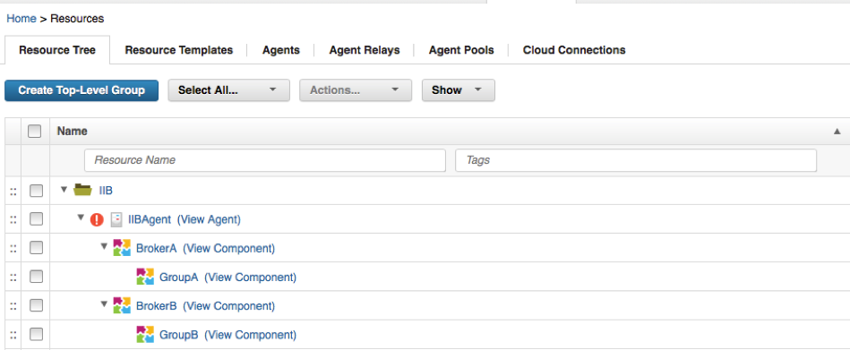](media/iib-resources-1.png)

In this layout, BrokerA and BrokerB are defined at the same level, and they each have their own groups (execution groups). When I configure the UCD applications environments, I add the group as a resource:

[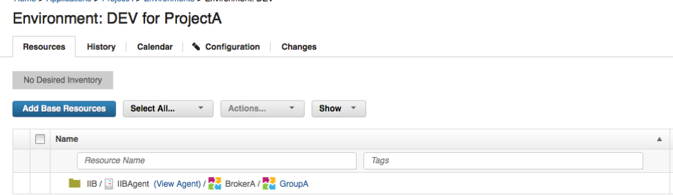](media/iib-env-a.png)

ProjectB would have its own setup similar to this as well. Then if you only wanted UserA to be able to run deployments in ProjectA, we create the UserA user in UCD and add it to a new team Ive called TeamA:

[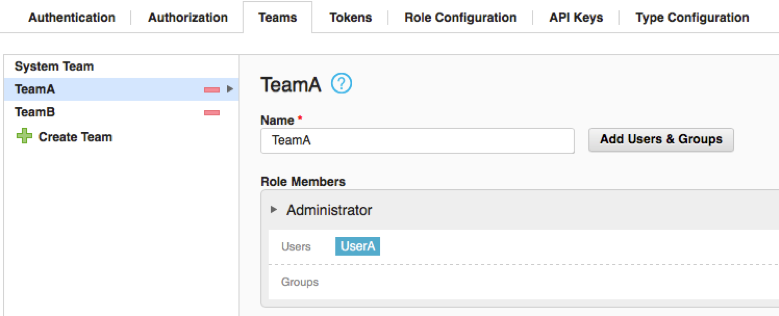](media/iib-team-a.png)

Note that the TeamB also shown in this screeshot has UserB added to it. In TeamA we can determine the objects this team has access to:

[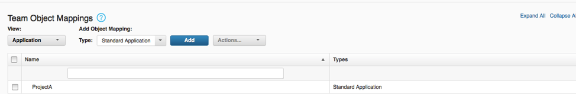](media/iib-team-a-objects.png)

Note that Ive only added ProjectA to the TeamA team. I also add the DEV environment to the TeamA group as well:

[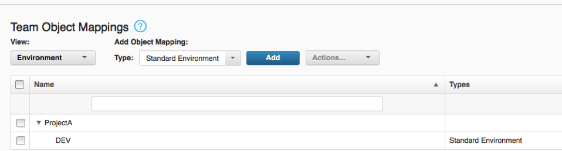](media/iib-team-a-objects2.png)

Now, when I login as UserA I only have access to the applications and environments that Ive mapped to TeamA:

[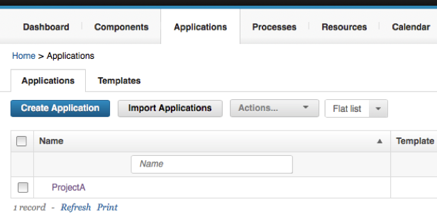](media/iib-project-a.png)

This means that UserA only has access to run processes in the DEV environment of ProjectA, because thats what Ive configured. By mapping UCD objects to IIB objects, you can determine exactly which IIB components each user or team may access. In UCD you can map any object type to a team, which is why I said how they go about this would be determined by how the design their UCD structure. Here are all of the types that you can map to teams in UCD:

[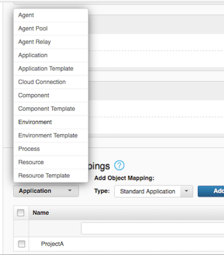](media/iib-mappings.png)


## Deploy a BAR File


## Example

In this process example, the broker archive (.bar) file includes overrides as needed for the target environment. A target execution group exists, and has a JVM heap size sufficient for the .bar file. Alternately, you can run a process step to create an execution group that has the appropriate properties.

1. As required, run the [WMB Set Broker Properties](#wmb_set_broker_properties) step to set runtime properties for the broker.
2. If a target execution group does not exist, run the [Create Execution Group](#create_execution_group) step.
3. As required, run the [Create Or Update Configurable Services](#create_or_update_configurable_service) step to update the properties of the configurable service that the .bar file depends on.
4. As required, run the [WMB Set Execution Group Properties](#wmb_set_execution_group_properties) step to set any required properties for the execution group. Do not set properties, such as JVM heap size, that require a restart of the execution group.
5. Run the Download Artifacts step to copy the .bar file to the target computer.
6. Run the [WMB Deploy](#wmb_deploy) step to deploy the .bar file on the target broker.
7. As required, run the [WMB Set Message Flows Property](#wmb_set_message_flows_property) step to set runtime properties on message flows.
8. As required, run the [WMB Stop Message Flows](#wmb_stop_message_flows) and [WMB Start Message Flows](#wmb_start_message_flows) steps to stop and start message flows.

## Concurrently Deploy BAR Files


There is a known issue in the IBM Integration Bus (IIB) plug-in where multiple BAR files cannot be simultaneously deployed when using the Deploy step. The crux of the issue comes from IIBs CMP Java API and its understanding of the brokers current state during deployment. In these multiple deployments scenarios, IIB will look at the destination and confirm whether or not a file (such as a jar file) exists. Based on its existence, it will then know whether or not to overwrite that location. However, IIB will find a conflict and fail when it expects the destination to be empty. In future deployments, you will find that all concurrent deployments complete successfully and this issue no longer exists. While some Deploy users may be able to deal with this inconvenience during the first deployment, IBM DevOps Deploy has the capability to work around this issue and make it repeatable for other application deployments.


Below I have outlined an Application Process example that can mitigate this deployment error. In this approach, we will design a process that will run sequentially the first time, but then will know, due to an application property, to run concurrently for all future deployments. This process can be generalized to first run a process one way due to the nonexistence of a property, but then run differently based on that property change. This design will require:

* Application Property to remember the deployed state.
* Generic Process and with a single Create Application Property step.
* Component Process with the Deployment process. For the issue outlined above, this process should contain the IIB plug-ins Deploy step.

## Application Process Overview

[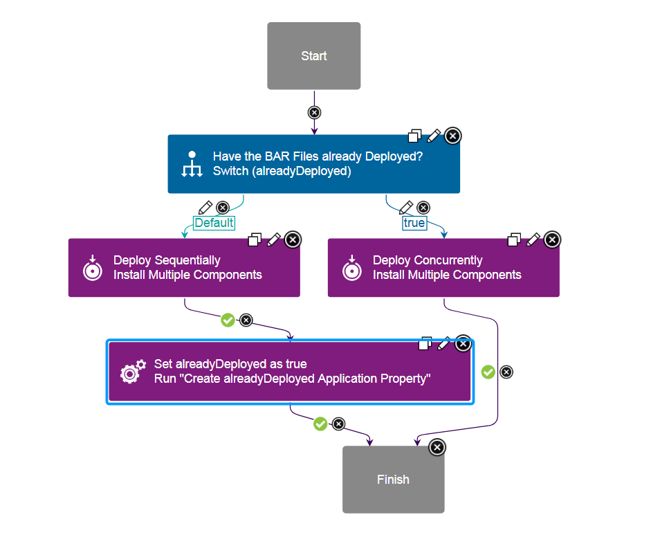](media/applicationproc-1.png)
Application Process Designer


The above screenshot outlines the application process that will control the BAR files deployment. In this process, we assume that multiple components are being deployed simultaneously and are based on the same component template. The application process begins with a Switch step that looks for the **alreadyDeployed** application property. This property will govern whether to deploy the BAR files sequentially or concurrently. If this is the first time running this application process, the **alreadyDeployed** property should be undefined and guide the process down the Default branch. Otherwise, if **alreadDeployed** is found, the true branch will run.


The Default, or left, branch is followed the first time the application process is run. Here the Deploy Sequentially step will run each components Deploy BAR process one at a time. This ensures that there will be no conflicting deployments and all BAR files will be imported successfully. After all deployments are complete, the **Set alreadyDeployed as True** generic process step is run. Utilizing a separate generic process, the application will become updated with the new **alreadyDeployed** property. This property will then be used in all following application processes in the Switch step. Once set to `true`, subsequent application processes will begin to follow the true, or right, branch. This side of the application process allows all component deploy processes to run in parallel. Since a BAR file has been deployed at least one time, deployment conflicts in IIB are no longer a concern and all files are deployed quickly. After the first deployment, the total time will be a factor of 1 rather than N.


## Install Multiple Components Steps

[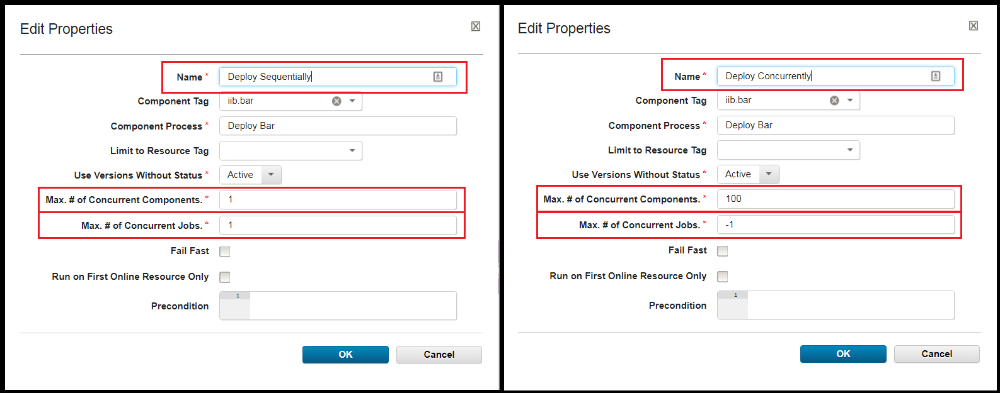](media/deploymulti.png)
Deploy Sequentially and Deploy Concurrently step configurations


The Deploy Sequentially and Deploy Concurrently steps are very similar, but contain two major differences in their configuration. Highlighted by the red squares in the above step configuration, the **Max # of Concurrent Components.** and **Max. # of Concurrent Jobs.** have different values. In the Deploy Sequentially step, both of these values are set to 1. This forces IBM DevOps Deploy to only run a single deployment at a time. These properties are critical to ensure that there are no conflicts during BAR deployments. The Deploy Concurrently step however, may use the default values. Here IBM DevOps Deploy is enabled to run all components simultaneously and drastically decrease future deployment times. Notice that both of these configurations use the same Component Tag and Component Process. In my example, I have tagged my components **iib.bar**.


## Create Application Property: Generic Process


Download JSON: [Create alreadyDeployed Application Property](CreatealreadyDeployedApplicationProperty.txt) process


This deployment solution requires the use of a generic process to properly enable the the parallel deployment strategy. The downloadable JSON file above is my configured generic process to give you a jump start in recreating this example. Simply import this process into your IBM DevOps Deploy server to have a readily available generic process. (The file may need to be renamed to have the .json extension.) Ensure you set the Default Resource in the **Configuration > Basic Settings** as this will make the following configuration step easier. The **Create Application Property** process will create and set the **alreadyDeployed** application property for a specified application. This process utilizes the [IBM DevOps Deploy Applications](https://urbancode.github.io/IBM-UCx-PLUGIN-DOCS/UCD/uDeploy-Application/) plug-ins Create Application Property step.


[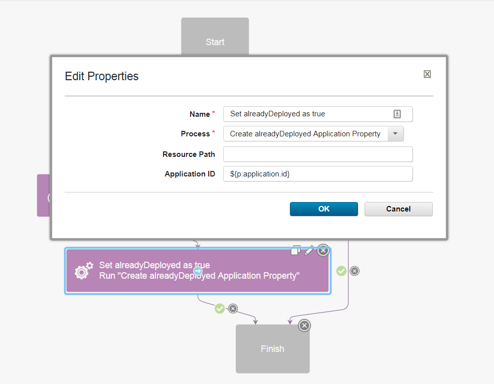](media/setproperty-2.png)
The Applications Generic Process Configuration


The above screenshot shows the application processs step configuration defining the **Create alreadyDeployed Application Property** process. You will need to use a specific application step type found under: **Utility Steps > Run Generic Process** . During configuration and in the above screenshot, you can see a special dynamic property called `Application ID`. This property was initialized in the Create Application Property process that we previously installed. Specifying ```${application.id}``` here enables the generic process to know on which application to create the **alreadyDeploy** property. If you specified a Default Resource in the **Create alreadyDeployed Application Property** process, you can leave the Resource Path blank. Otherwise, it will need to be updated with a direct path to an agent.


## Example Deployments


Below are the DevOps deployment logs from two different deployments. In this example, I have deployed two different components labeled **IIB BAR 1** and **IIB BAR 2**. In the first screenshot, where the **deployedAlready** property was not specified, the Deploy Sequentially (Default) branch was followed. Notice that the two Deploy BAR component processes start times, which about a minute each, do not overlap. IIB BAR 1 is run separately and to completion before IIB BAR 2 begins. Once all component processes are completed, the Create Application Property process is run and the **alreadyDeploy** property is set.


[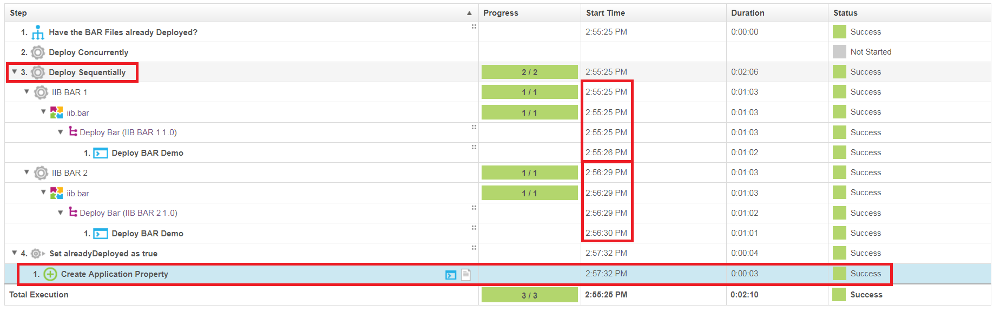](media/sequentially.png)

Sequential Deployment Logs


Now that the deployment scenario has run once, the Deploy Concurrently (true) branch can be followed. In this second screenshot, we can see that the component processes are being deployed simultaneously because the Start Times overlap. In addition, the Duration is approximately half of the first deployment. Lastly, our generic process to set the **deployAlready** variable is not run as it is not part of this branch. From this point on, or unless the application property is modified, all BARs will deploy concurrently.


[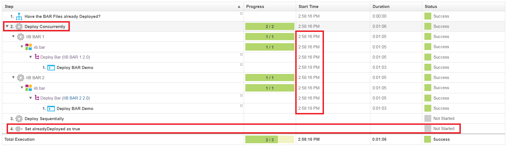](media/concurrently.png)
Concurrent Deployment Logs


## Environment Based Concurrency


This same overall process can be used, with small changes, to solve the same BAR deployment concurrency issues from the environment level. While the application property is simple because it uses a single property, in reality, you will deploying these files to different environments. Inevitably, you will have the same concurrency issues on these other servers as well. To fix this, you will want to create an `alreadyDeployed` property on the environment, rather than application. Follow the screenshots below to see the necessary changes to the above single application property process.


1. In the generic process, replace the Create Application Property step with the Create Environment Property step. Note: The new ```${p:environmentName}``` property.
[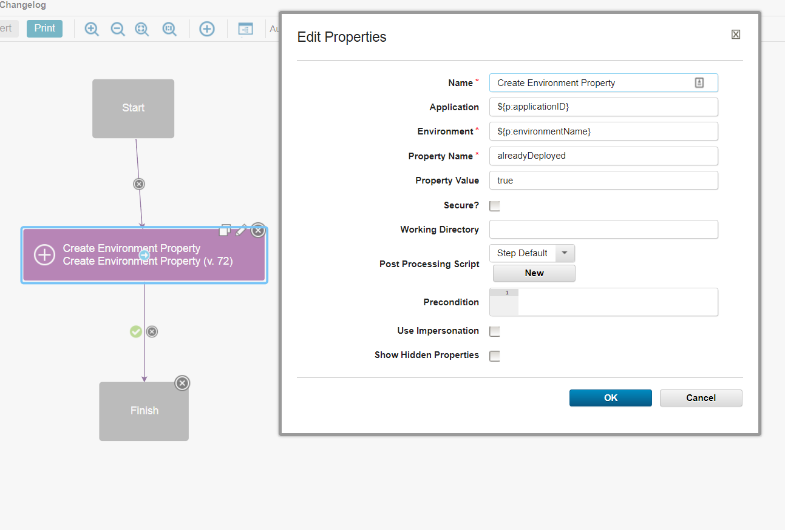](media/generic-process-create-environment.png)
Create Environment Property step and configuration
2. In the generic process configuration, add a new `environmentName` property. You should now have two properties: `applicationID` and `environmentName`
[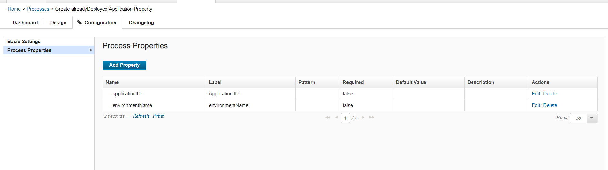](media/generic-process-properties.png)
Generic Process properties
3. In the application processs switch step, update the property name to ```${p?:environment/alreadyDeployed}```. The switch step will now look for an `alreadyDeployed` property on the environment, rather than the application.
[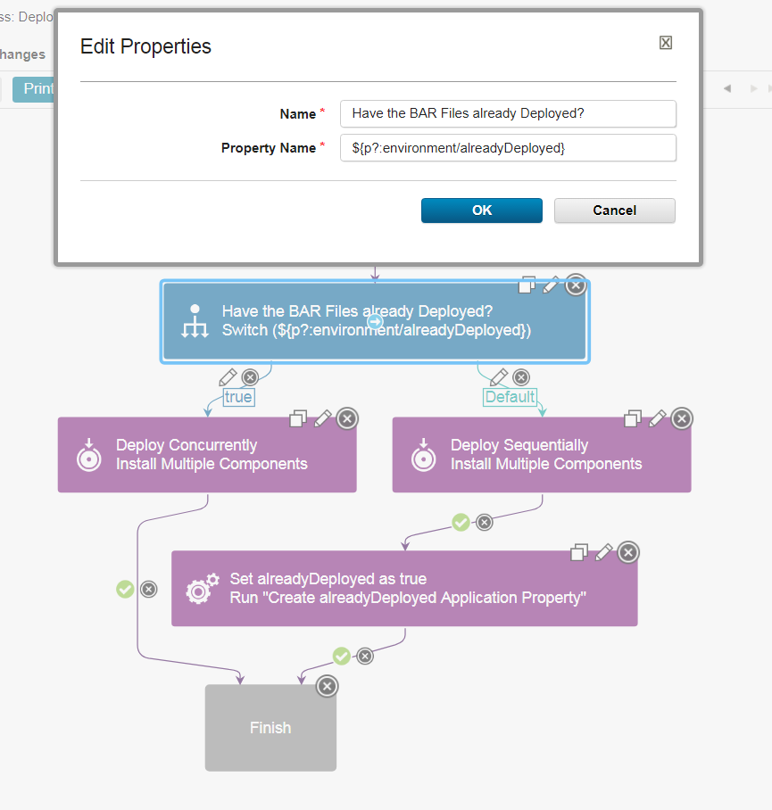](media/app-process.png)
Application ProcessSwitch steps environment property
4. Finally, add the new ```${p:environment.name}``` property to the Run Generic Process step in the application process. The environmentName property is appeared after we added it as a Generic Process property.
[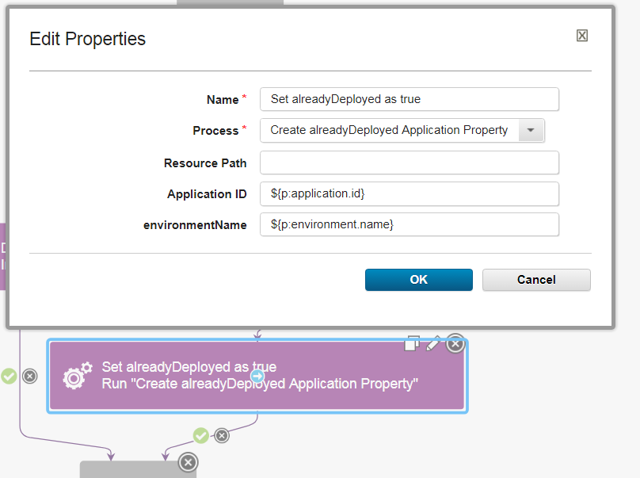](media/new-env-property.png)
Update Application Processs Generic Process step


Once these changes have been made, you can add any number of new environments and the process will know whether or not the BARs should be sequentially or concurrently deployed. On deployments to these environments, you will see the `alreadyDeployed` property on each of these environments.


## Community Involvement


The [IBM Integration Bus plug-in](https://github.com/IBM-UrbanCode/IBM-Integration-Bus-UCD) for IBM DevOps Deploy is a fully supported open source project that is accepting contributions. Please ask any questions about the documentation or plug-in usage on the [GitHub Issues page](https://github.com/IBM-UrbanCode/IBM-Integration-Bus-UCD/issues).


## Common step properties


The steps in the IBM Integration Bus plug-in include properties that are specific to a particular step and properties that are common for all steps. The common step properties include properties that are used to connect to the integration node. Other common step properties include the version of IBM Integration Bus, the path to the required JAR files, and the file to use for trace logging.

The properties that are required to connect to the integration node change based on the version of IBM Integration Bus that you are using.


| Name | Type | Description                                                                                                          | Required |
| ---- | ---- | -------------------------------------------------------------------------------------------------------------------- | -------- |
| IP | String | The IP address of the target server for a remote connection. | Yes |
| Port | String | The web administration port of the target server for a remote connection. | Yes |
| Use SSL | Boolean | Select to enable SSL for security authentication and authorization. By default, SSL is not enabled. | No |
| Username | String | User name for secure authentication of the remote connection. | No |
| Password | Password | Password for secure authentication of the remote connection. A password is required if you specify a user name. | No |


| Name | Type | Description                                                                                                          | Required |
| ---- | ---- | -------------------------------------------------------------------------------------------------------------------- | -------- |
| Integration Node Name | String | Name of the integration node. Specify this value to create a local broker connection. | Yes |


| Name | Type | Description                                                                                                          | Required |
| ---- | ---- | -------------------------------------------------------------------------------------------------------------------- | -------- |
| Channel | String | The name of the WebSphere MQ channel to use. The channel must be defined on the queue manager. | No |
| IP | String | The IP address of the target server for a remote connection. | Yes |
| Port | String | The WebSphere MQ listener port of the target server for a remote connection. | Yes |
| Queue Manager | String | The WebSphere MQ queue manager that the broker is using. | Yes |


|Back to ...||Latest Version|IBM Integration Bus (formerly WebSphere Message Broker) - CMP |||||
| :---: | :---: | :---: | :---: | :---: | :---: | :---: | :---: |
|[All Plugins](../../index.md)|[Deploy Plugins](../README.md)|[47.1156618](https://raw.githubusercontent.com/UrbanCode/IBM-UCD-PLUGINS/main/files/WebSphereMessageBroker-CMP/WebSphereMessageBroker-CMP-47.1156618.zip)|[Readme](README.md)|[Overview](overview.md)|[Troubleshooting](troubleshooting.md)|[Steps](steps.md)|[Downloads](downloads.md)|
