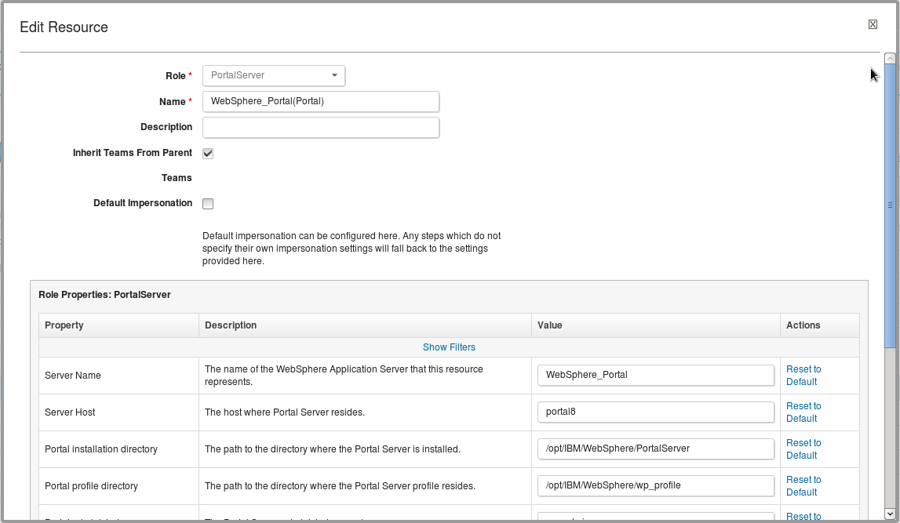
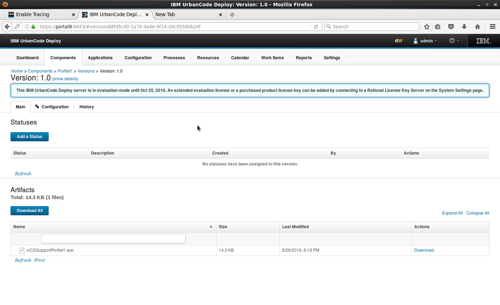
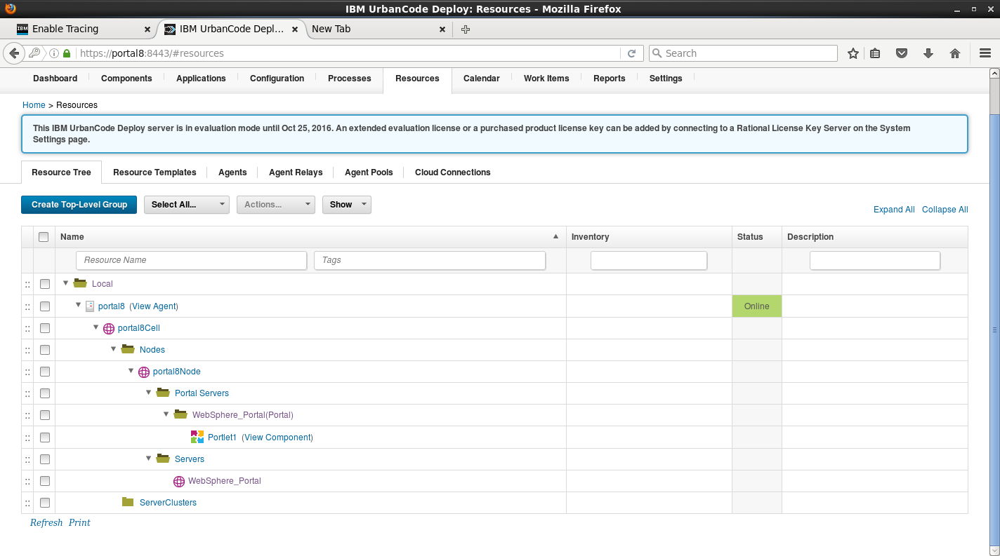
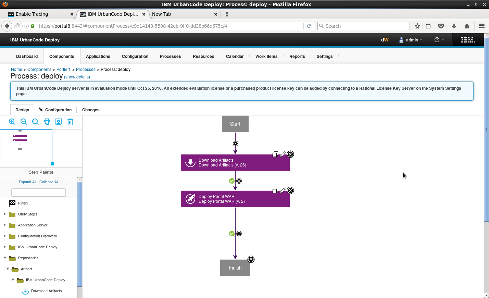
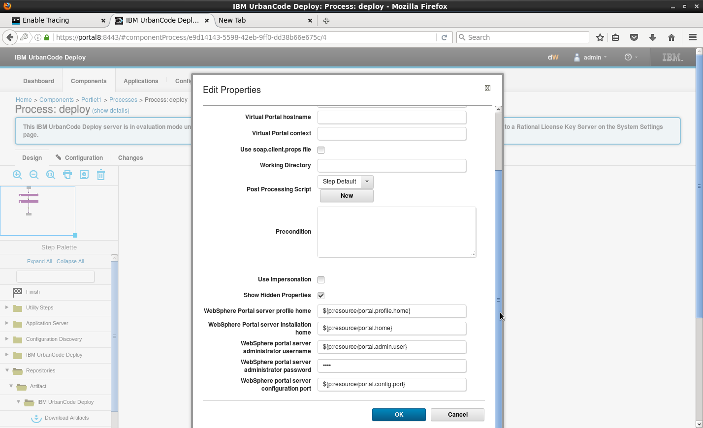
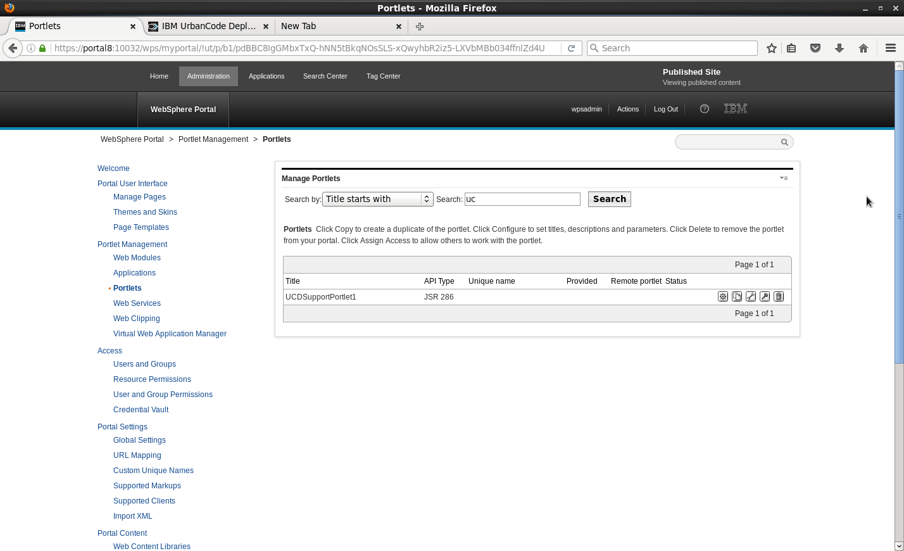

# IBM WebSphere Portal - Usage

## Before you begin

* The IBM DevOps Deploy agent must be installed on the system that hosts the Portal Node.
* If WebSphere Portal Server is deployed in a directory other than the default directory, you must set a property on the agent before you can run the WebSphere Topology Discovery step.
1. Go to **Resources > Agents > *agent-name* > Configuration > Agent Properties**.
2. Add a property that is named `wsadmin.path`.
3. Set `wsadmin.path` to the fully qualified path to the wsadmin script (including the script name).

## Procedure

1. Install the WebSphere Application ServerDeployment plug-in. Skip this step if the plug-in is already installed.
2. Add an agent.
1. Hover your mouse over the row for the resource group, click **Actions**, and then select **Add Agent**.
2. Wait 1030 seconds, then click **Refresh**. A twistie is now next to the agent. When you expand it, a subresource cell, `WebSphereCell`, is displayed.
3. Hover your mouse over the row, then click **Edit**.
4. Enter values for the following properties.
* `WebSphere Profile Path`
* `WebSphere User`
* `WebSphere Password`. If this value is left blank, `soap.properties` is used to locate the password for the user.Leave the `Cell Name` property blank.

**Note:** The SOAP port that is defined in the cell properties must match the `WasSoapPort` property that is defined in the `wkplc.properties` file. For more information, see [Properties file: wkplc.properties](https://www.ibm.com/support/knowledgecenter/SSHRKX_8.5.0/mp/properties/wkplc-dita.html).
5. Click **Save**.
3. On the Resources page, click the **Actions** push button that is associated with the `WebSphereCell` resource, and then click **Configure using WebSphere Topology Discovery**. The discovery step runs. This step might take several minutes. A log is displayed to show progress.
4. When the discovery process completes, close the log window, and then refresh the resource tree. Resources that represent the WebSphere Application Server components are displayed in the resource tree.
5. Define properties for the `WebSphere_Portal` resource, which is located under `*cell\_name*/Nodes/*node\_name*/Portal Servers` in the resource tree. Click the resource, then the **Configuration** tab, then **Resource Properties**. The Edit Resource window is displayed, with **Role** set to **PortalServer**. The heading of the properties table is `Role Properties: PortalServer`, as shown in the following screen capture.
* For ND topology, define the properties for `Portal Cluster`, `Portal Primary Node`, and `Portal Secondary Node` resources.
* For a stand-alone topology, define the properties for the `Portal Node` resource.Define the following properties:

* `portal.home`: Portal installation directory, by default `/opt/IBM/WebSphere/PortalServer`
* `portal.profile.home`: Portal profile directory, by default `/opt/IBM/WebSphere/wp_profile`
* `portal.admin.user`: Portal administrator user name, by default `wpsadmin`
* `portal.admin.password`: Portal administrator password, by default `wpsadmin`
* `portal.config.port`: Portal configuration port, by default `10039`
* `websphere.password`: WebSphere administrator password**Note:** The `portal.config.port` property must match the `XmlAccessPort` property that is defined in the `wkplc_comp.properties` file. For more information, see [Properties file: wkplc\_comp.properties](https://www.ibm.com/support/knowledgecenter/SSHRKX_8.5.0/mp/properties/wkplc_comp-dita.html).
6. Create components for the resources. You need one component for each resource to deploy.
The following example screen capture shows a portlet WAR file that is stored in the root of a component.
7. Add the components to the resources.
1. Go to the resource.
2. Select **Actions > Add Component**.
3. Select the component to use.The following example screen capture shows a portlet component that is mapped to a Portal server.
8. Create the application.
1. Go to Applications.
2. Click **Create New Application** (if one does not exist). You can also use an existing application that is attached to the cell to manage.
3. Enter an application name, then click **Save**.
4. Click the **Components** tab, then add the component that was created by the template generation procedure.
9. Create an application environment.
1. In the Resources page, click **Create New Environment**.
2. Enter an environment name, then click **Save**.
3. Go to the environment editor.
4. Click the environment name, then click **Add Base Resource**. Choose the group for your exemplar cell and environment.
10. Create a component process of type Deployment to deploy a Portal WAR file.
1. On the component page, click **Processes**, and then click **Create Process**. The Create Process window is displayed.
2. Specify a name for the process, select **Deployment** in the **Process Type** list, and then click **Save**.
3. Add a Download Artifacts step and then a Deploy Portal WAR step to the process. The following example screen capture shows a component process that deploys a portlet WAR file. If you edit the Deploy Portal WAR process step, and then select **Show Hidden Properties**, you can see that the step properties correspond to the properties that you defined in step 5 previously.
4. Save the process.
11. Create an application process to install the component.
1. On the application page, click **Processes**, and then click **Create Process**. The Create Process window is displayed.
2. Drag the Install Component step onto the process editor.
3. Select the component and component process that you created previously.
4. Click **Save**.
5. Save the process.
12. To test the newly created component, run the application process on your environment.

Open WebSphere Portal, and then search for the portlet by name. The portlet is displayed, as shown in the following screen capture. You can now add the portlet to a page.

|Back to ...||Latest Version|IBM WebSphere Portal |||||
| :---: | :---: | :---: | :---: | :---: | :---: | :---: | :---: |
|[All Plugins](../../index.md)|[Deploy Plugins](../README.md)|[8.1100783](https://raw.githubusercontent.com/UrbanCode/IBM-UCD-PLUGINS/main/files/WebSpherePortal/WebSpherePortal-8.1100783.zip)|[Readme](README.md)|[Overview](overview.md)|[Troubleshooting](troubleshooting.md)|[Steps](steps.md)|[Downloads](downloads.md)|
