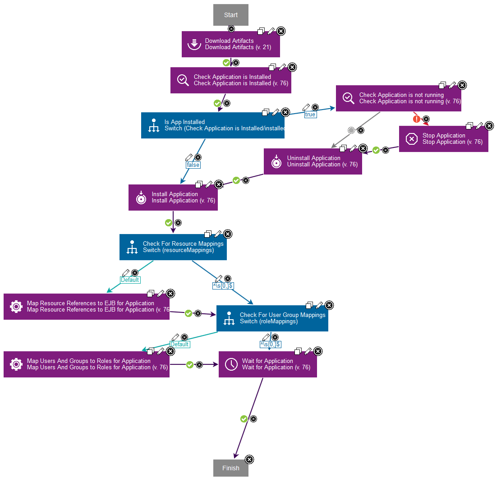

# WebSphere Application Server - Deployment - Usage

- [WebSphere Application Server - Deployment - Usage](#websphere-application-server---deployment---usage)
  - [Usage](#usage)
    - [Specifying multiple profiles](#specifying-multiple-profiles)
    - [Specify websphere.profilePath property](#specify-websphereprofilepath-property)
      - [Values for the websphere.profilePath property</h4](#values-for-the-websphereprofilepath-propertyh4)
    - [Specify wsadmin.path property](#specify-wsadminpath-property)
    - [Do not specify any properties](#do-not-specify-any-properties)
      - [Example: Installing an EAR file on WebSphere Application Server](#example-installing-an-ear-file-on-websphere-application-server)

## Specifying multiple profiles

If you have multiple profiles defined for your WebSphere installation, you may discover all the profiles by using one of the following methods:

## Specify websphere.profilePath property

Specify multiple profiles to collect information for multiple cells, either for the top-level group or for the agent.

You specify multiple profiles during deployment. You specify them in a `websphere.profilePath` property in 1 of 2 places:

- *Top-level group*: Set the `websphere.profilePath` here to collect profiles from multiple cells that are deployed across multiple hosts. All hosts must use the same installation directory for the cell.
- *Agent*: Set the `websphere.profilePath` here to collect profiles for multiple profiles on the same host.

### Values for the websphere.profilePath property</h4

Specify one or more paths as the property value. Separate multiple paths with a comma. The paths can be one of the following types:

- A path to a profile. The path does not have to specify `/bin/wsadmin.sh`, but autodiscovery works with paths that do.
- A path to a container directory of profiles. In this case, the autodiscovery code loops over each first-level directory. It registers base and ND profiles. It skips node and server profiles.

When you specify multiple profiles, the following values are read during autodiscovery:

- SOAP port (read from `portdef.properties`)
- profile path
- installation path

Example value with two container directories and one profile path:`"/opt/IBM/WebSphere/Profiles/,/opt/WAS/Profiles,/opt/IBM/profiles/dmgr"`

Note: If you specify multiple container directories, no duplicates are allowed in the profile names that the directories contain. If autodiscover finds the same profile name, it overwrites the previously found profile name.

Example: `/opt/IBM/WebSphere/Profiles` and `/opt/WAS/Profiles` both contain a `dmgr` profile. A resource is created only for the second `dmgr` resource because the first profile is overwritten.

If you encounter this situation, you can work around it by creating a separate top-level group and segregate the profile directories.

## Specify wsadmin.path property

Starting in version 109, you can also discover multiple profiles if you specify the following property: **wsadmin.path** on the Agent and make it refer to the wsadmin command located in the installation directory of WebSphere Application Server, as follows:

- Navigate to Resources > Agents
- Select the desired Agent name
- Select Configuration > Agent properties
- Add the property: **wsadmin.path** with the value: *WAS\_HOME*\bin\wsadmin.bat or *WAS\_HOME*/bin/wsadmin.sh where *WAS\_HOME* is the installation directory of WebSphere Application Server.

In this case, all the profiles listed in *WAS\_HOME*\properties\profileRegistry.xml will be discovered.

If you specify the path to the wsadmin command contained in one specific profile, only that profile will be discovered.

**NOTE:** The websphere.profilePath property takes precedence over the **wsadmin.path** property if both are specified.

## Do not specify any properties

If you do not specify any properties, the plugin will attempt to discover all the profiles contained in the profileRegistry.xml file, assuming the default installation path of WebSphere Application Server for that operating system.

### Example: Installing an EAR file on WebSphere Application Server

The plug-in now includes component templates. The component templates include processes and properties for working with WebSphere Application Server. See [Using component templates](http://www-01.ibm.com/support/knowledgecenter/SS4GSP_7.1.1/com.ibm.udeploy.doc/topics/comp_template_using.html) in the product help. If you create a component from the WebSphere Enterprise Application template, you can use the Deploy EAR With User/Group Mappings, Resource Mappings process in the template to install the EAR file. The process uses switch steps as needed to test property values. See [Switch steps](http://www-01.ibm.com/support/knowledgecenter/SS4GSP_7.1.1/com.ibm.udeploy.doc/topics/comp_process_switch.html) in the product help. The Deploy EAR With User/Group Mappings, Resource Mappings process runs the following steps:

1. The **Download Artifacts** step retrieves the binary files.
2. The **Check Application is Installed** step tests whether the application is already installed.
3. The **Is App Installed switch** step tests the installed output property from the **Check Application is Installed** step and branches accordingly.
4. If the application is already installed, the **Check Application is not running**, **Stop Application**, and **Uninstall Application** steps run as needed to stop and uninstall the application.
5. The Install Application step installs the application.
6. The Check For Resource Mappings switch step tests the resourceMappings property and branches accordingly.
7. The **Map Resource References to EJB for Application** step updates the resource reference mappings.
8. The **Check For User Group Mappings switch** step tests the roleMappings property and branches accordingly.
9. The **Map Users And Groups to Roles for Application** step maps users to roles.
10. The **Wait for Application** step introduces a delay to allow time for the application to start.

