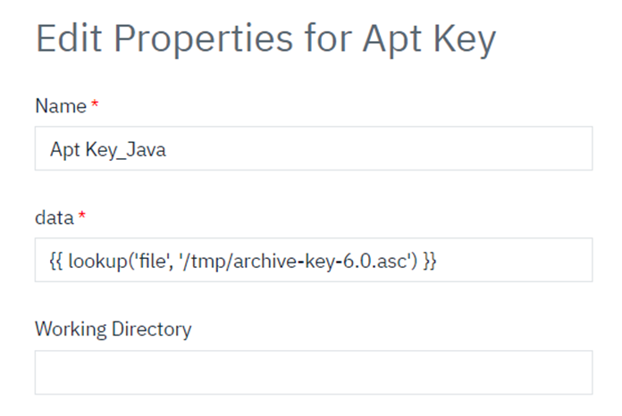

# Ansible - Usage

The Ansible plugin enables seamless integration of an Ansible environment into your deployment process. It provides a broad selection of modules, each of which can be utilized as discrete steps within your automation pipeline.

## **Providing Example Usage for Each Ansible Plug-in Step (Module):**

- [Command](#command)
- [Copy](#copy)
- [File](#file)
- [Get URL](#get-url)
- [Line In File](#line-in-file)
- [Pip](#pip)
- [Apt](#apt)
- [Service](#service)
- [Shell](#shell)
- [Unarchive](#unarchive)
- [AShell](#ashell)
- [GetBuiltInAnsibleProperties](#getbuiltinansibleproperties)
- [Apt Key](#apt-key)
 
## **Command**
The Command module is used to execute commands on a remote node. It is primarily utilized for running simple Linux commands on remote nodes or servers that are part of a host group or standalone server within that group. If you need to run basic shell commands on a remote server, the Command module is the ideal choice.

[]

## **Copy**
The Copy module transfers files or directory structures from a local or remote machine to a specified location on a remote machine. It allows you to set file system meta-information (such as permissions and ownership), even if the file or directory already exists on the target system. Additionally, certain meta-information can be copied upon request.

[]

## **File**
The File module is used to manage files and directories on remote hosts. It allows you to create, delete, modify permissions, and manage file ownership on remote nodes.

[]

## **Get URL**
The get_url module is used to access remote URLs (HTTP/HTTPS/FTP) and download files or packages, saving them locally.

[]

## **Line In File**
The lineinfile module is useful for adding, removing, or modifying a single line in a file. It allows you to use conditions and regular expressions to match the line before making changes. Additionally, you can reuse and modify the matched line using back-reference parameters.

[]

## **Pip**
The pip module is used to manage Python library dependencies.

[]

## **Apt**
The apt module is used to manage packages on Debian-based systems, including Ubuntu, that use the apt package manager. You can leverage the apt module to perform tasks such as installing, removing, and updating packages on remote hosts.

[]

## **Service**
The service module is used to manage services on remote systems. It offers a consistent and declarative approach to starting, stopping, restarting, and checking the status of services across various operating systems, helping to automate and standardize infrastructure management.

[]

## **Shell**
The shell module is used to execute shell commands on target Unix-based hosts. Unlike the command module, the shell module supports more complex commands, including those with pipes, redirection, and other advanced shell features. It also allows you to run shell scripts on remote systems.   
Ex: Shell script execution.   
[]
   
Ex: Two commands execution with pipe.   
[]

## **Unarchive**
The unarchive module is used to unpack or decompress files from archive formats such as .tar, .tar.gz, and .zip. This module can optionally copy the archive files to the remote server before extracting their contents.

[]

## **AShell**
This step for Automation shell using raw Ansible step script. The Ansible plugin allows Deploy to execute various Ansible module commands and any missing(The ansible plug-in does not contain) commands can be executed through an AShell plugin step.

[]

Example script with various ansible modules and missing(The ansible plug-in does not contain) module(raw) commands.
[]

## **GetBuiltInAnsibleProperties**
This step is used to read built-in Ansible variables (ansible_facts). It functions similarly to the Ansible setup module, where the queryKey parameter is equivalent to the filter parameter. This step returns the output value of the specified Result Key(Example: "result: jammy"). 

[]

## **Apt Key**
The apt_key module is for manage the keys for APT repositories on Debian-based systems (such as Debian, Ubuntu, and their derivatives). APT (Advanced Package Tool) uses keys to verify the authenticity of packages in repositories. The apt_key module allows you to add, remove, or manage these keys on remote hosts.

Requirements: The below requirements are needed on the host that executes this module.   
* gpg

Ex: Add a key from a file on the Ansible server.   
[]

