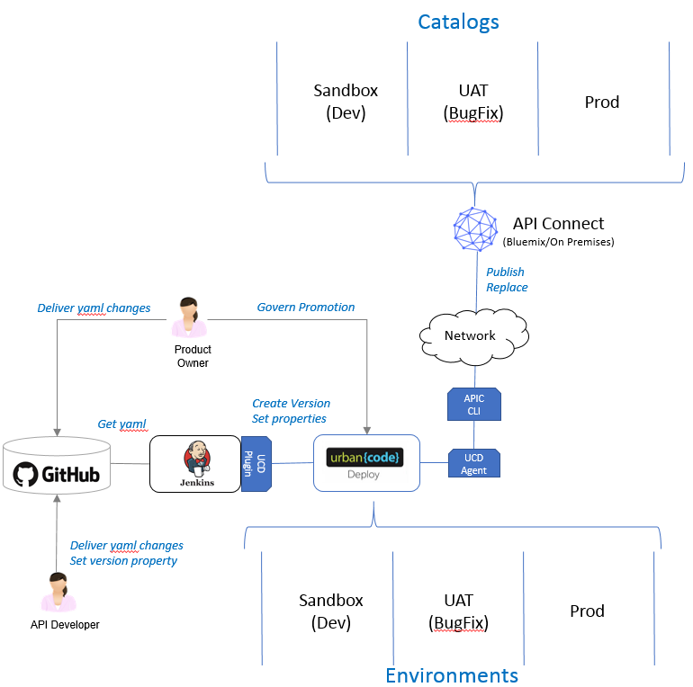

# IBM API Connect - Tutorials

- [IBM API Connect - Tutorials](#ibm-api-connect---tutorials)
  - [Tutorials](#tutorials)
    - [Using the plug-in with API Connect Version 2018](#using-the-plug-in-with-api-connect-version-2018)
    - [Hybrid API DevOps](#hybrid-api-devops)
    - [Using the API Connect plug-in video](#using-the-api-connect-plug-in-video)

## Using the plug-in with API Connect Version 2018

There are differences in using the IBM API Connect plug-in with the API Connect Version 2018 from the previous versions. The following video demonstrates how to use the plug-in with API Connect Version 2018.

## Hybrid API DevOps

A DevOps platform for APIs provides the ability to streamline and automate the process of developing, building, testing and deploying APIs onto the API runtime cloud platform either when these APIs are organically developed or when they are exposed endpoints to existing backend services.

The GitHub repository [refarch-hybridcloud-blueportal-api](https://github.com/ibm-cloud-architecture/refarch-hybridcloud-blueportal-api) provides an in depth tutorial on implementing GitHub, Jenkins, DevOps Deploy, and API Connect into a single devops integration. This walkthrough was first introduced as a full lab session at IBM Interconnect 2017.

## Using the API Connect plug-in video

The Using the API Connect plug-in video complements the information on the [Usage](usage.md) page.

