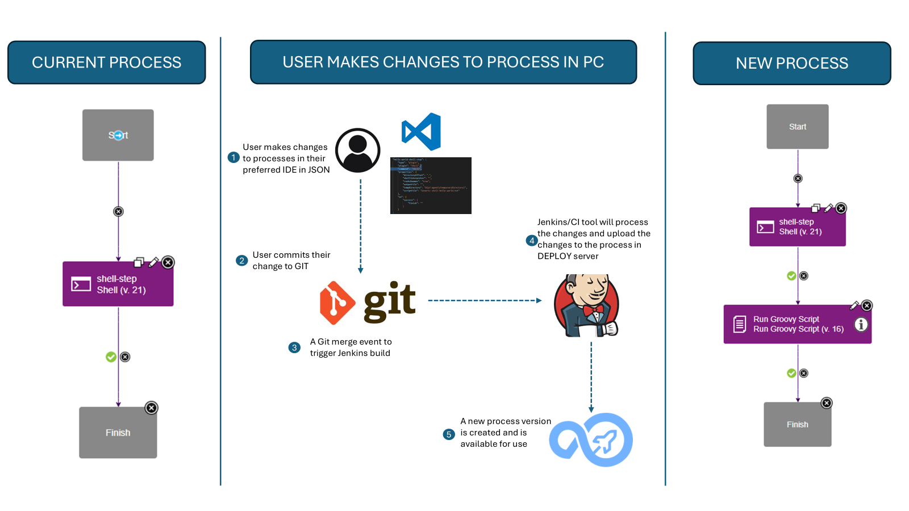
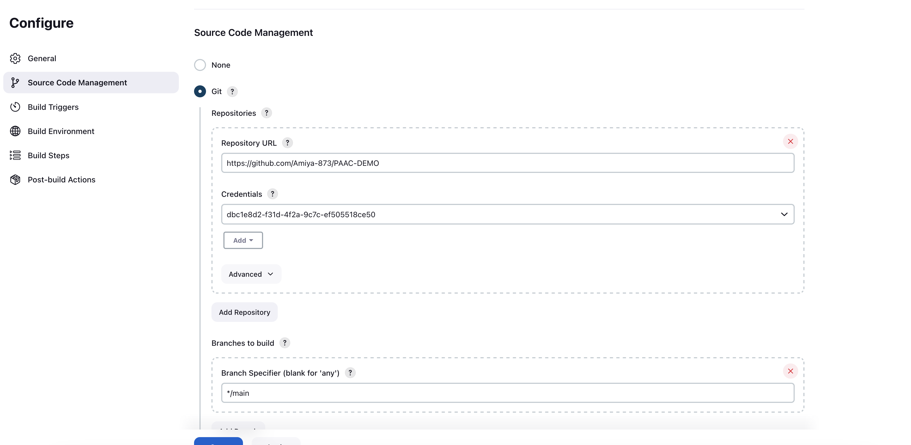
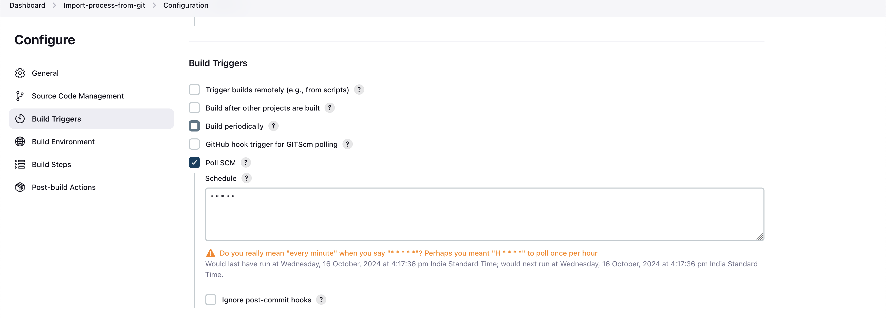
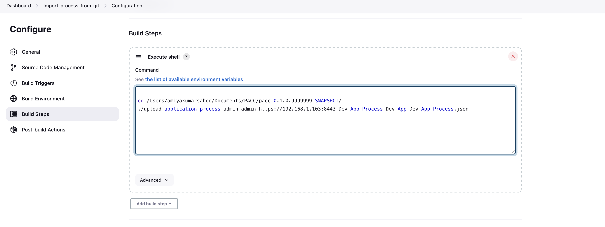
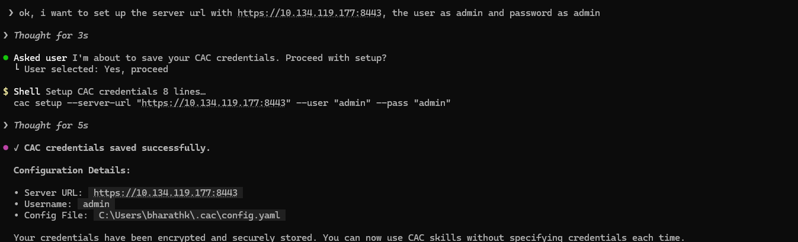
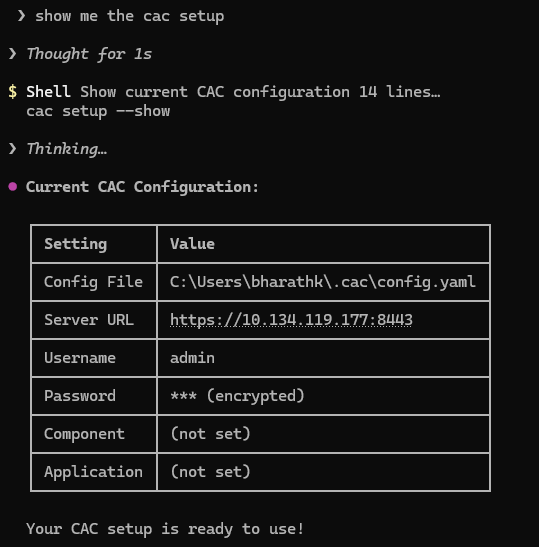
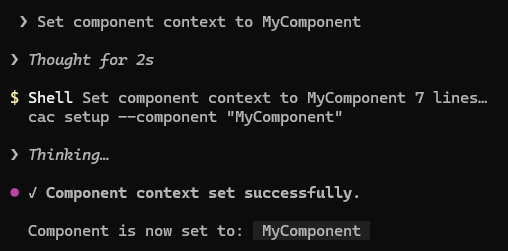
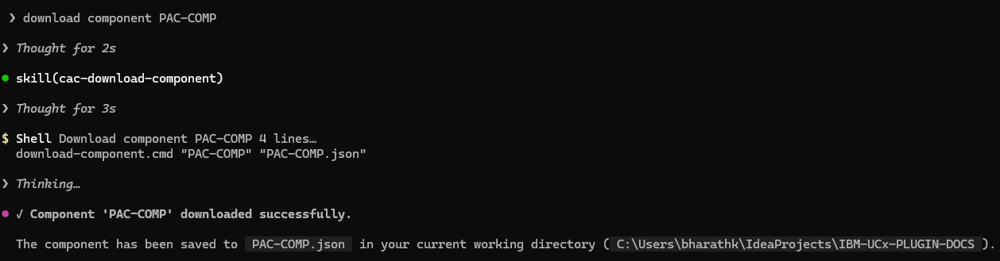
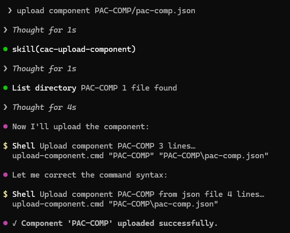

# Integrations

## Steps to Integrate CAC(using paac-0.1.0.1171817-beta) with DevOps Deploy using Jenkins

### Problem Statement:
Need to update an existing process stored in GitHub in JSON/YAML format to DevOps Deploy. The process can be of any type: **Generic**, **Component**, or **Application**.

### Illustration of an Integration Architecture

### Prerequisites:
- A up and running Jenkins instance.
- The CAC CLI should be present on the machine where the Jenkins server is installed.
- Permissions to update the process being worked on.

### Configurations Needed in Jenkins:

1. **Create a New Freestyle Project**  
   In Jenkins, create a new Freestyle project. Name it something like "Import-process-from-git".

2. **Configure the Source Code Management Section**  
   Add the Git credentials where the processes are stored.  
   

3. **Configure the Build Triggers Section**  
   Check the "Poll SCM" checkbox.  
   In the "Schedule" text box, provide `* * * * *` to poll for changes every minute from the Git repo.  
   

4. **Configure the Build Steps Section**  
   Add an "Execute Shell" option.  
   In the "Execute Shell" command box, change the current working directory to the directory where the CAC CLI is present.  
   Then execute the command (refer to the **List of All Commands** section) according to the type of process you're working with.  
   

5. **Make Changes to Your JSON File**  
   Use any IDE to make changes to the JSON file and push the changes to GIT.

6. **Jenkins Polling and Job Trigger**  
   Once changes are merged to the main or master branch (depending on your setup in step 2), Jenkins will poll the repository and trigger a job.  
   This will result in updating the process in DevOps Deploy.

---

## Steps to Set Up and Use CAC with DevOps Deploy using AI Skills

### Problem Statement:
An end user wants to configure CAC credentials, download existing DevOps Deploy configurations (components, applications, environments, or processes), edit them locally, and upload the modified configurations back to the server — all using natural language through an AI-capable CLI environment, without needing to memorize CAC command syntax.

### Prerequisites:
- The CAC CLI should be installed and available on the system `PATH`.
- An AI-capable CLI environment (e.g., GitHub Copilot CLI, Devin CLI) should be set up and running.
- CAC AI Skill definition files should be installed in the agent directory used by your AI-capable CLI environment.
- Access credentials (username, password) and the DevOps Deploy server URL should be available.
- Permissions to download and upload the configurations being worked on.

### Workflow Steps:

1. **Set Up CAC Credentials Using the Setup Skill**  
   Use natural language to configure the server URL, username, and password so that subsequent commands do not require credentials to be passed each time.  
   *Example prompt:*  
   `"Set up CAC with server https://ucd.example.com:8443, user admin, and password secret"`  
   This invokes `cac setup` and stores the credentials locally at `~/.cac/config.yaml`.
   
   

2. **Optionally Set Context for Target Resources**  
   If you plan to work repeatedly with a specific component or application, set the context to avoid specifying resource names in every command.  
   *Example prompts:*  
   `"Set component context to MyComponent"`  
     
   `"Set application context to MyApp"`

3. **Download Configurations from DevOps Deploy**  
   Use natural language to download the desired configuration (component, application, environment, or process) as a JSON or YAML file.  
   *Example prompts:*  
   `"Download component MyComponent as JSON"`  
     
   `"Export application MyApp to myapp.yaml"`  
   `"Fetch the generic process DeployProcess"`

4. **Edit the Downloaded Configuration Locally**  
   Open the downloaded JSON or YAML file in any IDE or text editor. Make the required changes — such as updating properties, tags, teams, cleanup policies, or process steps.

5. **Upload the Modified Configuration**  
   Use natural language to upload the edited file back to DevOps Deploy.  
   *Example prompts:*  
   `"Upload component from MyComponent.json"`  
     
   `"Import application from myapp.yaml"`  
   `"Push the generic process from DeployProcess.json"`

6. **Verify the Changes**  
   Log in to the DevOps Deploy UI or use a download command to confirm that the uploaded configuration reflects the intended changes.

### Important Notes:
- The effectiveness of AI Skill triggering depends on the underlying AI agent and model used in your CLI environment. Skill activation accuracy may vary across different models.
- Always review the operation and results before proceeding with changes to your DevOps Deploy environment.
- Refer to the **CAC AI Skills User Guide** in the Usage section for the complete list of supported skills, activation phrases, and parameters.

---
