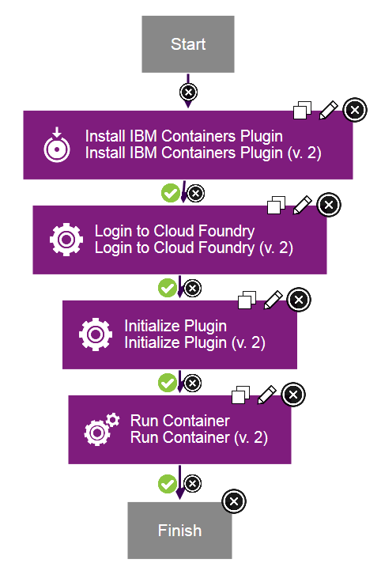

# IBM Containers - Usage

To use the steps in the plug-in, you must first install and initialize the plug-in. To install and initialize the plug-in, complete the following steps in the process editor:

1. Add the [Install IBM Containers Plug-in](#install_ibm_containers_plugin) step to the process. Ensure that the **Cloud Foundry CLI Path** field is set to the directory that contains the Cloud Foundry command-line utility.
2. Add the [Login to Cloud Foundry](#login_to_cloud_foundry) step to the process. Again, ensure that the **Cloud Foundry CLI Path** field is set to the directory that contains the Cloud Foundry command-line utility. Also, specify the Cloud Foundry user name, password, and API endpoint. Optionally, specify the Cloud Foundry organization and space.
3. Add the [Initialize Plug-in](#initialize_plugin) step to the process. This step initializes the command-line interface to use the plug-in that is installed by the [Install IBM Containers Plug-in](#install_ibm_containers_plugin) step.

After these steps have run, the plug-in is installed and initialized. You can now run the following plug-in steps: [Build Image from Dockerfile](#build_image_from_dockerfile), [Run Container](#run_container), [Start Containers](#start_containers), [Stop Containers](#stop_containers), [Set Namespace](#set_namespace), [Request IP Address](#request_ip_address), [Release IP Address](#release_ip_address), [Bind IP Address](#bind_ip_address), [Unbind IP Address](#unbind_ip_address), [Execute Command On Container](#execute_command_on_container), [Create Group](#create_group), [Remove Group](#remove_group), and [Update Group](#update_group).

The following screen capture shows an example process that installs and initializes the plug-in, and then runs a container: 

|Back to ...||Latest Version|IBM Containers ||||
| :---: | :---: | :---: | :---: | :---: | :---: | :---: |
|[All Plugins](../../index.md)|[Deploy Plugins](../README.md)|[6.1103420](https://raw.githubusercontent.com/UrbanCode/IBM-UCD-PLUGINS/main/files/cloud-foundry-ibm-containers/cloud-foundry-containers-6.1103420.zip)|[Readme](README.md)|[Overview](overview.md)|[Steps](steps.md)|[Downloads](downloads.md)|
