# HP LoadRunner - Usage

* [Default UCD Analysis Template](#default-ucd-analysis-template)
* [Customizing Analysis Templates](#customizing-analysis-templates)
* [Uploading Reports to Codestation](#uploading-reports-to-codestation)

## Uploading Reports to Codestation

After the Run Test Scenario step successfully executes you can utilize the IBM DevOps Deploy Versions plugin to upload the results to code station. This plugin is installed by default in the DevOps Deploy server, so theres not need to install it separately.

When the HP LoadRunner plugin runs analysis on the test results it creates a folder inside of the steps working directory. This folder holds all of the reports generated during analysis. It also holds the files used to run the analysis, including the LRR (LoadRunner Results) file. The name for this directory will be determined by the value specified in the LoadRunner Results Name field of the plugin step.

Here is the default configuration for the Run Test Scenario step: [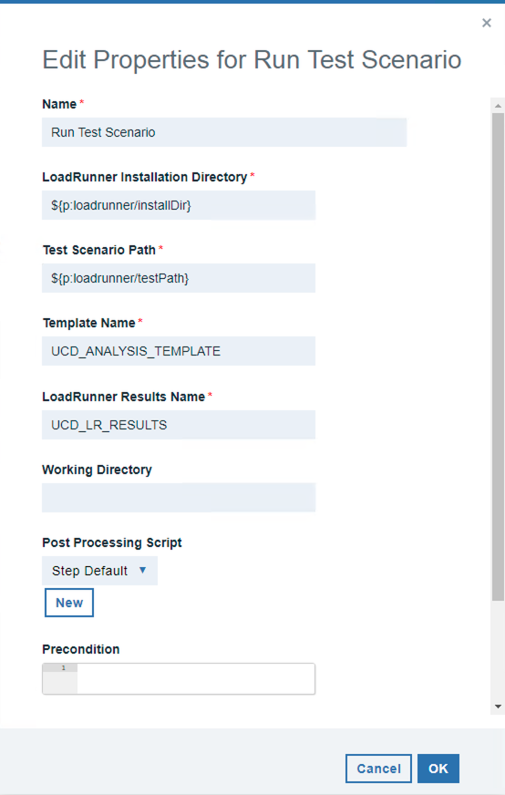](media/screen-shot-2018-11-15-at-2.25.23-pm.png)

Using this default configuration youll find the analysis results in the UCD\_LR\_RESULTS directory in your agents working directory. The default analysis template UCD\_ANALYSIS\_TEMPLATE generates an HTML report called An\_Report1.

[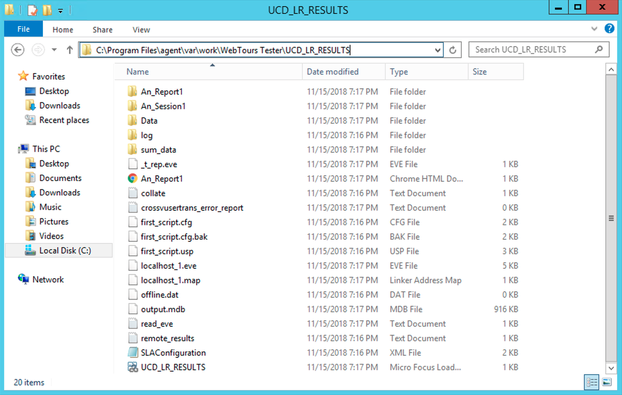](media/screen-shot-2018-11-15-at-2.30.26-pm.png)

Note that if you were to provide a different working directory, the folder would be created there instead of in the `agent_install_dir`/var/work/ directory.

To upload the report generated in this folder to codestation, you can utilize the Create Version step of the IBM DevOps Deploy Versions plugin. Further documentation on this step can be found in the [IBM DevOps Deploy Versions steps document](https://urbancode.github.io/IBM-UCx-PLUGIN-DOCS/UCD/uDeploy-Version/steps.html#create_version).

[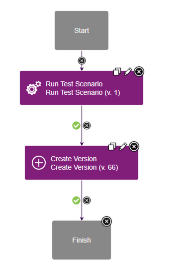](media/screen-shot-2018-11-15-at-2.55.41-pm.png)

In this example I am creating a new version to hold the reports. For this reason the component process that I have designed is an operational process that does not require an already created version to run. It is possible to use a similar approach with a deployment type component process, and modify the component version that is being used for the deployment. This approach would require usage of the udclient command-line utility, or the UCD REST API directly. For more information please see the [addVersionFiles documentation page](https://www.ibm.com/support/knowledgecenter/SS4GSP_7.0.1/com.ibm.udeploy.api.doc/topics/udclient_addversionfiles.html).

In the Create Version steps configuration youll need to specify a name for the component, the version name, and the files to include. In this example I am using the current component as the component to create the new version on, by referencing the component.name property.

[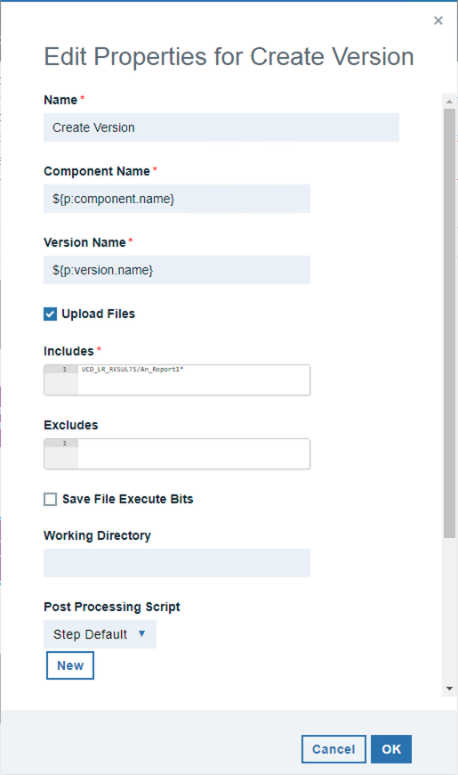](media/screen-shot-2018-11-15-at-2.22.00-pm.png)

As Ive stated, this process will be executing without a component version. I have instead, created a version.name property as an application process property. When the application process is run, it will prompt for a version name. As you can see above, that version.name property is being used to create the new component version.

The Includes field will determine which files and directories will be published to the new component version. I have chosen to include everything in the results directory.

[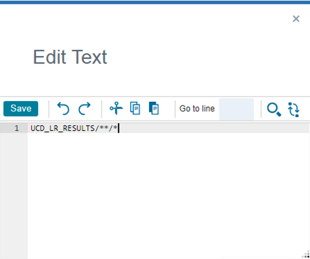](media/screen-shot-2018-11-15-at-3.13.22-pm.png)

After this process runs, a new version is created on the component with the name that Ive specified for the version.name application process property at runtime. This new version contains everything generated in the results directory. This includes all reports and results files. You can further specify exactly which reports and directories you want to create on the version in the Includes field of the Create Version step.

[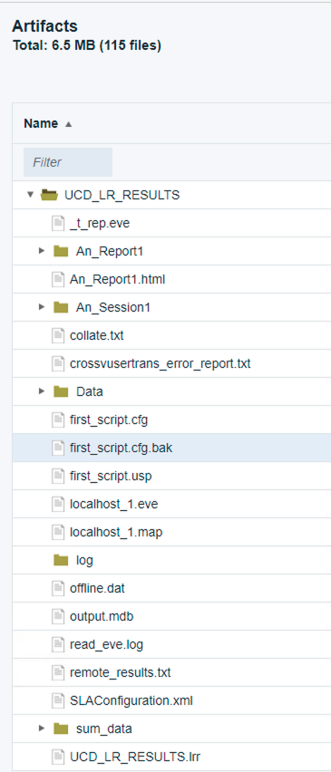](media/screen-shot-2018-11-15-at-3.18.19-pm.png)

## Customizing Analysis Templates

The HP LoadRunner plugin allows you to specify custom defined analysis templates. You may need to use a custom analysis template if:

* You are unable to give the agent user permissions to the LRAnalysis80.ini file. Please see the [Default UCD Analysis Doc](#default-ucd-analysis-template) for more information.
* You require specialized graphs or different report file types to be generated.

Before you can create your own custom HP LoadRunner Analysis template youll need to generate a MicroFocus LoadRunner Result File (LRR).

You can generate a MicroFocus LoadRunner Result File in one of two ways:

1. Run the HP LoadRunner plugin
* This will generate the LRR file in your plugin steps working directory under a subdirectory of the name youve specified for the plugin steps LoadRunner Results Name field.
* For instance, if you use the default working directory of a component named LR Test and specify the plugin steps LoadRunner Results Name as the default UCD\_LR\_RESULTS, youll find the UCD\_LR\_RESULTS.lrr file located in the following directory: [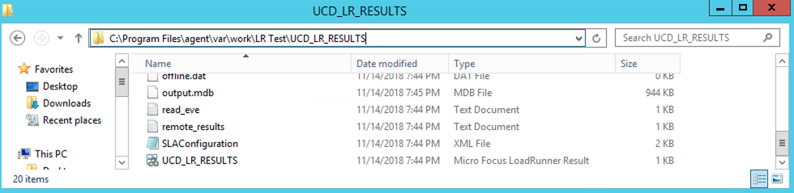](media/screen-shot-2018-11-14-at-4.12.30-pm-2.png)
2. Run your Test Scenario in the HP LoadRunner Controller directly
* You can find more information for running HP LoadRunner Test Scenarios from the Micro Focus [Running Scenarios in Controller](https://admhelp.microfocus.com/lr/en/12.60/help/WebHelp/Content/Controller/toc_running_scenarios.htm) documentation.

## Creating the analysis template in HP LoadRunner

After you open the LRR file in your HP LoadRunner Controller you can open the templates tool under the tools tab.

[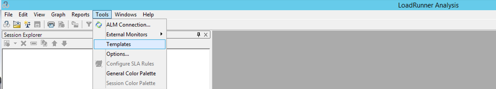](media/screen-shot-2018-11-14-at-2.46.00-pm-1.png)

From here youll select to add a new template and give it a name. It should be noted that it is a bad idea to select UCD\_ANALYSIS\_TEMPLATE as your new template name. If youve ever run the plugin with the default UCD\_ANALYSIS\_TEMPLATE template that is provided with the plugin, creating a new template of the same name will overwrite the imported one in HP LoadRunner. Also, if you intend to run with the plugins UCD\_ANALYSIS\_TEMPLATE in the future it will overwrite your custom made template of the same name.

[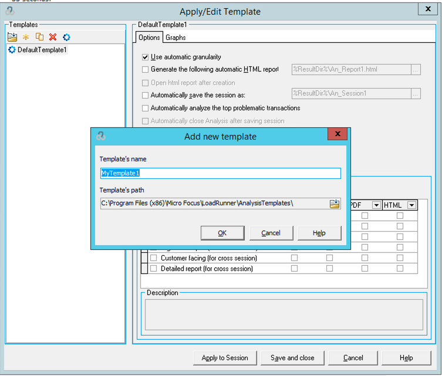](media/screen-shot-2018-11-14-at-5.12.11-pm.png)

After you create the new template you can configure all of the report generation options that you desire. Two of the options that you need to configure for the plugin to work with your custom template are the Automatically save the session as and Automatically close Analysis after saving session. If these two boxes arent checked your plugin step will continue executing until you go into the machine and manually close the Analysis tool.

[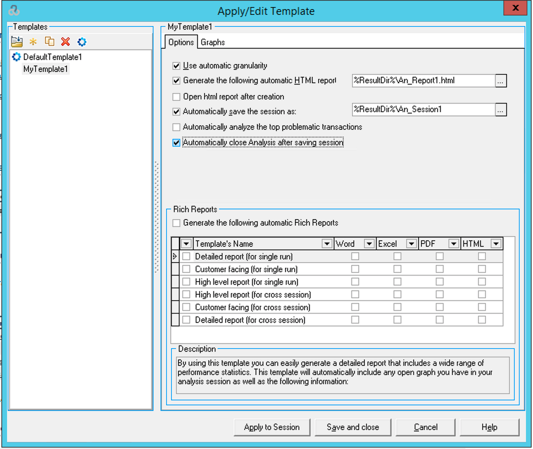](media/screen-shot-2018-11-14-at-5.56.00-pm.png)

To use the template in the plugins Run Test Scenario step, you can specify the name that youve created the template with for the Template Name field. This will run the specified test scenario and then run the analysis using your custom analysis template.

[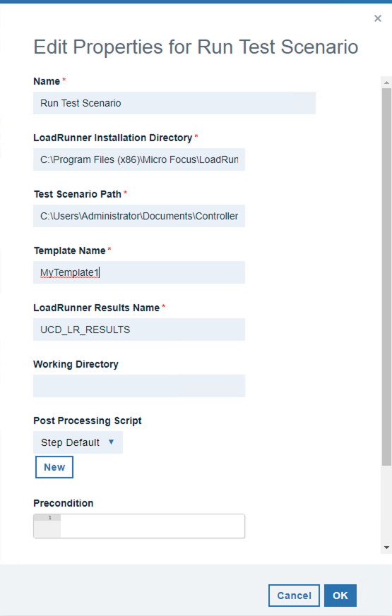](media/screen-shot-2018-11-15-at-1.49.01-pm.png)

## Default UCD Analysis Template

This plugin comes with a predefined HP LoadRunner analysis template called UCD\_ANALYSIS\_TEMPLATE. Specifying this template for the plugin steps Template Name field will automatically install and use the template for analysis. UCD\_ANALYSIS\_TEMPLATE is also set as the default value for the Template Name field.

[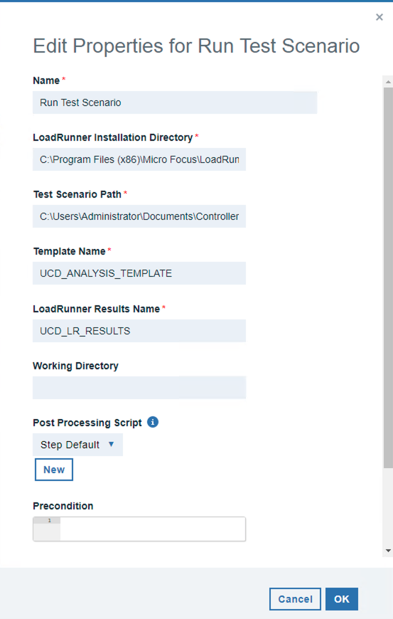](media/screen-shot-2018-11-15-at-1.43.59-pm.png)

In order to use the default template, the agent user must have privileges to read and write to the LRAnalysis80.ini file. This configuration file can be found at the following system path `<LoadRunnerInstallDir>`\config\LRAnalysis80.ini.

[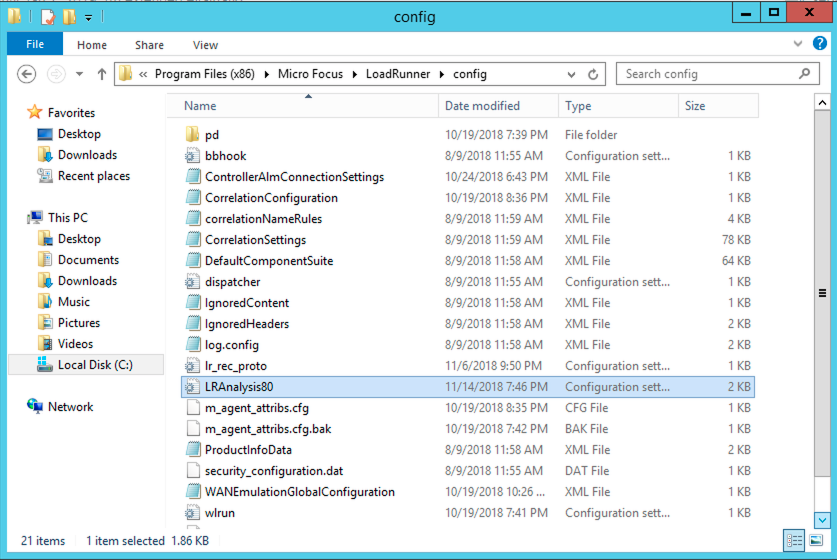](media/screen-shot-2018-11-14-at-2.53.18-pm.png)

After executing this step youll notice a new template in your LoadRunner Analysis tool. Open the LoadRunner Analysis tool and click on templates under the tools tab.

You can view all of the preconfigured settings of the UCD\_ANALYSIS\_TEMPLATE. It should be noted that any manual changes to this template will be overwritten when the plugin step runs again. For this reason, if you require a more custom template you may create your own and specify the name in the plugin step. Please see the plugin document entitled Customizing Analysis Templates for more information on using custom templates.

[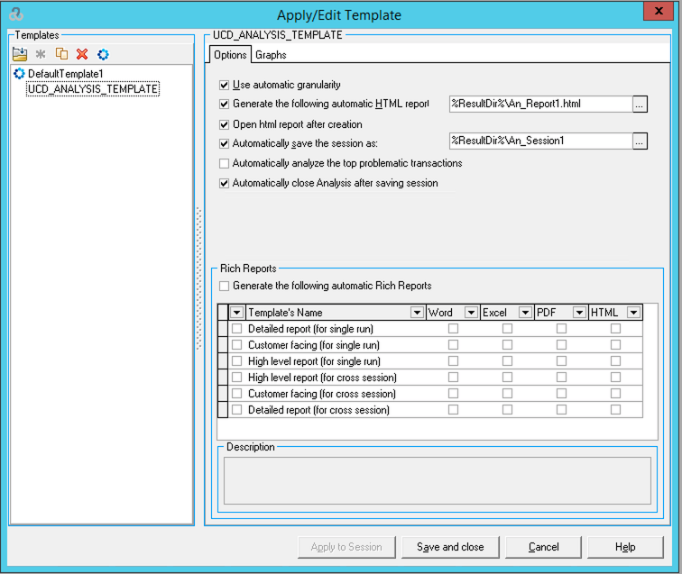](media/screen-shot-2018-11-14-at-2.46.11-pm.png)

After the step runs it will generate an HTML report file called An\_Report1.html in your working directory. This directory will be the components working directory in the UCD agent by default.

