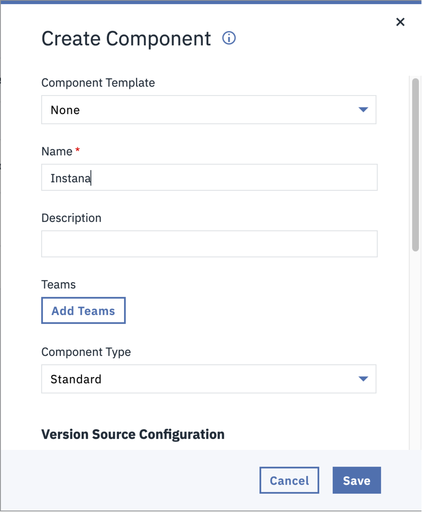

# IBM Instana - Usage

## Overview

This plug-in provides the [Add Global Release Marker](steps.md#add-global-release-marker) step.

## How to use

### Adding Instana “Add Global Release Marker” step to a Component process

* Working in a Component process, drag the “Instana” > “Add Global Release Marker” step from the step palette to the process designer area.
  * 
* Connect the “Add Global Release Marker” at the desired location in the component deployment process.
  * 
* Edit the “Add Global Release Marker” process step providing values for the following fields:
  * Instana Base URL
  * E.g. <https://ibmdevsandbox-instanaibm.instana.io>
  * Authorization Token
  * Generated by Instana instance
* Click “OK” to save the changes.
* “Save” the Component process.

### Adding Instana “Add Global Release Marker” step to an Application process

* On the Component page, create a new default Component named “Instana” (or a meaningful name of your choice) and click “Save”.
  * 
* In the new Component, create a new process of type “Operational (No Version Needed)”, provide a meaningful name, and click “Save”.
  * 
* From the Step Palette on the left, drag the Instana -> Add Global Release Marker  step to the process designer interface.
* Edit the “Add Global Release Marker” process step, add values for the Instana URL and Authorization Token fields, and click OK to save the changes.
  * 
* Save the process.
* Navigate to the Applications main page and open the Application you want to add the “Add Global Release Marker” process step to.
* Click on Components, add the new Component (i.e. Instana) to the application, and click “Save”.
  * 
* Click on Processes and open the Application deployment process you want to add the marker to.
* In the step palette, expand the “Component Process Steps” section and drag the “Instana” component onto the designer interface.
* Select the “Add Global Marker” operational process from the pulldown list for the ‘Operational (No Version Needed) Process’ field and click “Save”.
  * 
* Connect the Instana process step at the appropriate location in the application deployment process.
  * ! [connect process step](media/fig8.png)
* Save the updated Application deployment process.

### Additional Information

By default, the Instana Release marker will be named as follows:
    ${p:application.name}-${p:environment.name}

However, teams may want to include additional information in the marker name by providing the version number for what was deployed as part of the release (e.g component version or snapshot name).  In those situations, consider adding other system properties as shown below:

* To include the Snapshot name as part of the release marker name
    ${p:application.name}-${p:environment.name}-${p:snapshot.name}

* To include the Component version number as part of the release marker name
    ${p:application.name}-${p:environment.name}-${p:version.name}

Complete list of System Properties is available here: <https://www.ibm.com/docs/en/urbancode-deploy/7.3.0?topic=properties-default>

