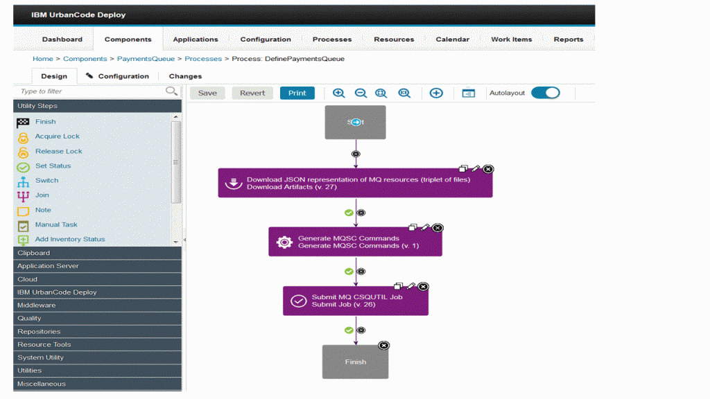
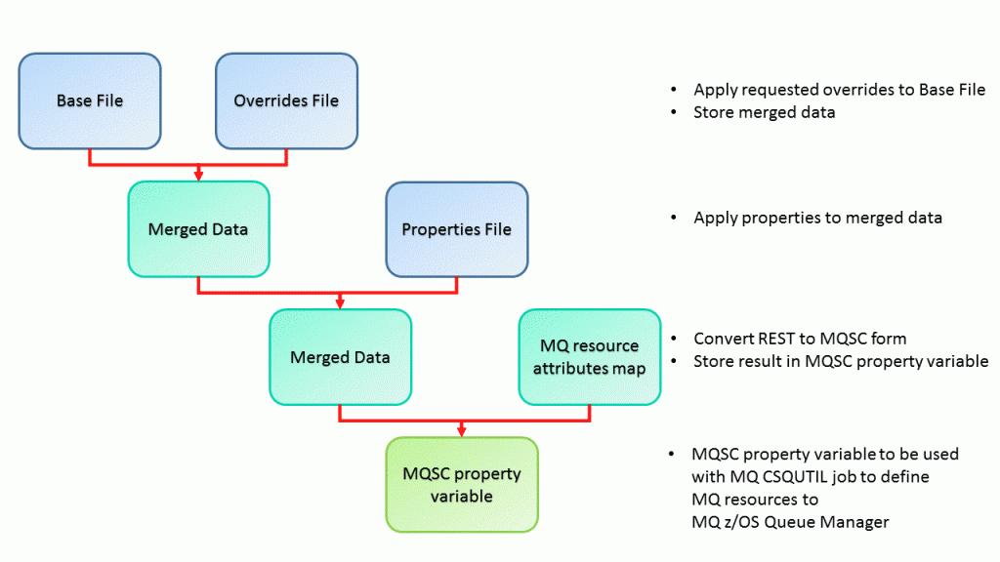
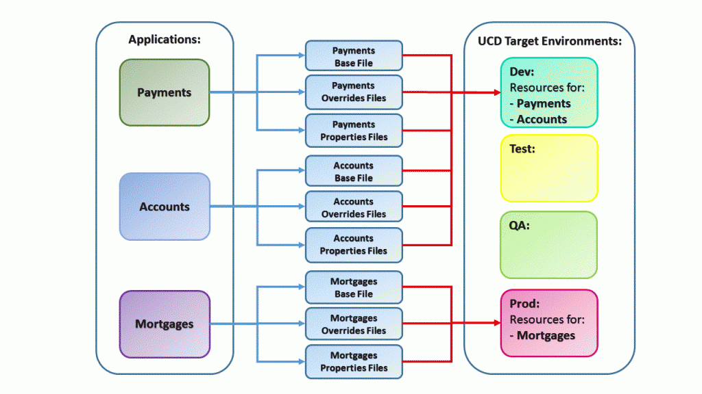
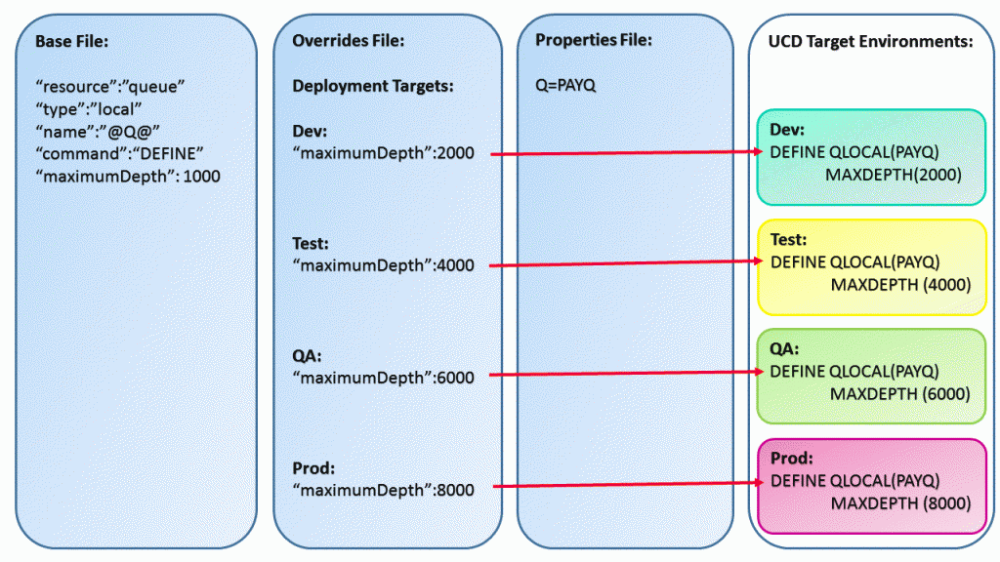

# IBM MQ for z/OS - Generate MQSC Commands - Usage

The REST form IBM MQ for z/OS queue and/or channel resource representations are defined as a triplet of files in the SCM system:

1. **Base** MQ resource definitions. The base definition of resource attributes and values. Resource attribute values in this file may contain tokens.
2. **Overrides** values per target deployment environment. Overriding attributes and values for each target deployment environment. Resource attribute values in this file may contain tokens.
3. **Properties** values. Tokens and values to be replaced in resource attribute values of resources defined in the base and overrides files.

The plugin expects the triplet of files to be present. Valid values must be defined in the base and overrides files however, the properties file can be left blank if no properties are in use.

The plugin is designed to be defined as a step in an IBM UCD process:

Defining the UCD process to include the IBM MQ for z/OS Generate MQSC Commands plugin

## Overall design of the IBM MQ for z/OS Generate MQSC Commands plugin

The IBM MQ for z/OS Generate MQSC Commands plugin is designed to process the triplet of files as follows:

Processing the triplet of files

1. The **Merged Data** is held in a string variable.
2. The **MQ resource attributes map** is an internal file, defined in encoding UTF-8, which is used by the IBM MQ for z/OS Generate MQSC Commands plugin to map rest form attributes to MQSC form attributes.
3. The **MQSC property variable** is an output variable from the plugin that is used in a subsequent step in the IBM UCD process to run the IBM MQ CSQUTIL job to define the MQ resources on the MQ queue manager for the target deployment environment.

### MQ applications and resource deployments

Before IBM MQ applications can put or get messages from IBM MQ queues, queue resources need to be defined to an IBM MQ for z/OS queue manager. Additionally, before applications can transfer data from one IBM MQ for z/OS queue manager to another, channel resources and further queues need to be defined on the local and/or remote IBM MQ for z/OS queue managers. The exact type and number of resources required will vary, depending on the specific needs of applications. Provided a reasonable separation of resources can be achieved, say by application, resources can be represented in the triplet of files as follows:

MQ applications and resource deployment

Resources for the Payments and Accounts applications are deployed to the Dev environment while resources for the Mortgages application are deployed to the Prod environment.

Resources in the triplet of files need to be defined in JSON format in encoding UTF-8.

## Deployment of resources to target environments

Depending on the target environment being deployed to, the IBM MQ for z/OS Generate MQSC Commands plugin applies the respective override values and generates the appropriate IBM MQ resource definitions. The resources are subsequently defined on the target environment. An example to define a local queue is shown below. A simplified syntax is used for clarity:

Deployment of resources to target environments

Notice how the maximum depth of Queue PAYQ varies depending on the target deployment environment.

|Back to ...||Latest Version|IBM MQ for z/OS - Generate MQSC Commands |||
| :---: | :---: | :---: | :---: | :---: | :---: |
|[All Plugins](../../index.md)|[Deploy Plugins](../README.md)|[0]()|[Readme](README.md)|[Overview](overview.md)|[Steps](steps.md)|
