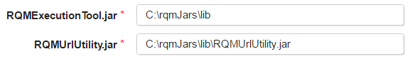

# IBM Rational Quality Manager (RQM) - Troubleshooting

* [Result Verdict of UNKNOWN](#result-verdict-of-unknownresult-verdict-of-unknown/)
* [RQMExecutionTool and RQMUrlUtility Jars](#rqmexecutiontool-rqmurlutility-jars)

## RQMExecutionTool and RQMUrlUtility Jars

The RQM plugin takes advantage of two utilities:

* [Rational Quality Manager Execution Tool](https://jazz.net/wiki/bin/view/Main/RQMExecutionTool) (RQMExecutionTool.jar): Stand-alone application to run Test Case Execution Records (TCERs) and Test Suite Execution Records (TSERS).
* [Rational Quality Manager URL Utility](https://jazz.net/wiki/bin/view/Main/RQMURLUtility) (RQMUrlUtility.jar): Java command line application that can access the RQM server via the RQM Reportable API. This enable the plugin to obtain the results of the TCERs and TSERs.
Both of these utilities are required to run the plugin and must be downloaded directly from Jazzs website. Its imperative that the versions of these jars match the version of your RQM server. Mismatched versions will result in an UNKNOWN error.

## Installation Directions

To download the required jars, start by heading to the [RQM Download Page](https://jazz.net/downloads/rational-quality-manager/). Select your version of RQM and click the All Downloads tab near the top of the page. Scroll down to the Extras section and find Rational Quality Execution Manager Tool and Rational Quality URL Utility. For both files, click the All platform link to download the RQM-Extras-ExecutionTool-X.X.X.zip and RQM-Extras-RQMUrlUtil-X.X.X.zip. The versions of each downloaded zip should match the version of your RQM instance. Extract the zip and place the RQMExecutionTool.jar and RQMURLUtility.jar in a reachable location on the DevOps Agents server.

## Configuration Directions

The Execute Test Case and Execute Test Suite steps have two properties to specify the jars: RQMExecutionTool.jar and RQMURLUtility.jar

In these two properties, specify the folder or file path containing the RQMExecutionTool.jar and RQMUrlUtility.jar. Follow the below picture for an example. The RQMExecutionTool.jar example property specifies the folder location, while the RQMUrlUtility example property shows the full file path. Note: These jars must be physically located on agent.

## Result Verdict of UNKNOWN

The plugin takes advantage of two different jars the RQMExecutionTool.jar and RQMUrlUtility.jar. The output from the RQMExecutionTool is fed into the RQMUrlUtility to acquire various result data. However, the RQMExecutionTool.jar may return an UNKNOWN status which is when the RQM server reports an execution state other than define/predictable states. The RQMUrlUtility is unable to find result data from a test with an UNKNOWN result verdict. This status indicates something went wrong with the specific test case or suite within RQM. The RQM server log could be useful to analyze the issue in detail [(Log file location)](https://jazz.net/help-dev/clm/index.jsp?topic=%2Fcom.ibm.rational.test.qm.doc%2Ftopics%2Fc_rqm_logfiles_loc.html).

