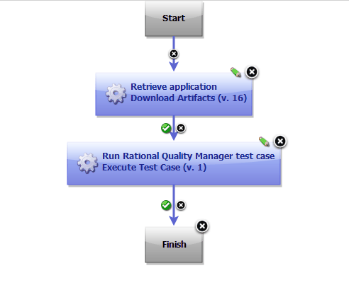

# IBM Rational Quality Manager (RQM) - Usage

## Example: Running tests in Rational Quality Manager

The following component process runs a test case in Rational Quality Manager.

To run this process the application binary files must be in the component. Also the environment must contain an installation of Rational Quality Manager. The process runs the following steps in order:

1. The Download Artifacts step retrieves the binary files.
2. The [Execute Test Case](steps.md#execute-test-case) step runs the specified test case in Rational Quality Manager.

A component process that uses the steps in the Rational Quality Manager plug-in to run a test case in Rational Quality Manager

