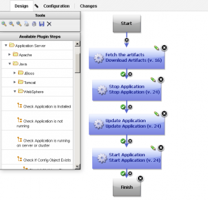
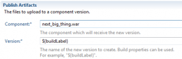
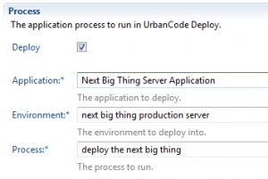

# IBM Rational Team Concert - Build

No source configuration plug-in is required to use Rational Team Concert builds in IBM DevOps Deploy.

View a demo of this capability [here](https://youtu.be/1WSpLKsekr0). Read about a full deployment architecture and process using WAS, BPM, and RTC [here](https://community.ibm.com/community/user/wasdevops/blogs/laurel-dickson-bull1/2022/07/20/bpserver).

You can now continuously build and deploy your applications with Rational Team Concert Build and IBM DevOps Deploy. You can use IBM DevOps Deploy to define the application components and the processes that are required to manage an application in test and production environments. The IBM DevOps Deploy process design tool makes it easy to define the steps required to deploy a new version of an application.

A Rational Team Concert build creates the files that run your application, such as .jar, .war, and .ear files. The post-build deploy option makes it easy to create a new component version in IBM DevOps Deploy and to upload those files to that version.

Then, you can configure the post-build deploy option to have IBM DevOps Deploy run an application process. IBM DevOps Deploy runs the steps in the process to deploy them in a live environment with minimal or no down time.

When the build is complete, the application process runs, and customers can continuously use the latest features.

