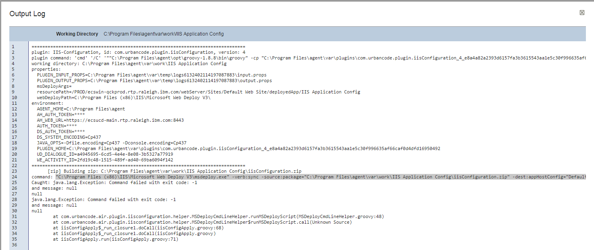
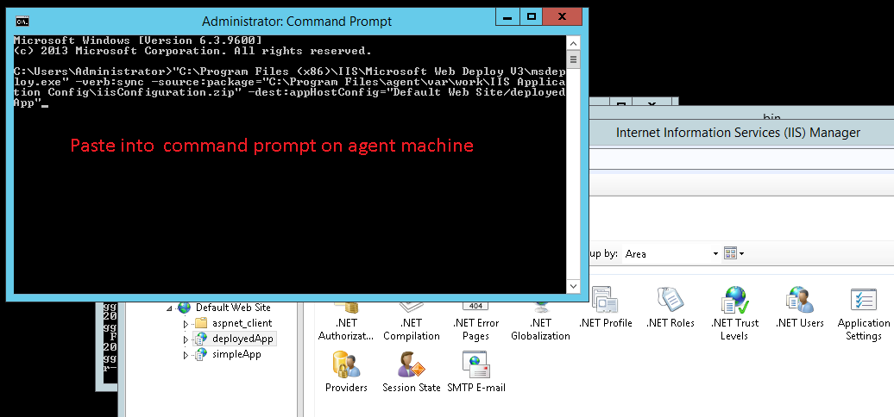
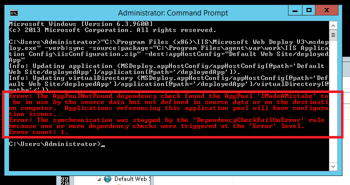

# Microsoft IIS - Configure - Troubleshooting

## Running topology discovery immediately after auto-discovery fails

You might get the following error message in the output log when you run topology discovery: `Command:list site` `Caught: java.io.IOException: Cannot run program "list": CreateProcess error=2, The system cannot find the file specified` When auto-discovery occurs, for example, after you add an agent to a top-level resource group, the webServer resource group is displayed under the top-level node. Before you run topology discover, click the pencil icon, and then click **Save** on the dialog box that opens. Click **Save**, even if you change nothing. By clicking **Save** in that dialog box, you save the properties to the DevOps Deploy server so that the properties can be used for topology discovery and anything else that requires them. If you run a topology discovery immediately after the webServer resource role is displayed underneath the agent without editing and saving, those properties are not be available to the processes that use them.

## An IIS Configure plug-in step fails. The output log contains entries about error codes and null messages

**Note:** Plug-in version 8 includes a fix for this issue. You can avoid this problem by using version 8.

If you see null messages in the output log, copy the `cmd.exe` command that is printed at the top of the output log and run the command manually from a command prompt on the Microsoft Windows server where the agent is running. Remember to include the quotation marks at both ends of the command that you copy from the output log. Typically, when you run the command manually on the agent computer, more informative messages are displayed at the command prompt. See the following screen captures for an example.

## Messages about unrecognized attributes are displayed when you use the deployment command from the output log at a command prompt

If you are trying to use troubleshoot a problem by using the previous method, and a message about unrecognized attributes is displayed, the agent might be attempting to apply an IIS 8.5 configuration to IIS 8.0. More generally, this message can be displayed when you try to apply a configuration from a later version of IIS to an earlier version of IIS. The plug-in does not support this scenario.

|Back to ...||Latest Version|Microsoft IIS - Configure |||||
| :---: | :---: | :---: | :---: | :---: | :---: | :---: | :---: |
|[All Plugins](../../index.md)|[Deploy Plugins](../README.md)|[13.1127381](https://raw.githubusercontent.com/UrbanCode/IBM-UCD-PLUGINS/main/files/iis-configuration/ucd-IIS-Configuration-13.1127381.zip)|[Readme](README.md)|[Overview](overview.md)|[Usage](usage.md)|[Steps](steps.md)|[Downloads](downloads.md)|
