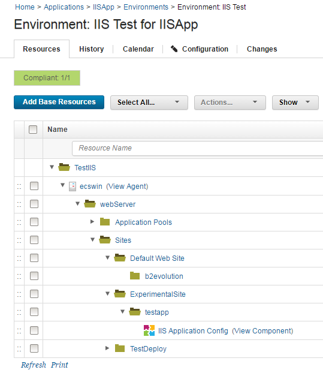
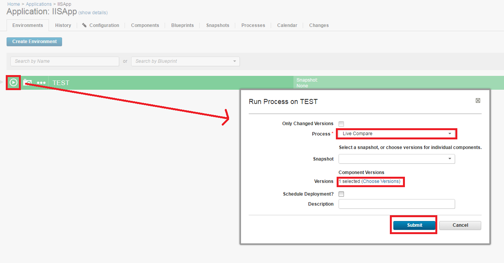
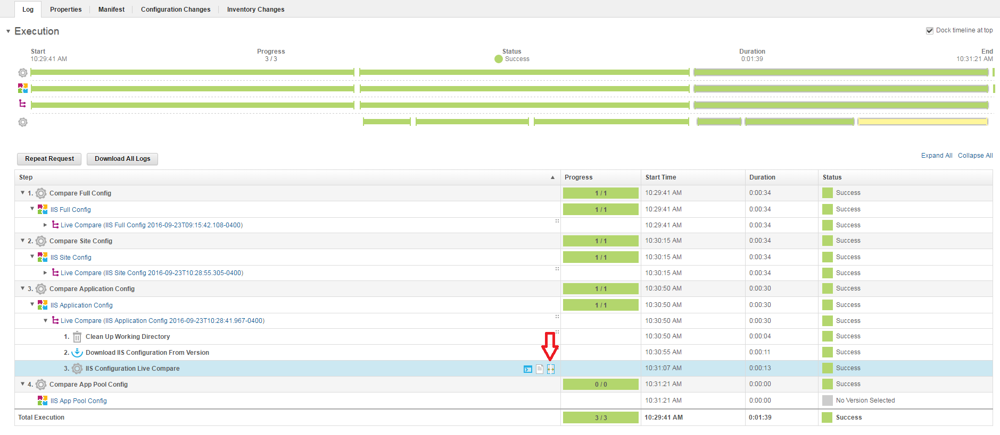
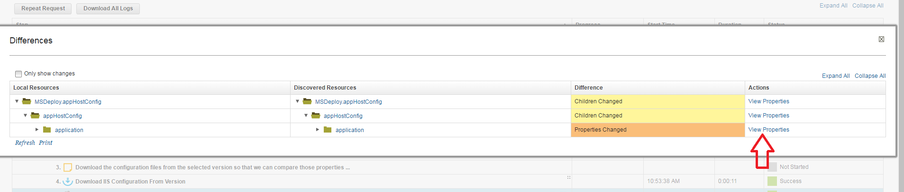
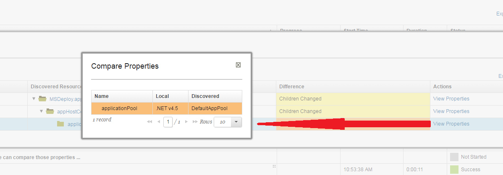
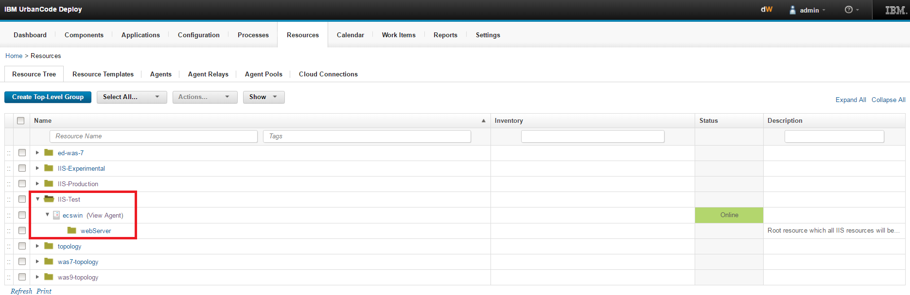
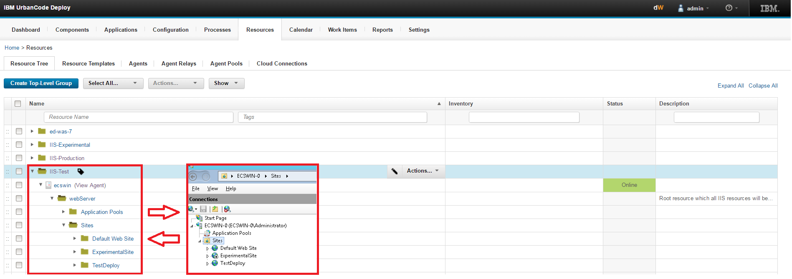
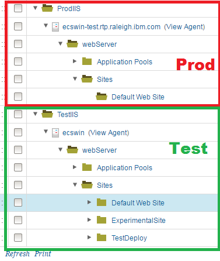
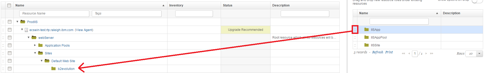

# Microsoft IIS - Configure - Usage

* [Discovering and applying configurations](#discovering-and-applying-configurations)
* [Comparing configurations with live IIS instances](#comparing-configurations-with-live-iis-instances)

## Comparing configurations with live IIS instances

You can use the live comparison feature of the IIS Configure plug-in to compare the properties from previously discovered IIS configurations against the current live configuration. A live comparison shows the specific properties that changed, which can help you investigate problems with the current configuration. Differences in the stored configuration versus the live configuration are sometimes known as *configuration drift*.

## Before you begin

* Discover an existing IIS configuration and store the configuration as component version in IBM DevOps Deploy. For more information, see [Discovering and applying configurations](#discovering-and-applying-configurations).
* Change several properties in either the live IIS configuration or in the component version so that the changes can be detected during a comparison.

## Running the live comparison

Map the relevant component to your application environments resource tree, as shown in **Figure 1**. The comparison process skips the request if you do not have a component that is mapped to the resource tree. The application process iterates through each component in the resource tree. For each component in the resource tree, the version that you select is compared to the live configuration.

In IBM DevOps Deploy, go to the Applications page. Click the example IISApp application. Click the deployment push button on the environment where you want to run the live comparison. From the **Process** list, select **Live Compare**. Select the version or versions from multiple components to compare against the live configuration. If you select multiple component versions, they are compared sequentially. Ensure that **Only Changed Versions** is cleared. For an example of the Run Process window, see **Figure 2**. Click **Submit**. The live comparison process runs. Typically, it can take several seconds to run the comparison, depending on how much configuration data is stored.

Figure 1. IIS application component that is mapped to the resource tree.

Figure 2. The Run Process window for a live comparison process.

## Analyzing changes

After the live comparison process completes, you can review and analyze the results. Click the **History** tab in the IISApp application to return to the process request window. Click **View Request** in the Actions column to return to the last request that you made.

To view the configuration drift, expanding the child objects of the process request until the IIS Configuration Live Comparison plug-in step is displayed. When you hover your mouse pointer over this row, a compare icon is displayed at the right side of the Step column. Click the compare icon. Any changes between the version that you selected and the current live configuration are displayed here, highlighted in yellow and orange. To view the full comparison tree that includes unchanged assets, clear **Only Show Changes** at the upper left. See **Figures 3-5** for visual reference.

Figure 3. The compare icon on the process request page.

Figure 4. The Differences window that is displayed after you click the compare icon. The arrow points to the link to view changed properties.

Figure 5. The Compare Properties window that is displayed after you click View Properties. The Compare Properties window shows the changed properties.

## Result

You compared a previously discovered configuration to the live configuration. You can use this feature to detect unexpected changes to your live configuration, and to detect changes that were made since your previous component version. After you determine exactly which properties changed, you can fix any problems that occurred because of those changes.

## Discovering and applying configurations

You can use the IISConfigure plug-in to manage IIS configurations with IBM DevOps Deploy. The plug-in includes steps to discover configurations and package them into .zip files by using Microsoft Web Deploy, which is integrated into the plug-in. You can modify the configuration file in the .zip archive file by using tokenization steps that the plug-in provides. After you modify a configuration, you can apply it to the original environment or to a different environment. You can work with entire IIS configurations, or at a specific scope such as Sites, Apps, or App Pools.

The following steps describe a standard process of discovery, tokenization, and application.

1. Create a resource topology in IBM DevOps Deploy that models the IIS topology.
2. Discover an existing IIS configuration, and store the configuration as component versions in IBM DevOps Deploy.
3. Tokenize properties in the configuration so that the configuration is specific for your individual environments.
4. Apply the modified configuration to a new environment and examine the result.
5. Test the new environment to confirm that the configuration was applied successfully.

## Prerequisites

* 2 Windows computers that are running IIS and Microsoft Web Deploy.
* A preconfigured, working application installed on one computer.
* IBM DevOps Deploy agents that are installed and running on both computers and connected to an IBM DevOps Deploy server.
* The IISConfigure plug-in running on the IBM DevOps Deploy server. For more information, see [Installing plug-ins in DevOps products](https://community.ibm.com/community/user/wasdevops/blogs/laurel-dickson-bull1/2022/06/13/install-plugins).

## Procedure

## Create a resource tree topology

Create a top-level group in the resource tree in IBM DevOps Deploy. The top-level group is the backbone of the resources that represent the IIS environment. In the following example screen capture, the top-level group is called `IIS-Test`.

Add the agent that is running on the computer where the preconfigured working application is installed (the computer to discover the configuration from). Hover your mouse over the new top-level group, and then select **Actions > Add Agent**.

Wait 10 seconds while the automatic discovery process runs, and then click **Refresh** at the lower left of the resource tree pane. A new resource role that is called webServer is displayed as a child of the agent. An example resource tree is shown in **Figure 1**.

Figure 1. The resource tree with top-level group, agent, and discovered webServer object.

Click the **Edit** icon for the webServer resource role and verify that the properties are set correctly for the computer, and then click **OK**.

For the webServer object, click **Actions > Configure using IIS Configuration Configure**. The Configure step runs and creates the rest of the topology in DevOps Deploy. After the Configure step completes, a topology is displayed that matches your IIS topology. An example topology is shown in **Figure 2**.

Figure 2. The resource tree with full topology (left) after the configure step completes. On the right, the topology on IIS Manager for comparison. The topologies should match.

## Discover an IIS configuration

After you set up the IIS topology on the resource tree in IBM DevOps Deploy, you can discover the configuration from your IIS computer. You use a generic process to discover the configuration of an application on the IIS computer. After you discover a configuration, you can use the `Tokenize Configuration File` plug-in step to create variables in the configuration file.

The plug-in includes two example generic processes. The following example uses the `Example 2: IIS App Discovery (IIS APPS ONLY)` process. This process is designed to first discover the configuration of the application that you choose, then tokenize some values in the configuration file, and then upload the modified configuration package to a component version.

First, go to Processes. Then, click `Example 2: IIS App Discovery (IIS APPS ONLY)`. Click **Set** for the resource, and then select the IIS application to discover from the resource tree. Click **OK**, and then click **Submit** if you do not want to specify other options. After the process completes, your configuration file is uploaded to a component version in the `IIS Application Config` component, which is loaded when you install the plug-in.

The generic process includes the `Tokenize Configuration File` step. If you click the console output icon (at the right of the row), you can see that the applicationPool property was replaced with the @applicationPool@ token. When you deploy this application to a new environment, you can replace that token with an application pool of your choice by using IBM DevOps Deploy properties.

## Deploy an application to a new environment

You can now apply the configuration to a new environment. The first step is to attach the `IIS Application Config` component to the topology resource tree that you created previously.

Go to the Applications page. The IISApp application is automatically installed when you install the plug-in. Click the IISApp application. Three example environments are displayed. In this example, you use two of the environments, IIS Test and IIS Prod. To set up the IIS Test environment, click the IIS Test environment to open the environment resource pane. Click **Add Base Resources**, and then select the entire topology that you discovered previously. After you add base resources from the topology, the resource tree looks similar to the tree shown in **Figure 3**.

Figure 3. The resource tree in the IIS Test environment after you add base resources.

After the IIS Test environment is set up, you discover the configuration of the target IIS computer, which you can then add to the resource tree for the IIS Prod environment. Repeat the steps in the *Discover an IIS configuration* section, but use the agent on the computer where you plan to deploy the application.

The resource tree now contains two topologies: one that corresponds to the agent on the IIS Test environment, and one that corresponds to the target computer where you plan to deploy the application. The resource tree looks similar to the tree shown in **Figure 4**.

Figure 4. The resource tree after you discover the topology on the target computer.

Next, you add a resource role as a placeholder in the resource tree to represent the application to move to the target environment. Add a resource role by clicking the **Show** drop-down list underneath the tabs for the resource tree, and then click **Resource Roles**. A sidebar that contains resource roles is displayed on the right side of the window. The resource roles that are associated with the plug-in all have the `IIS` prefix. Drag the IISApp resource role to the production topology that you created and drop it under the target site. In this example, drag the IISApp resource role under the `Default Web Site` folder to host the application on that site. When you drop the IISApp resource role, you are prompted to provide basic properties for the application placeholder. Complete any relevant information, including a name. In this example, the application is called `b2evolution`, for the open source application B2Evolution, as shown in **Figure 5**. The applicationPool object in this example is DefaultAppPool.

Figure 5. The resource roles on the right, after dragging an IISApp to the resource tree and renaming it to b2evolution.

After you add the IISApp resource role, you add the IIS Application Config component to the tree so that the component has access to the supplied properties. This component contains your configuration files and thus represents the application. Click **Actions** for the IISApp resource role that you added, then click **Add Component** and select **IIS Application Config**. Your component is now displayed under the resource role that you added to the tree.

Next, you associate the new resource tree to the Production environment in the IISApp application. Click **Applications > IISApp > IIS Prod** to go to the production environment. To add the new topology to the production environment, click **Add Base Resources** and then select the production topology. After you complete this step, two separate environments are set up that represent the respective Test and Production IIS computers.

You can now run the deployment. Go back to the Environments page for your application by clicking the breadcrumbs below the tabs at the top. Click **Deploy** for IIS Prod. In the window that opens, select the **Apply** process, and for **Choose Versions** select the latest version for IIS Application Config, then click **OK**. Click **Submit** to deploy the application to new production environment.

## Verify the application

Run the new application from the browser on your Production IIS computer and verify that it works correctly.

## Result

The application from the test environment is now deployed to the production environment.
