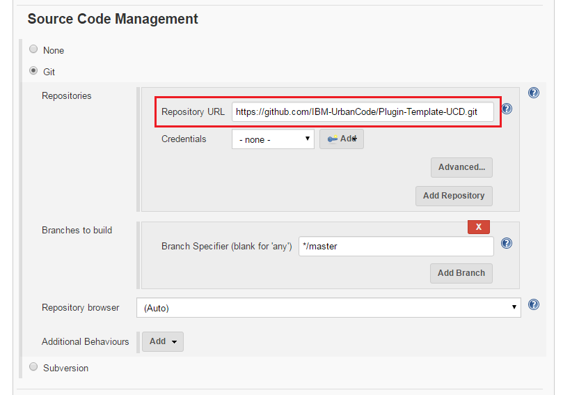
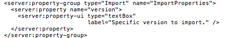

# Jenkins Pipeline - Usage

To use the Jenkins Pipeline plug-in both the DevOps Deploy and Jenkins serves must be started. After installing the plug-in on the Jenkins server, you must then configure the integration with the DevOps Deploy server. While the integration is defined on the Jenkins server, you must install and start an DevOps Deploy agent.Below are the overall setup tasks for using the plug-in.

* Install and start the Jenkins server.
* Start the Jenkins nodes and connect the nodes to the Jenkins server.
* Download and install the Jenkins Pipeline plug-in on the Jenkins server.
* Set up the source control management configuration of the project, such as Git or Maven.
* Set up the build configuration of the project, such as Ant or Gradle.

## Integration process

After all the necessary parts are in place to use the plug-in, you can define the integration. You can define one or more DevOps Deploy servers where the Jenkins artifacts are to be pushed.

1. Open the Jenkins user interface.
2. Click **Manage Jenkins** > **Global Settings**
3. Locate the DevOps Deploy section
4. Complete the configuration settings to the DevOps Deploy server.[](media/jenkins-servers1.png)

| Name | Description |
| --- | --- |
| Profile name | The name of the integration, used for reference only. |
| DevOps Deploy URL | The URL of the DevOps Deploy servers to push artifacts to from the Jenkins server. More than one can be specified. |
| Username | The user name to authenticate with the DevOps server. |
| Password | The password to authenticate with the DevOps server. |
| Trust All Certificates | Enable to accept all certificates. |

* Click **Test Connection** to confirm the DevOps Deploy server can be reached.

**Note:** You can add additional DevOps Deploy configurations by clicking **Add**.

On the DevOps Deploy server:

1. Create a resource group and add the DevOps Deploy agent to the resource group. [](media/jenkins-resources1.png)
2. Create the Jenkins application and environment.[](media/jenkins-app-env1.png)

## Using the Jenkins plug-in

After the setup is complete, you can use the plug-in to perform several tasks. There are two ways you can implement the plug-in into your DevOps Deploy pipeline:

1. Jenkins user interface
2. Pipeline script

In the following usage scenarios both methods are described.

* [Create a component version](#createversion)
* [Deploy a component](#deploycomponent)
* [Trigger Version Import](#triggerversionimport)
* [Import into DevOps Deploy](#import2ucd)
* [Adding an Alternative User](#addaltuser)
* [In-Process Script Approval](#scriptapproval)

### Creating a component version

#### Method: User interface

To create a component version, create and configure a Jenkins job. In the Jenkins job complete the following updates:

1. Specify the URL for the Git repository on the Source Code Management page. [](media/jenkins-source-control1.png)
2. The Build Management section. For example, run a Gradle build. [](media/jenkins-build1.png)
3. Add the Publish Artifacts to IBM DevOps Deploy build step. Configure the build step by completing the following steps:
   1. Select the IBM DevOps Deploy Server that you configured previously.
   2. Select **Create Component Version**.
   3. In the drop-down list, enter an appropriate value for **Component Name**.
   4. Select **Create as New Component**.
   5. In the options, specify appropriate values for **Component Template** and **Add to Application**.
   6. Leave **Delivery Mechanism** set to **Push Files**.
   7. Specify the options under **Push Files** as needed.[](media/jenkins-create-component1.png)
   8. Save the step configuration, and then run a build.
4. The component is created with its first component version.

#### Method: Pipeline script

The following pipeline script example defines a new component named Jenkins and attaches it to the Jenkins application. All ZIP files are pushed from the `jobs\\test-ucd\\workspace\\build\\distributions` directory.

```
node {
step([$class: 'UCDeployPublisher', // Class name of the Jenkins pipeline
siteName: 'local',// Name of DevOps Deploy server
component: [// Actions to perform
$class: 'com.urbancode.jenkins.plugins.ucdeploy.VersionHelper$VersionBlock',
componentName: 'Jenkins',// Component name
createComponent: [ // Create new component
$class: 'com.urbancode.jenkins.plugins.ucdeploy.ComponentHelper$CreateComponentBlock',
componentTemplate: '', // Template name to base component on
componentApplication: 'Jenkins'// Name of application to add component
],
delivery: [//Perform a componetn version input
$class: 'com.urbancode.jenkins.plugins.ucdeploy.DeliveryHelper$Push',
pushVersion: '``${BUILD\_NUMBER}``',//Name toassign component version
baseDir: 'jobs\\test-ucd\\workspace\\build\\distributions',// Base directory containing artifacts
fileIncludePatterns: '\*.zip',// Files to include using Regex
fileExcludePatterns: '', // Files to exclude using Regex
pushProperties: 'jenkins.server=Local\njenkins.reviewed=false', // Assign properties to new component version
pushDescription: 'Pushed from Jenkins'//Description for component version
]
]
])
}``

```

### Deploying a component

After you create a component with a version, you can deploy the component from Jenkins.

#### Method: User interface

1. Add the new component to the resource tree. [](media/jenkins-comp-env1.png)
2. Add the base resource to the environment. [](media/jenkins-base-env1.png)
3. Create a process on the new component. [](media/jenkins-process1.png)
4. Go back to the Jenkins job that you configured when you created a component version and examine the Publish Artifacts to IBM DevOps Deploy build step. Modify the configuration by completing the following steps:
   1. Select **Deploy**.
   2. In the drop-down list, enter the appropriate values for **Application Name** and **Component Name** that you created previously.
   3. Enter an appropriate value for **Application Process Name**.
   4. Select **Create As New Application Process**.
   5. In the options, specify the name of the process that you created in step #3 for **Component Process Name**.
   6. For **Snapshot/Component Version**, list the component and version that you created when you created a component version.
   7. If nothing changes between the versions, clear **Only Changed Versions**.[](media/jenkins-deploy1.png)
   8. Save the step configuration, and then run a build.
5. A new deployment is displayed in your applications history.

#### Method: Pipeline script

The following pipeline script automatically starts a deploy process for a successful import.

```

node {
step([$class: 'UCDeployPublisher',//Class name of the Jenkins pipeline
siteName: 'local', //Name of the DevOps Deploy server
deploy: [//Actions to perform
$class: 'com.urbancode.jenkins.plugins.ucdeploy.DeployHelper$DeployBlock',//Deploy action
createSnapshot: [
deployWithSnapshot: true,// Deploy with snapshots(true /false)
updateSnapshotComp: false, // Update Component version in existing Snapshot(true/false)
snapshotName: 'NEW_SNAP' //Snapshot name for new snapshot creation.
],
deployApp: 'Jenkins',//Name of the application
deployEnv: 'Test', //Name of the environment
deployProc: 'Deploy Jenkins', //Name of the application process to run
createProcess: [
$class: 'com.urbancode.jenkins.plugins.ucdeploy.ProcessHelper$CreateProcessBlock', //Create Process action
processComponent: 'Deploy'//Create the application process if it does not exist
],
deployVersions: 'Jenkins:``${BUILD_NUMBER}``', //Versions to deploy. Specify multiple on a new line in the format *component*:*version*
deployOnlyChanged: false
]
])
}``

```

### Trigger a version import

#### Method: User interface

This user case demonstrates using Jenkins to create a component source configurations and trigger component imports.

1. Follow the steps in the [Create a component version](#createversion) section.
2. Add another `Publish Artifacts to IBM DevOps Deploy` build step. Configure the build step by completing the following steps:
   1. Select the DevOps Deploy server that you previously configured.
   2. Select **Create Component Version**.
   3. In the drop-down list, enter an appropriate value for **Component Name**.
   4. Select **Create as New Component**.
   5. In the options, specify appropriate values for **Component Template** and **Add to Application**.
   6. Change **Delivery Mechanism** to **Trigger Import**.
   7. Specify options under **Trigger Import** as needed.[](media/jenkins-trigger-import.png)
3. Save the step configuration, and then run a build.
4. Your component is created with its first component version.

#### Method: Pipeline script

```

node {
step([$class: 'UCDeployPublisher', //Class name of the Jenkins pipeline
siteName: 'local',//Name of DevOps Deploy server
component: [ //Actions to perform
$class: 'com.urbancode.jenkins.plugins.ucdeploy.VersionHelper$VersionBlock', //
componentName: 'Jenkins',
createComponent: [ //Create component
$class: 'com.urbancode.jenkins.plugins.ucdeploy.ComponentHelper$CreateComponentBlock',
componentTemplate: '',//Template name to base component on
componentApplication: 'Local' // Name of application to add component
],
delivery: [
$class: 'com.urbancode.jenkins.plugins.ucdeploy.DeliveryHelper$Pull',
pullProperties: 'FileSystemImportProperties/name=``${BUILD_NUMBER}``\nFileSystemImportProperties/description=Pushed from Jenkins',//Description
pullSourceType: 'File System',
pullSourceProperties: 'FileSystemComponentProperties/basePath=C:\\Test',
pullIncremental: false
]
]
])
}``

```

### Import into DevOps Deploy

You can use the Jenkins Pipeline plug-in to push or pull artifacts to and from DevOps Deploy. Pulling is also called importing. Note that this is completely different than pushing artifacts from Jenkins.

* When you push an artifact, a new version is created in DevOps Deploy and the artifact is added to the new version.
* When you pull (import), most of the task is handled by DevOps Deploy.

When creating a component in DevOps Deploy, you select a source configuration type plug-in to use for importing new component versions into an DevOps Deploy component. Each source configuration plug-in has different properties that must be provided. These properties are called component properties and are saved. They are available every time yourun a version import. The following graphic shows the properties for the Nexus Repository Manager V3 source configuration plug-in.


There is another set of properties called the import properties that are defined at runtime. When you click **Import New Versions** in your component, a dialog box displays for you to enter properties.


For both component and import properties, their definitions are defined in the source config plug-in that you are using.

After the properties are configured, you can use the Jenkins Pipeline plug-in to import new component versions. Component properties are not configurable from the Jeninks Pipeline plug-in, they must be set on the component beforehand. However, you can specify the import properties during runtime and when using the Jenkins Pipeline plug-in. They are defined using the **pullProperties** property. The following is an example for starting an import of a component configured with Nexus Repository Manager V3. **Note:** The **pullSourceType** property is no longer required.

```
{
step([$class: 'UCDeployPublisher', // Class name of the Jenkins pipeline
siteName: 'UCD', // Name of DevOps Deploy server
component: [ // Actions to perform
$class:'com.urbancode.jenkins.plugins.ucdeploy.VersionHelper$VersionBlock',
componentName: 'Nexus Nuget',
delivery: [
$class:'com.urbancode.jenkins.plugins.ucdeploy.DeliveryHelper$Pull',
pullSourceType: 'Nexus Repository Manager V3',
pullProperties: 'version=1.0.0.0'
]
]
])
}``

```

The above syntax works for any source configuration plug-in that is configured. The only different between source config plug-ins is **pullProperties**. You can find the list of properties in the source configuration plug-in `plugin.xml` file. Youll find them in the ImportProperties group. You may download and extract any source config plugin from the microsite and examine the plugin.xml to find these properties. For example, below is the **ImportProperties** property in the Nexus Repository Manager V3 `plugin.xml` file.



### Adding an Alternative User

Using alternative credentials in a pipeline script requires usage of the `Hudson.util.Secret` class to properly encrypt an alternative password. The script writer needs to employ the `Hudson.util.Secret.fromString()`  method to encrypt the alternative password. Below is an example script that uses an alternative user with the username user and password password.

```
node {
step([$class: 'UCDeployPublisher',
siteName: 'UCD',
altUser: [
altPassword: hudson.util.Secret.fromString('user'),
altUsername: 'password'
],
component: [
$class: 'com.urbancode.jenkins.plugins.ucdeploy.VersionHelper$VersionBlock',
componentName: 'Jenkins-Import',
createComponent: [
$class: 'com.urbancode.jenkins.plugins.ucdeploy.ComponentHelper$CreateComponentBlock',
componentApplication: 'Jenkins-APP'
],
delivery: [
$class: 'com.urbancode.jenkins.plugins.ucdeploy.DeliveryHelper$Push',
pushVersion: '``${BUILD\_NUMBER}``',
baseDir: '/var/jenkins\_home/workspace/',
fileIncludePatterns: '\*',
fileExcludePatterns: '',
pushDescription: 'Pushed from Jenkins'
]
]
])
}``

```

### In-Process Script Approval

The `Hudson.util.Secret.fromString()` class is a static method and Jenkins blocks static method calls. Changes must be made using an administrative user account to permanently approve the function.

To alert the administrative user that a job is attempting to use the static method execute a job that making the call to `Hudson.util.Secret.fromString()`. This job will fail and make a request in the **In-Process Script Approval** page. Log into the Jenkins user interface as an administrative user. Click **Jenkins** > **Manage Jenkins** > **In-Process Script Approval**. There will be a new approval awaiting.


After you click **Approve**, the static method call is listed in the **Signatures already approved** section. This means that the specified method signature can be called in Jenkins pipeline scripts and all future Jenkin pipeline scripts calling this method are approved.


