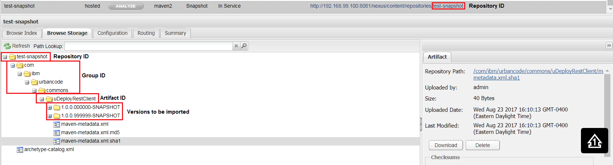
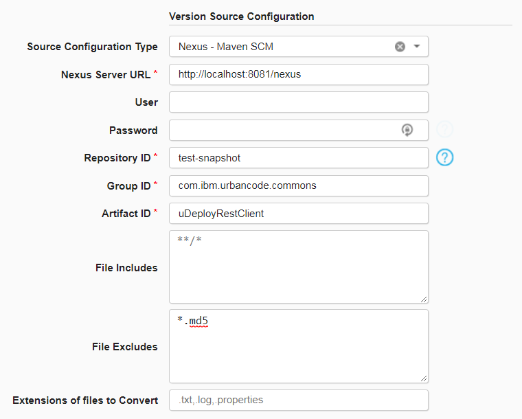
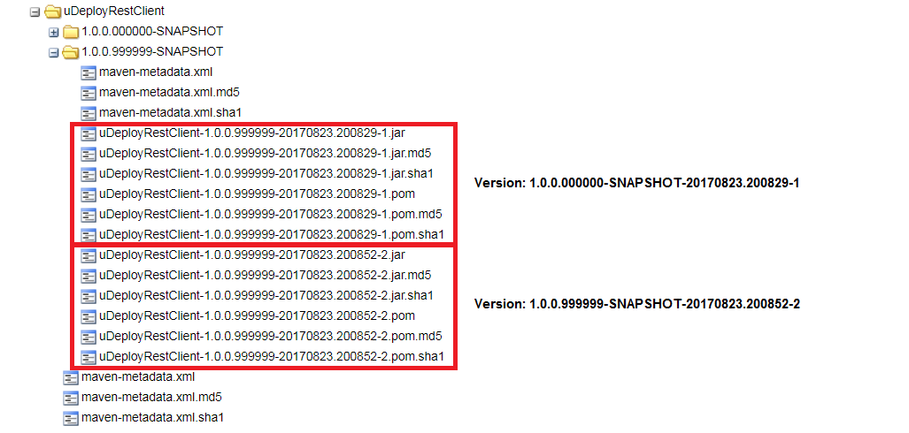

# Nexus Source Config - Configuration

## Overview

The Nexus Source Configuration plug-in allows IBM DevOps Deploy to retrieve artifacts from Maven Release or Snapshot repositories in Sonatypes Nexus version 2. If you are using Nexus version 3, use the Maven Source Configuration plug-in.

The configuration requirements for this plug-in are very similar to the Maven Source Configuration. However, a few fields allow for enhanced functionality.

## Required Properties

* **Nexus Server URL**:The base URL to the Nexus server. Typically, for Nexus version 2, it will take the form: https://IP\_ADDRESS:PORT/nexus. For example: https://localhost:8081/nexus. Unlike the Maven Source Configuration plug-in, do not specify the full repository URL path.
* **Repository ID**: The identifier for your Maven repository. Generally, this does not match the Repositorys name.
* **Group ID**:The Group ID to identify the Maven project. Each folder in the path can be delimited by forward slashes or dots. Example: com.ibm.urbancode.commons
* **Artifact ID**: The Artifact ID to identify the Maven project. This is the last folder name before the version list. Example: uDeployRestClient

## Optional Properties

* **User**: If the Nexus server is secured, specify the username.
* **Password**: If the Nexus server is secured, specify the password associated with the username.
* **File Includes and Excludes**: Two text area boxes allow further specification of the files to permit or deny. Specify a files or folders to include or exclude in regex format. By default, all files will be imported.

## Sample Nexus Maven Repository

Below you can see a sample folder structure for a Snapshot Maven Repository. Identification of the properties can be applied to Release repositories as well. Ensure you are using one of the two locations for the Repository ID, otherwise you may specify the Repository Name and your import will fail.

Maven Repository in Nexus

## Sample Nexus Source Configuration

Here you can see how the properties are directly applied to the configuration of the Nexus Source Config plug-in. In this example, all files, except those with the `.md5` extension, will be imported.

Configuration of the Nexus Source Config

## Maven Release vs Snapshot Repositories

The Nexus Source Configuration plug-in allows the import of entire Release or Snapshot Maven projects. However, versioning works slightly differently between these repository types. For Release projects, each version project will be imported as a component version. If the above Nexus repository example was a Release project, the Nexus plug-in would import two versions named `1.0.0.0000-SNAPSHOT` and `1.0.0.999999-SNAPSHOT`. Fortunately, because all SNAPSHOT versions are labeled as such, the plug-in can easily differentiate between the two. If a Snapshot project is identified, the plug-in will dive one level deeper into each version folder and create component versions based on names. In the screenshot below, you can see how the Maven Snapshot artifacts would be grouped into component versions.

Maven Snapshot Grouping

|Back to ...||Latest Version|Nexus Source Config ||||
| :---: | :---: | :---: | :---: | :---: | :---: | :---: |
|[All Plugins](../../index.md)|[Deploy Plugins](../README.md)|[4.1053075](https://raw.githubusercontent.com/UrbanCode/IBM-UCD-PLUGINS/main/files/nexus-source-config/Nexus-Source-Config-4.1053075.zip)|[Readme](README.md)|[Overview](overview.md)|[Steps](steps.md)|[Downloads](downloads.md)|
