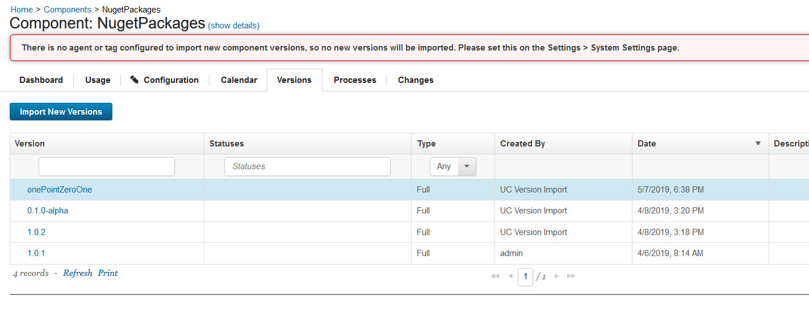
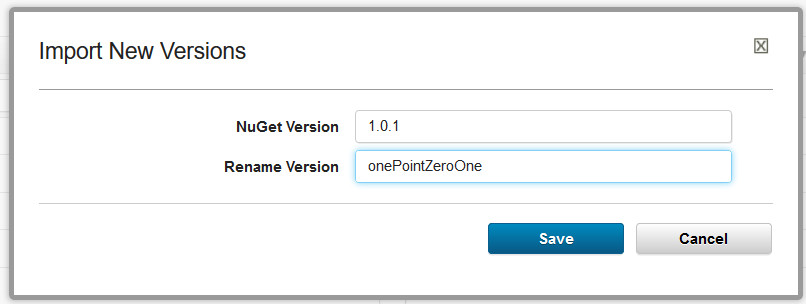
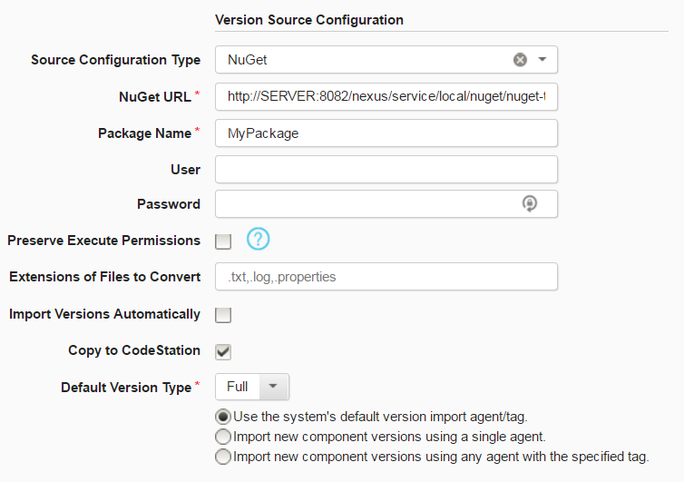
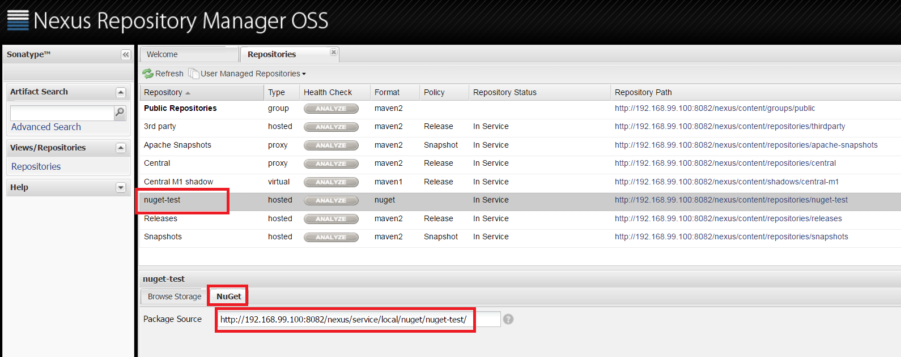
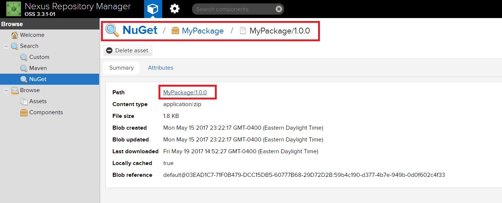
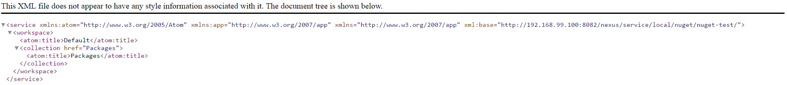

# NuGet - Usage

* [Create a component](#create-a-component)
* [Nexus Repository Manager support](#nexus-repository-manager-support)
* [Change the artifact version name when importing](#change-the-artifact-version-name-when-importing)

## Create a component

Youll need to define an DevOps Deploy component which defines the source and processes for the NuGet repository. The component contains the information for importing the artifacts and any processes to implement on the artifacts.

You can manually or automatically create component versions from a NuGet repository by detecting NuGet packages based off their names and creating associated component versions for the package.

To create a component by importing from a NuGet repository, complete the following steps. For more information, see [Creating components](http://www-01.ibm.com/support/knowledgecenter/SS4GSP_7.0.2/com.ibm.udeploy.doc/topics/comp_create.html "Creating components") in the product documentation.

1. In DevOps Deploy, click **Components** and then click **Create Component**.
2. In the Create Component window, specify a name and description for the component.
3. In the **Teams** fields, specify the access information for the new component.
4. To use a template for the new component, select a template from the Template list. In this case, the component inherits source configuration, properties, and processes from the template.
5. In the **Source Config Type** list, select **NuGet**.
6. Specify the properties for the component. See [Settings](#settings) for property descriptions. **Notes:** The format of the **NuGet URL** property is different for the NuGet v2 and v3 servers.
* For v2: `https://*[server\_ip or domain\_name]*/artifactory/api/nuget/nuget-hosted`
* For v3: `https://*[server\_ip or domain\_name]*/artifactory/api/nuget/v3/nuget-hosted`
7. Click **Save**.

## Import a version

When the artifacts are imported, a component version is created using the version of the package. You can specify to import a specific package version or import all versions. If importing all versions, a component version is created for each version.

1. Click the **Versions** tab for the component.
2. Click **Import New Versions**.
3. Specify a specific version of the package to import, or leave blank to import the latest version of the package available in the repository. Additionally, enable **Import All Versions** to import all versions of a package.
4. Click **Save**.

## Change the artifact version name when importing

When you import artifacts, you can specify a specific NuGet artifact version to import and change the version name.

In the **Import New Version** window, specify the version name in the NuGet repository and the name for the version in the DevOps Deploy repository.

In the preceding example, instead of the version number 1.0.1, the artifacts are renamed to onePointZeroOne.

## Nexus Repository Manager support

Starting with the NuGet source configuration plug-in version 3, DevOps Deploy provides support for artifact retrieval from NuGet repositories in Nexus Repository Manager versions 2.14 to 3.3.1-01. While the server versions are fundamentally the same, the links to the repositories are different.

The NuGet plug-in uses the NuGet REST API v2. For information about the API, see [NuGet API](https://docs.microsoft.com/en-us/nuget/api/overview). Specifying the correct NuGet URL is necessary for utilizing the REST API calls. For Nexus configuration, you will need to specify the full repository URL. Specifying the Nexus servers host name is insufficient because it is a repository manager and supports multiple repository types. However, if referencing a standalone NuGet server, then the host name is expected.

## Sample Configuration

The following sample configuration demonstrates how to configure a Nexus server import process.

In the graphic below is the DevOps Deploy component. Properties with the asterisk (\*), a value must be specified.

**NuGet URL**: The NuGet Repository server. If retrieving artifacts from a NuGet server, this is a the host name. For Nexus Repository Manager, specify the repository URL defined below.

**Package Name**: The name of the package on the NuGet server or in the specified Nexus repository.

**Note:** If authentication is required, specify the user name and associated password.

Specifications for the Nexus Repository Manager varies based on the version. To verify that the URL

* [Nexus Repository Manager v2](#nrmv2)
* [Nexus Repository Manager v3](#nrmv3)

After configuring the Nexus Repository Manager, you can use the information to verify that the GetNu repository is accessible, see [Confirm NuGet URL](#id=confirm).

## Nexus Repository Manager v2

For a Nexus v2 repository, the value specified for the **NuGet URL** property in the component is considered the package source of a repository. Place this value, in the **Package Source** field of the Nexus Repository Manage OSS panel. Specify in the format: `http://SERVER:PORT/nexus/service/local/nuget/REPOSITORY_NAME/`.

Identify the URL by navigating to the NuGet repository with the package to import, select the **NuGet** tab, the **Package Source** is located on this tab. Copy and paste the full URL from the **NuGet URL** property configuration field into the **Package Source** field.

## Nexus Repository Manager v3

In Nexus v3, the user interface changed significantly and the repository URL was simplified. The URL is now in the format: `http://SERVER:PORT/repository/REPOSITORY_NAME/`. However, this link is slightly harder to identify and confirm. Identify your URL by navigating to a package version in a browser. Hover over its path to see the full download link for this package at the bottom of the screen. Transpose the URL, up to the repository name, into the **NuGet URL** property configuration field.

## Confirm NuGet URL

The NuGet repository URL must be accessible through the version 2 of the NuGet REST API. This can be verified by placing the Nexus URL, identified above, in a browser. The response will look similar to the screenshot below. If the request requires authentication, then credentials should also be specified in the plug-ins source configuration. This quick test can be confirmed outside of IBM DevOps Deploy.

|Back to ...||Latest Version|NuGet ||||
| :---: | :---: | :---: | :---: | :---: | :---: | :---: |
|[All Plugins](../../index.md)|[Deploy Plugins](../README.md)|[17.1154071](https://raw.githubusercontent.com/UrbanCode/IBM-UCD-PLUGINS/main/files/nuget-source-config/ucd-nuget-source-config-17.1154071.zip)|[Readme](README.md)|[Overview](overview.md)|[Settings](settings.md)|[Downloads](downloads.md)|
