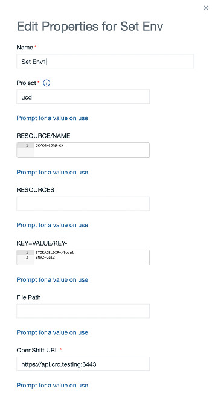

# OpenShift for IBM DevOps Deploy - Usage

Use the Create New-App step to generate OpenShift Container Platform objects that build, deploy, and run the application being created. For more information, see the [Openshift](https://docs.openshift.com/container-platform/3.11/dev_guide/application_lifecycle/new_app.html) documentation.

The following example demonstrates using the step to create an application using a remote git repository. While this demonstration uses a generic process, a component process part of a component can be created using the [Openshift source configuration](https://urbancode.github.io/IBM-UCx-PLUGIN-DOCS/UCD/openshift/) plug-in. The following image shows the plug-in step properties where we specify the source.

The source can be a local or remote git repository, source code path, image, template, and more. If the source is code, you can use the GitHub Source-to-Image (S2I) tool which creates a container image from source based on the source language. It creates build configurations, deployment configurations and services. The following log shows the resources created on lines 66 to 70.

## Using the Set Triggers step

Use the Set Triggers step to set or remove triggers for build configurations, deployment configurations, and other workload objects. The triggers can create a new build or deployment when an image changes. The image below shows the step properties. The RESOURCE/NAME property is used to specify which resource are needed to set triggers and the Step Flags property to specify options like manual, auto or remove triggers.

## Using the Set Image step

The Set Image step updates the existing container images of resources. The following image shows the configuration to update the deployment configuration image **alpine** which exists in Openshift.

## Set Env step

The Set Env step updates environment variables on a pod template or a build configuration. The following image shows the step configuration to update environment variables for the Openshift **cakephp-ex** deployment configuration.

|Back to ...||Latest Version|OpenShift for IBM DevOps Deploy ||||
| :---: | :---: | :---: | :---: | :---: | :---: | :---: |
|[All Plugins](../../index.md)|[Deploy Plugins](../README.md)|[25.1176034](https://raw.githubusercontent.com/UrbanCode/IBM-UCD-PLUGINS/main/files/openshift/ucd-openshift-25.1176034.zip)|[Readme](README.md)|[Overview](overview.md)|[Steps](steps.md)|[Downloads](downloads.md)|
