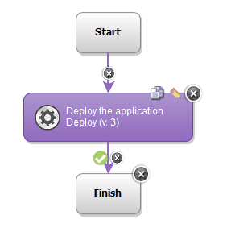

# Oracle WebLogic Application Deployment - Usage

* [Before you begin](#before_you_begin)
* [Step palette](#palette)
* [Examples](#example)

## **Before you begin**

To use this plug-in, the Oracle WebLogic Server version 10g or later and agent must be installed.

## **Step palette**

To access this plug-in in the palette, click **Application Server** > **WebLogic** > **WebLogic Application Deployment**.

## **Example: Deploying an application on Oracle WebLogic Server**

When you deploy an application using the WebLogic Application Server plug-in, you only need to use the [Deploy](https://urbancode.github.io/IBM-UCx-PLUGIN-DOCS/UCD/plugin-air-WebLogic-Application-Deployment/steps.html#deploy) step:

