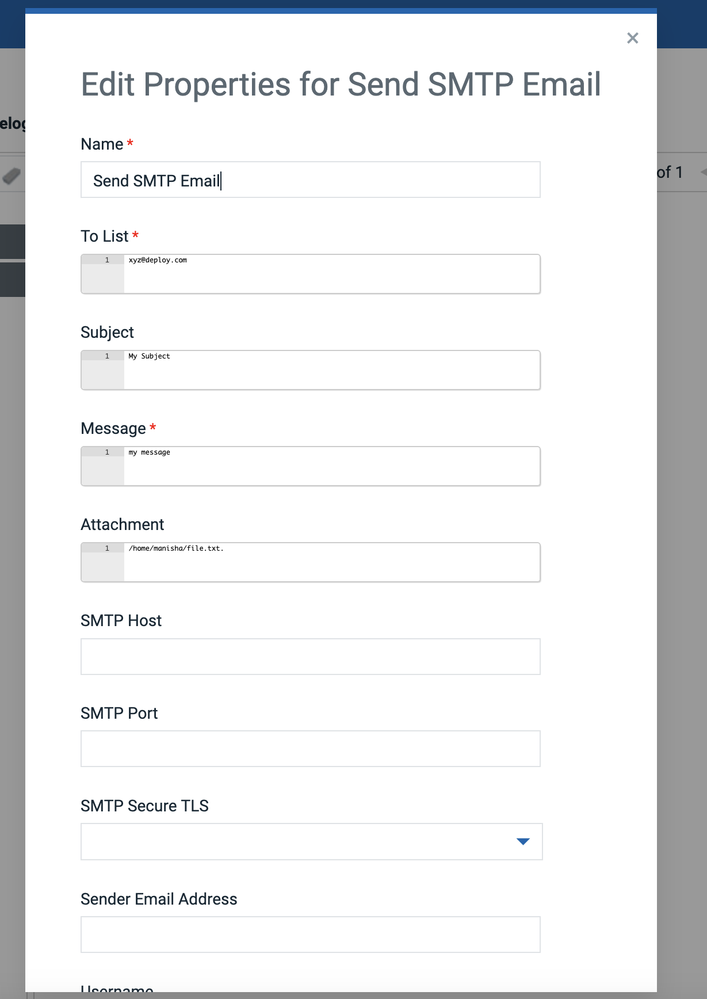

# Usage

## Send an SMTP email

This step allows sending SMTP emails in your deployment process. Users can send email to multiple Email-IDs at once using this step by adding comma separated values in the "To list" parameter. 

.

