# IBM DevOps Release - Usage


## IBM DevOps Release

* [Before you begin](#before_you_begin)
* [Adding comments to a task](#adding-comments-task)
* [Updating an application inventory](#updating-application-inventory)
* [Applying a status to an application version](#applying-status-application-version)
* [Obtaining the appropriate release for an environment](#obtaining-appropriate-release-environment)


## **Before you begin**

Optionally, you can define authentication properties that the plug-in requires as system properties. System properties are accessible from anywhere and are automatically updated throughout all process steps that use them.


## Applying a status to an application version


Use the Add Snapshot Status step to apply a status or stamp to an application versionduring an IBM DevOps Deploy application process. For example, a deployment process might perform a quality test on an application version and add a status based on test results, along with comments and attachments. The inventories of both IBM DevOps Releaseand IBM DevOps Deploy can be automatically updated.

You can manually add statuses, comments, and attachments to application versions in IBM DevOps Release. With the Add Snapshot Status step, you can automate those manual steps with a single deployment process.

### **Before you start**

The Add Snapshot Status step requires the ID of the target snapshot.This value is found in the **snapshot.id** property accessible at the application process scope. To make it available at the component process scope, create a component process property by using the same process as in the Add Comment to Task step.

If the selected snapshot does not exist in IBM DevOps Release, the process fails. You can ensure that the snapshot exists by running an integration process before you run the application or use the Update Application step to the workflow. By using the Update Application step, you ensure that the snapshot exists in the IBM DevOps Release inventory before it is referred to.

## **Example: Add a status to a snapshot**

In this example, the Add Snapshot Status step is used to apply a status to a snapshot, based on the test results of the Install Notification Manager application. This application is an automated Selenium test that is run on a snapshot version.The application process is triggered by a scheduled deployment in IBM DevOps Release. When the test runs, the results are posted to an external web page. Using the Add Snapshot steps also provides the external URL as a comment and attaches a file that contains additional test details.

The version statuses previously created in IBM DevOps Release are as follows:  `SELENIUM TEST PASSED SELENIUM TEST FAILED`

The component property name for the target snapshot ID is **snapshotid** and is assigned a value of **``${p:snapshot.id}``**. The **snapshotid** property contains the ID of the snapshot that the user selects when the application is run.

When you run the process in IBM DevOps Deploy, the **snapshot** field in the Install Notification Manager automatically contains the property reference that was defined earlier.

After completion of the Selenium test, the SELENIUM TEST PASSED status is added to the snapshot. The following figure shows the status applied to the Install Notification Manager application version in IBM DevOps Release.

[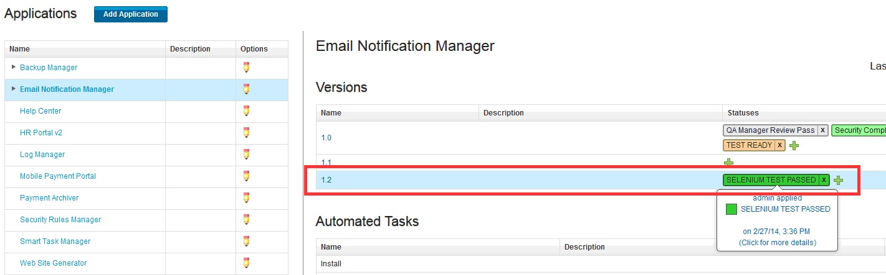](media/release-plugin-add-status-snapshot-result.jpg)
In the following figure, you see that the comment and the attachment have been added to the status.

[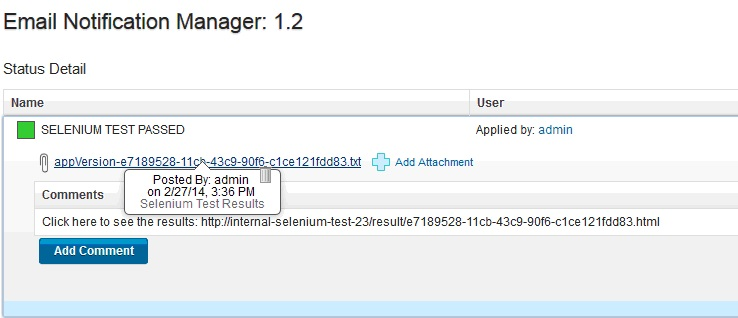](media/release-plugin-add-status-snapshot-status-detail.jpg)

## Obtaining the appropriate release for an environment


Use the Get Release for Environment step to facilitates auto progression for IBM DevOps Release releases. With IBM DevOps Release, you can create a recurring rule for a release that automatically promotes and deploys an application version from one phase of the lifecycle to the next.As soon as an application acquires the required statuses and degree of readiness, it is automatically deployed to the next phase.

When you deploy an application version to a DEV environment, say, a snapshot is created of all component versions that are deployed in the environment. This snapshot is automatically included in the IBM DevOps Release inventory. As soon as the snapshot acquires the required statuses, the recurring rule creates a scheduled deployment of that version for the next phase. By using recurring rules, application versions can be automatically deployed to every phase in the lifecycle through to production as shown in the following figure.

[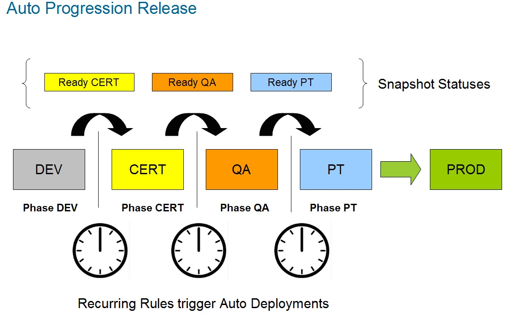](media/release-plugin-release-for-environment-autoprogression.jpg)
The Get Release for Environment step addresses several issues.

* Recurring rules can use patterns, such as simple naming patterns or a regular expression, to select versions automatically. By naming snapshots after releases, a recurring rule can be used to determine the intended release for a snapshot. For example, the following naming pattern can be used by a recurring rule.Using this simple pattern, a recurring rule can select only those versions that follow the pattern.  `Snapshot\_[ReleaseName]`
* You can reserve an environment by using the IBM DevOps Release environment reservation feature. A release environment is reserved for a specific period. After an environment is reserved, the Get Release for Environment step can identify the release that has a reservation for the current time.
After the release is identified and its name retrieved, the value can be stored in an output property and passed to the next step in the process.

### **Before you start**

The Add Snapshot Status step requires the environment ID, which is located in the **snapshot.id** property and accessible at the application process scope. To make it available at the component process scope, create a component process property by using the same process as in the [Add Comment to Task](#id_4_component) step.

## **Example: Determine the active release for an environment**

This example demonstrates how to use the Get Release for Environment step in a process that creates a snapshot that can be used by a recurring rule for auto progression.It uses a naming pattern to name a snapshot and depends on the IBM DevOps Release reservation feature being used.

The following figure shows the settings for the **Get Release for Environment** step. In this example, the **Output Property Name** property is named `releaseName`.

[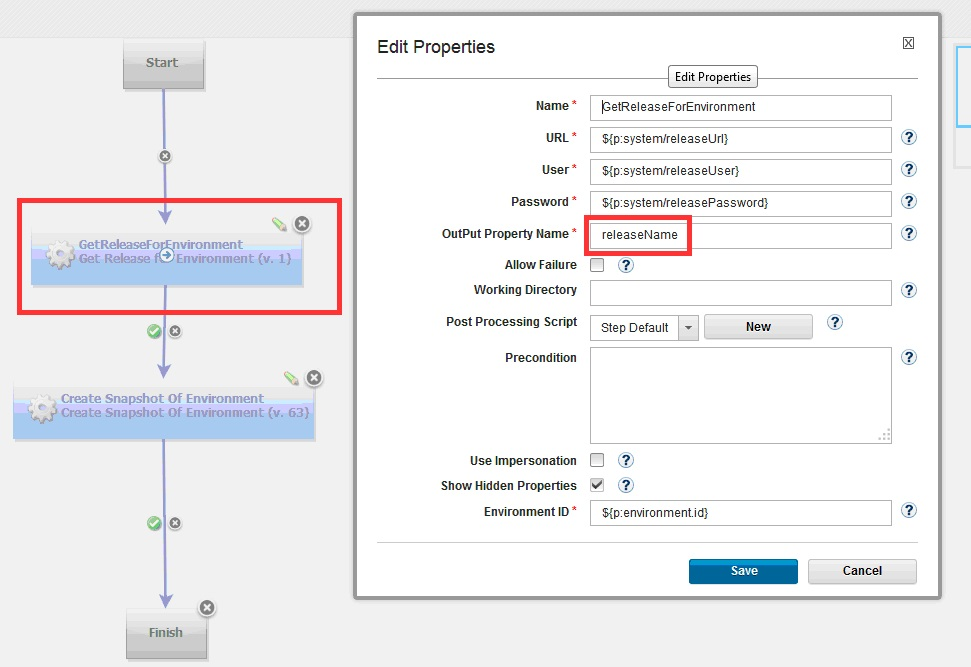](media/release-plugin-release-for-environment-step.jpg) The `releaseName` output property is passed to the next step in the workflow as **``${p:GetReleaseForEnvironment/releaseName}``**, as shown in the following figure.The **Create** **For Environment** step creates a snapshot by using the naming pattern that the recurring rule expects.

[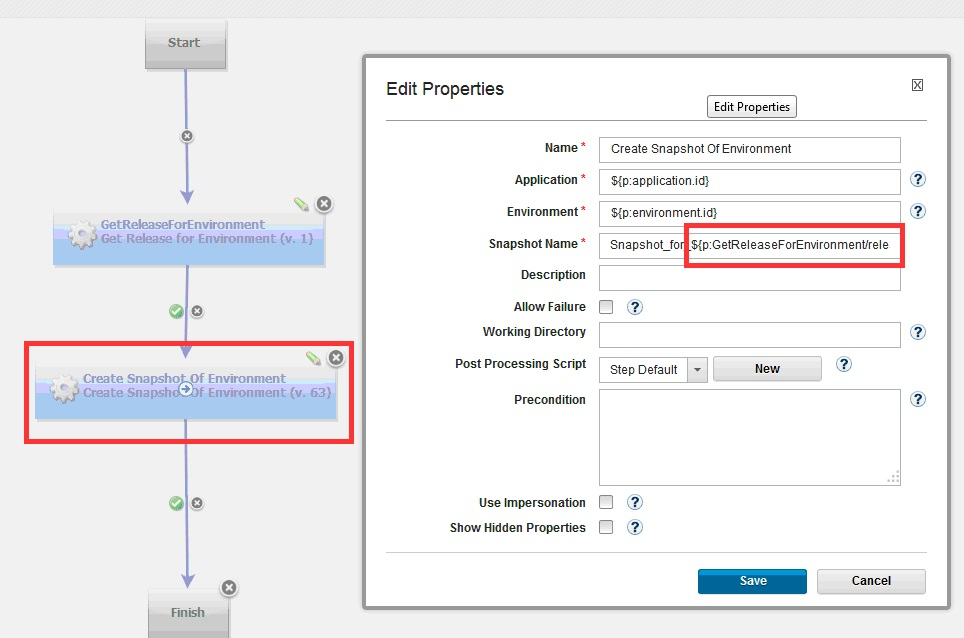](media/release-plugin-release-for-environment-step2.jpg)
When this sample process runs, it captures the name of the release, as shown in the following illustration.

[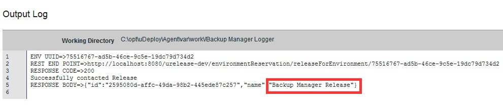](media/release-plugin-release-for-environment-trace.jpg)
The following figure shows the snapshot in the IBM DevOps inventory after an integration process is run.

[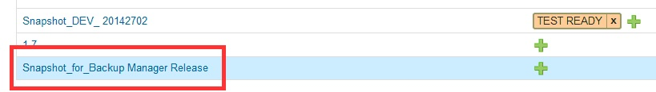](media/release-plugin-release-for-environment-result2.jpg)The recurring rule configuration in IBM DevOps Release is shown in the following figure:

[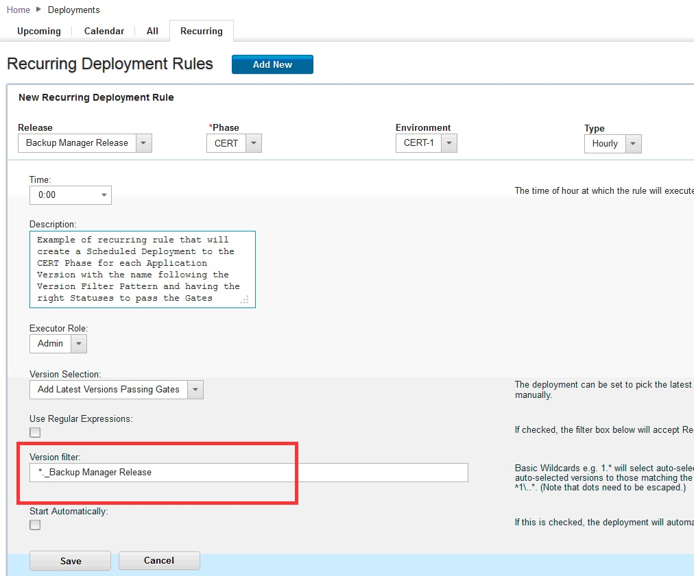](media/release-plugin-release-for-environment-recurring.jpg) **Using dates in naming patterns**
In addition to the simple naming pattern that was used earlier, other patterns can be used to generate snapshot names.For example, you can generate a date to be used in snapshot names:

1. Create a shell step that displays the system date.
2. Use a post-processing script ([described in Adding comments to a task](#adding-comments-task)) to read the output date. Then make the date available to the following step by storing it in an output property. This figure shows a shell step that captures the system date:

[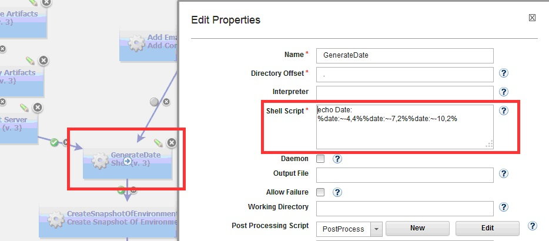](media/release-plugin-tips-generate-date.jpg)
The following figure shows a post-processing script that stores the date in an output property named `GeneratedDate`.

[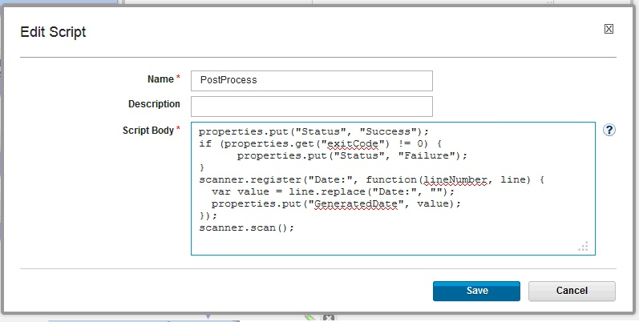](media/release-plugin-tips-generate-date-post-script.jpg)
The date can be accessed by the following step that uses these properties:**Snapshot\_``${p:environment.name}``\_``${p:GenerateDate/GeneratedDate}``**. The generated name will be similar to `Snapshot_DEV_ 20142702`.


## Updating an application inventory


Use the Update Application step to update the inventory in IBM DevOps Release to match the inventory in IBM DevOps Deploy during an integration process. An integration process can be run manually or automatically based on defined specifications. For example, an integration process can be scheduled to run on a defined time interval such as every 30 minutes.

An IBM DevOps Deploy application can also run an integration process as part of its process workflow. For example, if an application creates a snapshot during deployment processing, it can use the Update Application step to update the IBM DevOps Release inventory and access the snapshot later in the workflow. This can be important if the next scheduled integration is minutes or hours away.

## **Example: Update inventory during processing**

This example shows how to update the inventory without using the Update Application step. In the example, an IBM DevOps Deploy deployment process creates a snapshot that contains all component versions that are deployed to a DEV environment. By using the Update Application step,the IBM DevOps Release inventory is updatedas soon as the snapshot is created.

[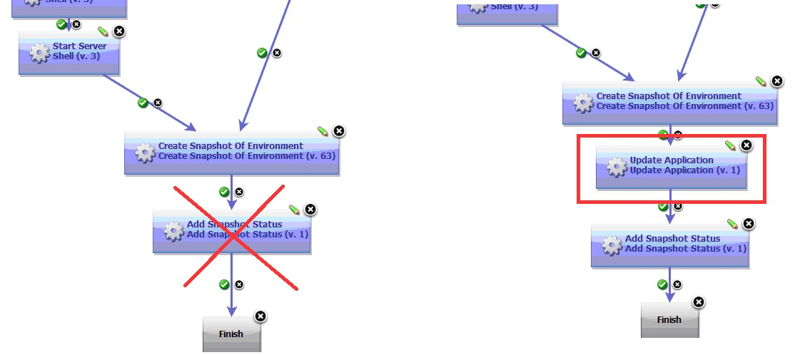](media/release-plugin-update-application-workflow.jpg)
On the IBM DevOps Deploy Properties page, specify **``${p:application:id}``** in the **Application UUID** property. This is a unique number that is assigned when a new application is created in IBM DevOps Deploy.


## Adding comments to a task


Use the Add Comment to Task step to add comments to automated tasks that are started from a scheduled deployment. This step displays the output of IBM DevOps Deploy deployment processes directly in IBM DevOps Release task rows.On the IBM DevOps Release scheduled deployment page, you can access IBM DevOps Deploy task execution logs byclicking the **View Process Request** link that is associated with the task.The link redirects you to the IBM DevOps Deploy Process Request logs, whereyou can update task comments in real time. When IBM DevOps Release starts an automated task, an application process request that contains task-related properties is sent to IBM DevOps Deploy.


## **Before you start**

The task ID is a required input to the Add Comment to Task step. The task ID is contained in the **post-deploy-message** property. You can view this property on the **Properties** tab for the application process request.

The **post-deploy-message** property is accessible within the application process request scope but is not directly accessible by the component process. To provide the ID to the component process, you can create a component process property that the application uses to pass the value of the post-deploy-message property.

To create the component process:

1. In IBM DevOps Deploy, create a component process property without a default value for the property. In the example, the created property is called **taskPostMessage**.  [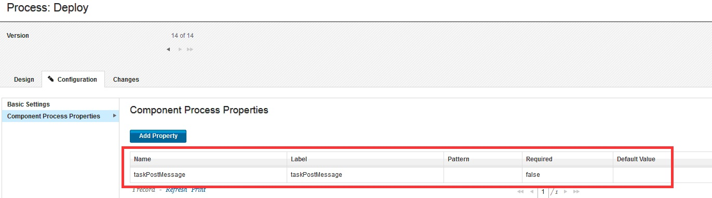](media/release-plugin-property.jpg)
2. In the application process, use the new property to pass the value of the **post-deploy-message** property. On the Edit Properties page for the application process, specify **``${p:post-deploy-message}``** as the value for the created property.  [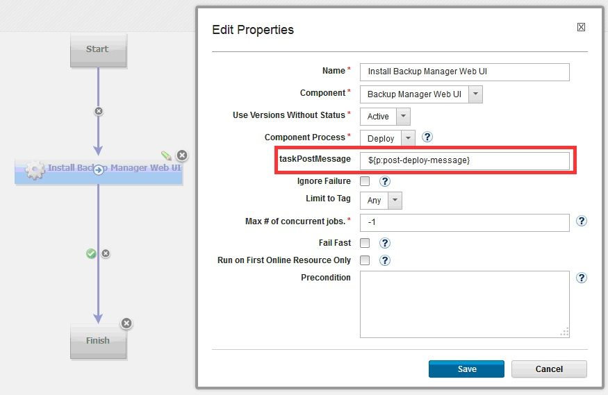](media/release-plugin-add-comment-task-form.jpg)
## **Example: Add a comment to automated task**

In this example, comments are added to an IBM DevOps Release automated task in a scheduled deployment. The comments are generated from the output logs of two steps in an IBM DevOps Deploy component process. The following figure shows the requesting automated task in IBM DevOps Release.

[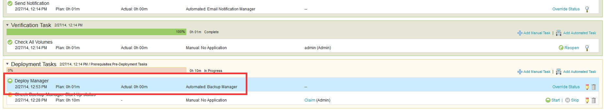](media/release-plugin-add-comment-task-sd.jpg)
The following figure shows the workflow of the corresponding component process in IBM DevOps Deploy.The output logs of the ExportBackupLogs and SendNotification steps are examined and passed to the steps that follow them in the workflow,Add Comment with backup logs URL and Add Email Notification Comment, which are highlighted in the illustration.

[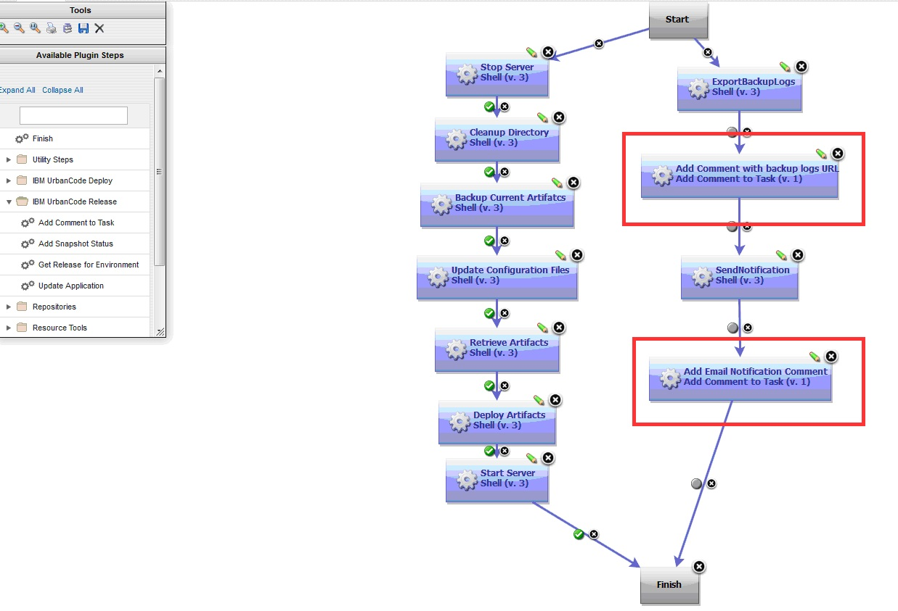](media/release-plugin-add-comment-task-workflow.jpg)
TheExportBackupLogs step uses an external tool to archive backup logs to a web server during processing. An automatically-generated URL is included in the steps output. By using a post processing script, you can scan the steps output and retrieve the URL and save it to a property that can be passed to the subsequent step. The following step, Add Comment with backup logs URL, uses the output property to create a comment in IBM DevOps Release.

## **Example: Scan step output by using post-processing script**

This example demonstrates how to scan the output of a step and save it to an output property that is accessible by the subsequent step. Every automation plug-in step has a post-processing element. By using a post-processing script, you can save the step output to an output property.

In this example, the post-processing script is called **exportOutputLogs**. A post-processing script is a JavaScript script that automatically runs when a step completes processing. In this example, the script scans the output logs of the step.  `properties.put(Status, Success) if (properties.get(exitCode) !=0){ properties.put(Status, Failure); }```

scanner.register (Output;, function(lineNumber, line) { var value = line.replace(Output;,); )}``; scanner.scan();


In this example, the backup log tool has the following output message format. The message contains the URL of the logs where the backup process can be accessed: `Output: http://xxxx/xxx.html`

The following snippet retrieves the row and saves it to an output property that is named **outputlogs**.The **outputlogs** property can be referred to by the next step: **``${p:NameOfTheStep/outputlogs}``**.

**``${p:NameOfTheStep/outputlogs}``**  `scanner.register(Out***put:, function(lineNumber, line) {*** var value = line.repla***ce(Output:, );*** properties.put(output***logs, value);*** }``); scanner.scan();`

The following figure below shows the configuration for an Add Comment to Task step, using the properties created earlier. The step retrieves the output log of the previous step and sends it to IBM DevOps Release.

[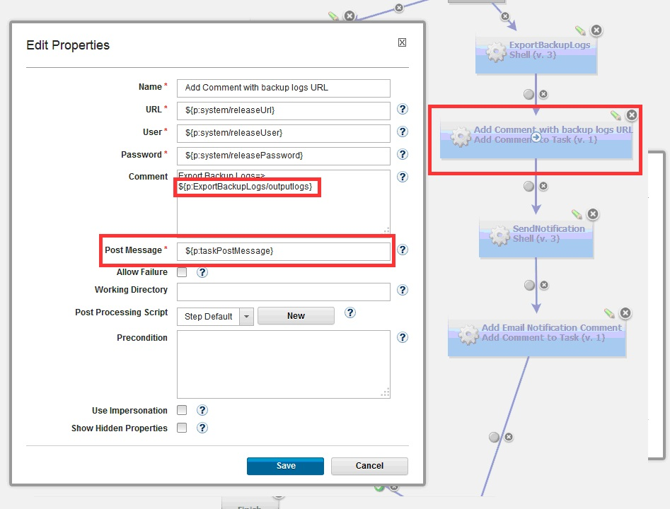](media/release-plugin-add-comment-task-step.jpg)
During the execution of the IBM DevOps Deploy deployment process, the comments are created and added to the task row in IBM DevOps Release. By expanding the row, the comments are displayed, as shown in the following figure:

[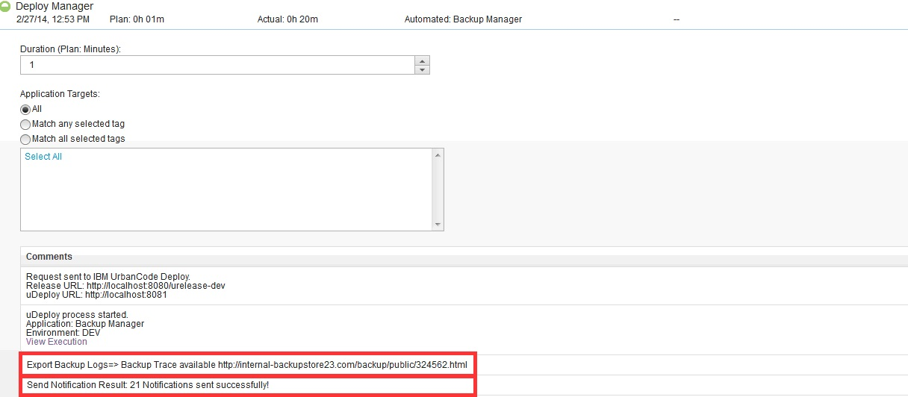](media/release-plugin-add-comment-task-result.jpg)


|Back to ...||Latest Version|IBM DevOps Release ||||
| :---: | :---: | :---: | :---: | :---: | :---: | :---: |
|[All Plugins](../../index.md)|[Deploy Plugins](../README.md)|[9.1056530](https://raw.githubusercontent.com/UrbanCode/IBM-UCD-PLUGINS/main/files/ucr-plugin/ucr-plugin-9.1056530.zip)|[Readme](README.md)|[Overview](overview.md)|[Steps](steps.md)|[Downloads](downloads.md)|
