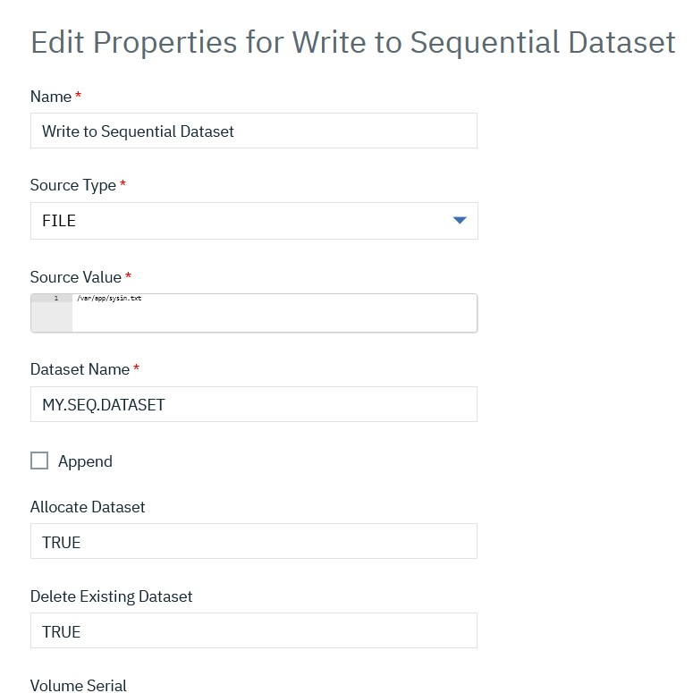
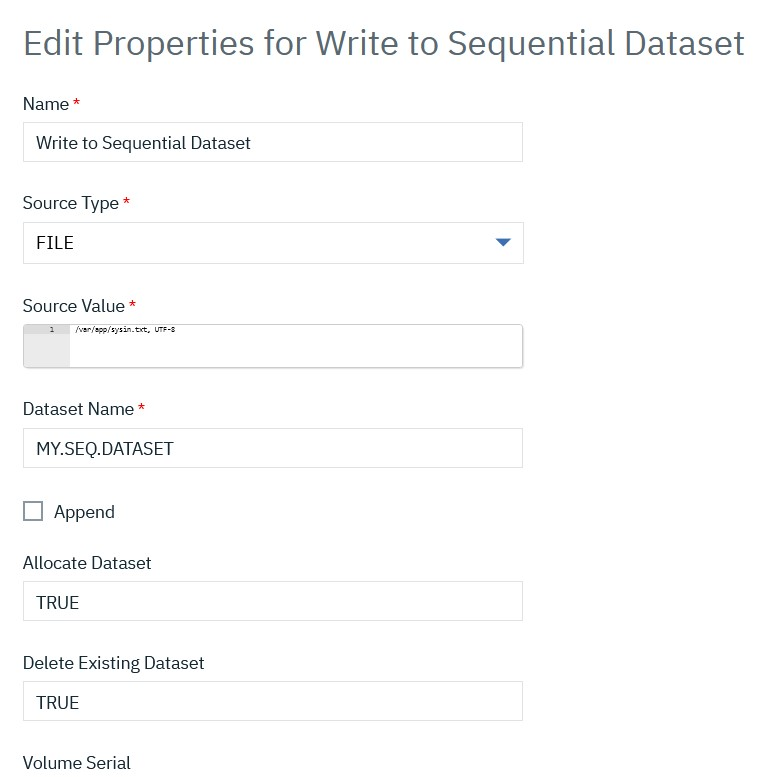
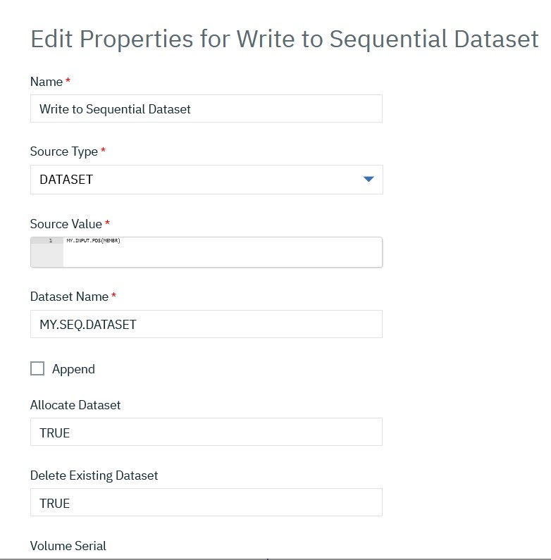
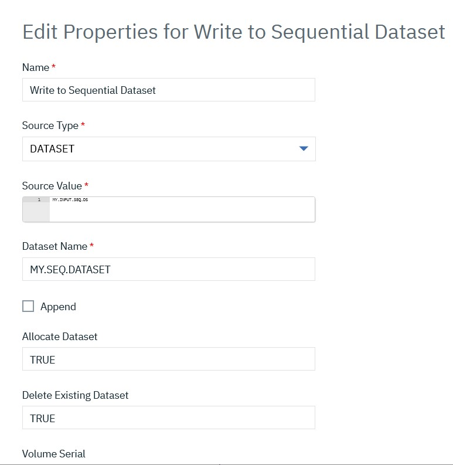

# z/OS Dataset Writer - Usage


The z/OS Dataset Writer plug-in contains the **Write to Sequential Dataset** step to write input text, dataset, or USS file to a sequential dataset.

* [Copy text to a dataset](#copy-text-to-a-dataset)
* [Copy file data to a dataset](#copy-file-data-to-a-dataset)
* [Copying PDS member or Sequential dataset data to another dataset](#copying-pds-member-or-sequential-dataset-data-to-another-dataset)

## Copy text to a dataset

Select Source Type as TEXT from the drop-down and a JCL SYSIN content can be passed as text input in Source value. Refer to the below screenshot:

[](media/picture1.png)

Third input Dataset Name can either be a Sequential dataset name as below MY.SEQ.DATASET or could be a user-defined property say ```${p:sequential.dataset.name}```. The `sequential.dataset.name` property needs to be defined with a sequential dataset name for writing the input text.

[](media/zos-dataset-writer-plugin.png)

Select checkbox **Append** to append input text data after the existing data in a given dataset. By default, **Append** is unchecked and writes the input text newly in a given dataset.

The **Allocate Data Set** and **Delete Existing Data Set** values are set to `TRUE` by default. As the name suggests, setting input **Allocate Data Set** to `TRUE` will give you an option to decide and set the parameters of a sequential dataset to be created. If **Allocate Data Set** is `FALSE`, the plug-in step assumes that the dataset exists and writes the input text to the dataset.

Input **Delete Existing Data Set** comes into action only when **Allocate Data Set** is set to `TRUE` and deletes the existing dataset. Set to **Allocate Data Set** to `TRUE` to allocate a new dataset with passed parameters and write the input text to a sequential dataset.

The remaining inputs in the step are to set parameters like DCB and Space etc., for a sequential dataset and are applicable only if **Allocate Data Set** is `TRUE`.

## Copy file data to a dataset

Select **Source Type** as `FILE` from the drop-down and pass the file path as input in **Source value**. Refer to the below screenshot:


By default, the plugin assumes the USS file to be in IBM-1047 encoding. However, encoding can be passed along with a file path separated by a comma (,) as shown in the screenshot below

The plugin step copies the data in the USS file to the Sequential dataset.

## Copying PDS member or Sequential dataset data to another dataset

Select **Source Type** as `DATASET` from the drop-down and pass the PDS member or Sequential dataset name as input in **Source value**. Refer to the below screenshots:


For Sequential dataset as input


The plugin step copies the data from a PDS member or input Sequential dataset to the Output Sequential dataset.

|          Back to ...          |                                |                                                                   Latest Version                                                                    | z/OS Dataset Writer ||||
|:-----------------------------:|:------------------------------:|:---------------------------------------------------------------------------------------------------------------------------------------------------:|:-------------------:| :---: | :---: | :---: |
| [All Plugins](../../index.md) | [Deploy Plugins](../README.md) | [4.1176024](https://raw.githubusercontent.com/UrbanCode/IBM-UCD-PLUGINS/main/files/zos-dataset-writer/ucd-plugins-zos-dataset-writer-4.1176024.zip) | [Readme](README.md) |[Overview](overview.md)|[Steps](steps.md)|[Downloads](downloads.md)|
