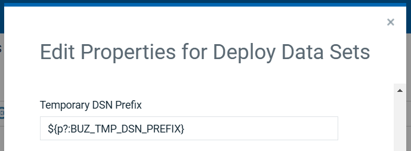

# z/OS Utility - Troubleshooting


## Copy Artifacts step limitation

When you use the Copy Artifacts step, you can copy only in the same logical partition (LPAR). To transfer artifacts between different LPARs, use the FTP Artifacts step.

---

## Missing return code for Run TSO or ISPF Command step

If you use the Run TSO or ISPF Command step to run a TSO command, the return code might not be displayed in IBM DevOps Deploy because the ISPF gateway does not support passing return codes when in TSO mode. To work around this behavior, in the **TSO Or ISPF** list, select **ISPF** instead of **TSO**.

---

## Repository field for Copy Artifacts and FTP Artifacts steps

The local repository referred to in the Copy Artifacts and FTP Artifacts steps is not the Codestation repository, but rather the z/OS deployment tools artifact repository. You specify this directory when you install the z/OS deployment tools. By default, the artifact repository is the following directory: *agent\_installation\_directory*/var/repository. To learn more, see [Completing the installation of the z/OS deployment tools](http://www-01.ibm.com/support/knowledgecenter/SS4GSP_6.2.1/com.ibm.udeploy.doc/topics/zos_installing_finish.html?lang=en).

---

## Disable inputs for Z Inventory

Follow below steps to disable inputs for Z Inventory.

* Upgrade the z/OS Utility plugin to latest version.
* Take a backup of `AGENT_HOME/bin/setenv-zos.sh` file
* Edit `AGENT_HOME/bin/setenv-zos.sh` file and add `ignore.zsearch.inputs` property in `ZOS_JAVA_OPTS` export command as below setting it to `true`.

  ```
    export ZOS_JAVA_OPTS='-Xmx128m -Dignore.zsearch.inputs=true' 
  ```

* Restart the Agent for changes to be applied.

**Note:** This will also fix APAR PH57385 - Error deploying version.Status code - 400 

---

## Setting Temporary DSN prefix

During the step execution, temporary datasets are created using the
HLQ (High Level Qualifier) prefix given in the hidden input `Temporary DSN Prefix`.

By default, the value of `Temporary DSN Prefix` is set to `${p?:BUZ_TMP_DSN_PREFIX}` as shown below for `Deploy Data sets` step.



If `BUZ_TMP_DSN_PREFIX` is not set on the Agent and the value of `Temporary DSN Prefix` is empty, Impersonation/Agent Userid is used as HLQ (High Level Qualifier) prefix to create temporary datasets.

Datasets creation using the Impersonation/Agent UserId as HLQ prefix may be disabled on the MVS System resulting in below error

> BPXWDYN failed; S99ERROR/S99INFO = 0x970c/0x0 RC=-1760821248 (0x970c0000)

In such a scenario a custom temporary DSN prefix needs to be setup either at the Plugin Step or at the Agent. 

### To set the Temporary Dataset Prefix value at Agent level

In the file `<AGENT_HOME>/bin/setenv-zos.sh`, add below export statement

> export BUZ_TMP_DSN_PREFIX=UCD.TMP

This will set prefix to the given value (`UCD.TMP`). After the changes, agent restart is needed.

### To set the Temporary Dataset Prefix at step level

Modify the hidden input in the plugin step `Temporary DSN Prefix` to allowed dataset prefix on the MVS system. 

---

## Configuring Timeout To Fix SocketTimeoutException

When working with a large number of artifacts, deployment or rollback fails with below error

```
java.net.SocketTimeoutException: Read timed out
```

The default timeout is `five minutes`. To increase the value set the environment variable `UC_HTTP_TIMEOUT` to a value in milliseconds 
in `<AGENT_HOME>/bin/setenv-zos.sh` script like below.

```
# Setting timeout to 15 minutes
export UC_HTTP_TIMEOUT=900000
```

After adding timeout value, `restart` the agent.


|          Back to ...          |                                |                                                        Latest Version                                                         |    z/OS Utility     |                         |                   |                   |                           |
|:-----------------------------:|:------------------------------:|:-----------------------------------------------------------------------------------------------------------------------------:|:-------------------:|:-----------------------:|:-----------------:|:-----------------:|:-------------------------:|
| [All Plugins](../../index.md) | [Deploy Plugins](../README.md) | [98.1178819](https://raw.githubusercontent.com/UrbanCode/IBM-UCD-PLUGINS/main/files/zos-deploy/devops-deploy-zos-deploy-98.1178819.zip) | [Readme](README.md) | [Overview](overview.md) | [Steps](steps.md) | [Usage](usage.md) | [Downloads](downloads.md) |
