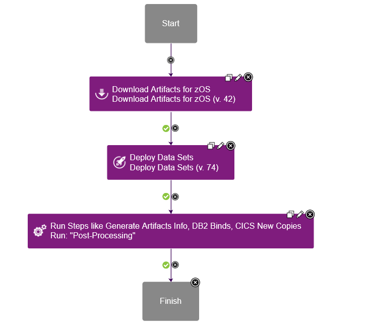
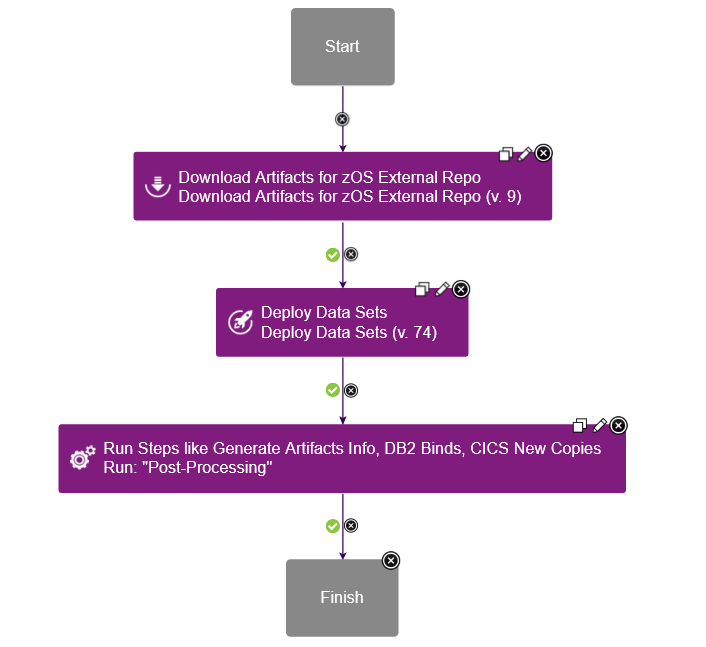
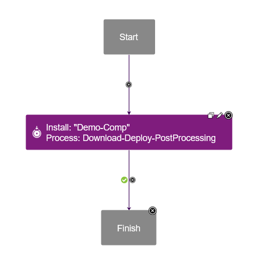
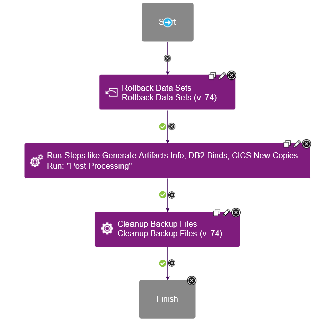
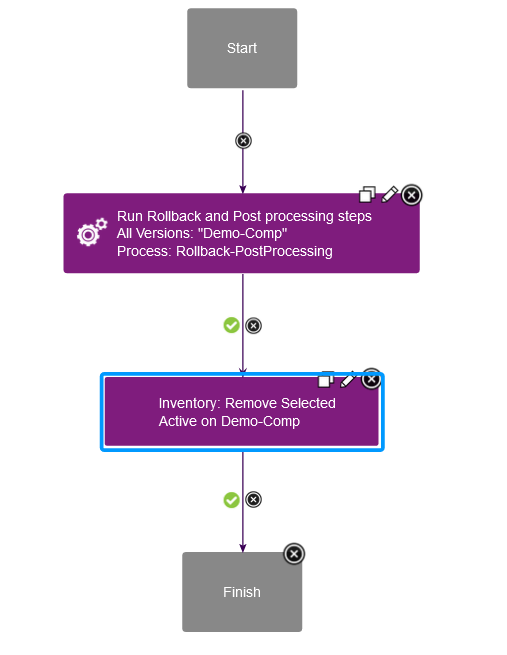

# Deployment and Rollback for z/OS component version

---

## This page covers below sections

* [Deploy a component version to z/OS platform](deploy-rollback.md#deploy-a-component-version-to-zos-platform)
  * [Component process setup for deploying component version](deploy-rollback.md#component-process-setup-for-deploying-component-version)
  * [Application process setup for deploying component version](deploy-rollback.md#application-process-setup-for-deploying-component-version)
* [Rollback a component version from z/OS platform](deploy-rollback.md#rollback-a-component-version-from-zos-platform)
  * [Component process setup for rolling back a component version](deploy-rollback.md#component-process-setup-for-rolling-back-a-component-version)
  * [Application process setup for rolling back a component version](deploy-rollback.md#application-process-setup-for-rolling-back-a-component-version)

## Deploy a component version to z/OS platform

### Component process setup for deploying component version

For zOS deployment, create a component process with __Process Type__ as __Deployment__.

Following steps are mandatory for deploying a zOS Component version stored on DevOps Deploy codestation.

* [Download Artifacts for zOS](../../UrbancodeVFS/steps.md#download-artifacts-for-zos) step to download the version artifacts
* [Deploy Data sets](../steps.md#deploy-datasets-and-uss-files) step to deploy datasets to mapped target Dataset/HFS Directory

Component process design will be as below.

Post-processing steps can be added as per the requirement after [Deploy Data sets](../steps.md#deploy-datasets-and-uss-files) step with below steps

* [Generate Artifact Information](../steps.md#generate-artifact-information) step to generate text based on the passed template.
* [Submit Job](../steps.md#submit-job) step to run DB2 Bind job
* [Replace Token MVS](../steps.md#replace-tokens-mvs) step to replace tokens in dataset/member
* [CICS New Copy](../../CICS/steps.md#new-copy-resources) step and so on.

If external repository (Artifactory or Nexus) is used to store zOS Component version, Use [Download Artifacts for zOS External Repo](../../zOS-external-artifact-download/steps.md#download-artifacts) step to download version artifacts from the external repository.
Component process design will be as below.

### Application process setup for deploying component version

For deployment, create an application process with __Inventory Management__ set to __Automatic__ under process configurations.
A sample application process contains __Install Component__ step which internally calls the component process for deployment contains Deploy Data sets step.

Application process design will be as below.

## Rollback a component version from z/OS platform

### Component process setup for rolling back a component version

For rollback, create a component process with __Process Type__ as __Uninstall__.
A sample component process design starts with [Rollback Data sets](../steps.md#rollback-datasets-and-uss-files) step and ends with [Cleanup Backup Files](../steps.md#cleanup-backup-files) step.

Post-processing steps can be added as per the requirements after [Rollback data sets](../steps.md#rollback-datasets-and-uss-files) step with below steps

* [Generate Artifact Information](../steps.md#generate-artifact-information) step to generate text based on the passed template.
* [Submit Job](../steps.md#submit-job) step to run DB2 Bind job
* [CICS New Copy](../../CICS/steps.md#new-copy-resources) step and so on.

Component process design will be as below.

### Application process setup for rolling back a component version

For rollbacks, an application process is created with __Inventory Management__ set to __Advanced__ under process configurations.
A sample application process contains two steps.

* __Run Process For Each Version__ step
* __Component Inventory Update__ step

In __Run Process For Each Version__ step point to the component process created for rollback.
__Component Inventory Update__ step must be the last step in the application process design with below settings

1. Select component
2. Set __Action__ to __Remove Desired Inventory__
3. Set __For Which Versions?__ to __All selected (Manual uninstall)__
4. __Status__ is kept __Active__

Application process design will be as below.

| Back to ...          |
|----------------------|
| [Usage](../usage.md) |
