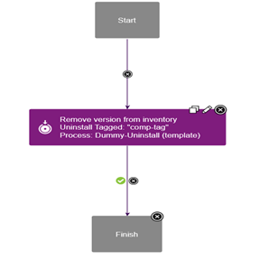
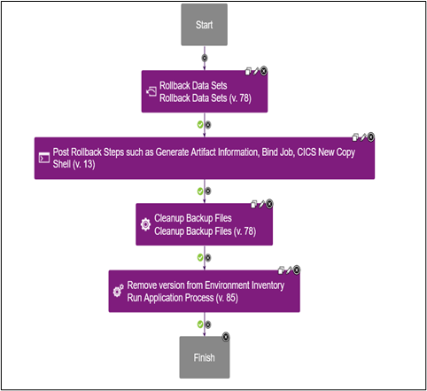
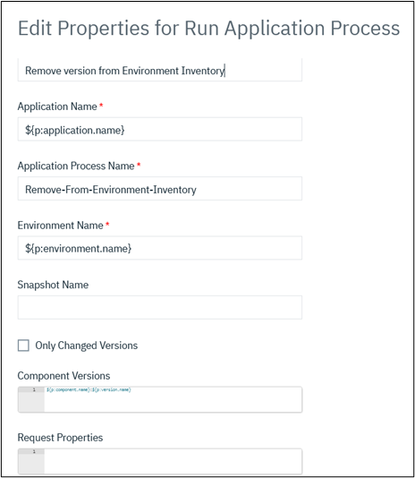

# Rollback for z/OS component version with application template

## This page covers below sections

- [Rollback for z/OS component version with application template](#rollback-for-zos-component-version-with-application-template)
  - [This page covers below sections](#this-page-covers-below-sections)
    - [Overview](#overview)
    - [Component Process for Uninstall](#component-process-for-uninstall)
    - [Application Template Process for Uninstall](#application-template-process-for-uninstall)
    - [Component Process for Rollback](#component-process-for-rollback)
    - [Application Template Process for Rollback](#application-template-process-for-rollback)
    - [Execution](#execution)

### Overview

When designing application process with application template below two differences are observed

* Application process steps like **Install Multiple component** and **Uninstall multiple components** works with component tag instead of component name.
* Application process inside an application template has automatic inventory management and cannot be managed manually.

To overcome above differences below changes are needed

* Add a component tag to z/OS component(s)
* Create two component processes under z/OS component (or) component template and two application processes for z/OS Artifacts Rollback.
One to run as an **operational** process and other to run as an **uninstall** process to remove the version from inventory as shown below

### Component Process for Uninstall

* Create a component process with type **uninstall** and add a **set status** step to **success** as below.

_This is a dummy step to **uninstall** the version from the inventory after all the steps of Rollback process is completed successfully._

### Application Template Process for Uninstall

* Create a new process in the application template. Add **Uninstall Multiple Components** step. Update below
  * Add name for process step for e.g., "Remove version from inventory"
  * Add component tag which has the component process
  * Add component process name which has **set status** step
  * Set **Uninstall Type** to **All Selected For Process**

### Component Process for Rollback

Create a component process with type **operational (With version)** and add all the steps of a typical rollback process like below

* Rollback Data Sets step
* Generate artifact step, Bind step, CICS step etc.,
* Cleanup backup files step
* Run Application process step

The Run Application process step should point to the [uninstall application process](#application-template-process-for-uninstall) and all other values should be UCD properties like below

### Application Template Process for Rollback

Create a new process in the application template. Add **Uninstall Multiple Components** step and update below

* Add name for process step
* Add component tag which has the component process
* Add component process name which has rollback steps
* Set **Uninstall Type** to **All Selected For Process**

### Execution

To rollback Z Artifacts, run [Rollback Z Artifacts process](#application-template-process-for-rollback) to run all the rollback steps under component process.
The Component process triggers [Remove Version From Inventory process](#application-template-process-for-uninstall) only when artifacts are rolled back and all the steps ran successfully.
