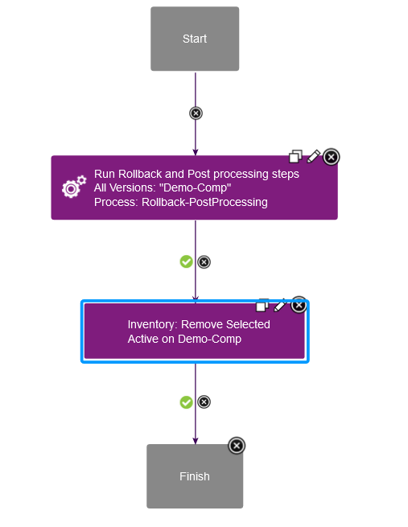

# Deployment and Rollback for z/OS component version

---

## Deploy a component version to z/OS platform

### Component process setup for deploying component version

For zOS deployment, create a component process with __Process Type__ as __Deployment__.

Following steps are mandatory for deploying a zOS Component version stored on UrbanCode Deploy codestation.
* __Download Artifacts for zOS__ step to download the version artifacts
* __Deploy Data sets__ step to deploy datasets to mapped target Dataset/HFS Directory

Component process design will be as below.

Post processing steps can be added as per the requirement after __Deploy data sets__ step with below steps
* __Generate Artifact Information__ step to generate text based on the passed template.
* __Submit Job__ step to run DB2 Bind job
* __Replace Token MVS__ step to replace tokens in dataset/member
* __CICS New Copy__ step and so on.

If external repository (Artifactory or Nexus) is used to store zOS Component version, Use __Download Artifacts for zOS External Repo__ step instead of __Download Artifacts for zOS__ step to download version artifacts from the external repository.
Component process design will be as below.

### Application process setup for deploying component version

For deployment, create an application process with __Inventory Management__ set to __Automatic__ under process configurations.
A sample application process contains __Install Component__ step which internally calls the component process for deployment contains Deploy Data sets step.

Application process design will be as below.

## Rollback a component version from z/OS platform

### Component process setup for rolling back a component version

For rollback, create a component process with __Process Type__ as __Uninstall__.
A sample component process design starts with __Rollback Data sets__ step and ends with __Cleanup Backup Files__ step.

Post processing steps can be added as per the requirements after __Rollback data sets__ step with below steps
* __Generate Artifact Information__ step to generate text based on the passed template.
* __Submit Job__ step to run DB2 Bind job
* __CICS New Copy__ step and so on.

Component process design will be as below.

### Application process setup for rolling back a component version

For rollbacks, an application process is created with __Inventory Management__ set to __Advanced__ under process configurations.
A sample application process contains two steps.
* __Run Process For Each Version__ step
* __Component Inventory Update__ step

In __Run Process For Each Version__ step point to the component process created for rollback.
__Component Inventory Update__ step must be the last step in the application process design with below settings

1. Select component
2. Set __Action__ to __Remove Desired Inventory__
3. Set __For Which Versions?__ to __All selected (Manual uninstall)__
4. __Status__ is kept __Active__

Application process design will be as below.

| Back to ...          |
|----------------------|
| [Usage](../usage.md) |
