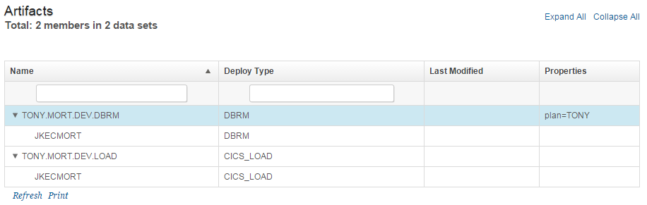
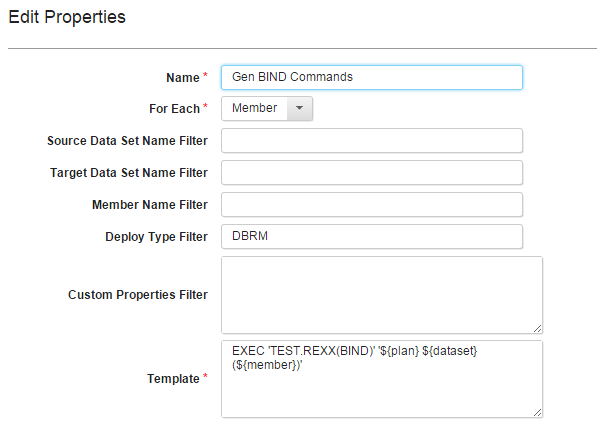
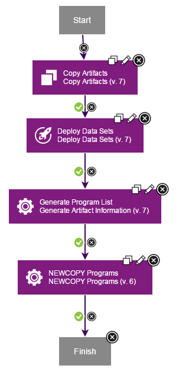
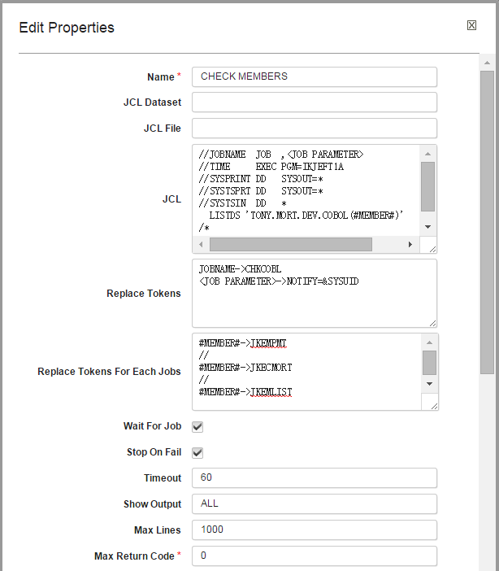
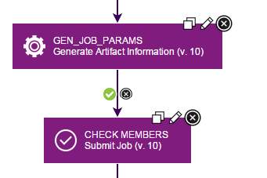
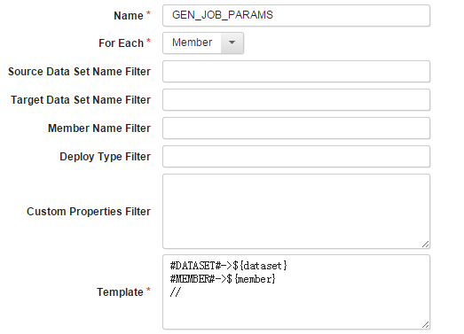
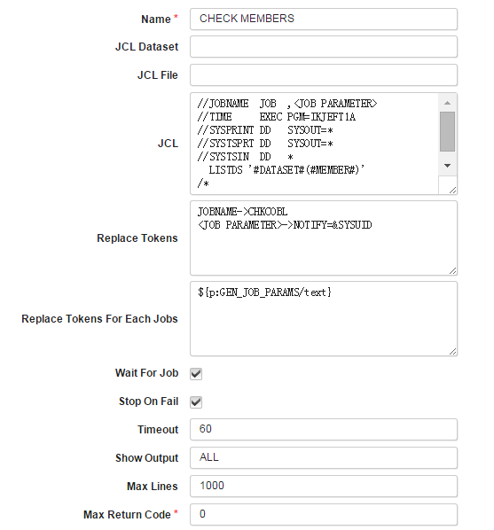
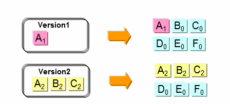
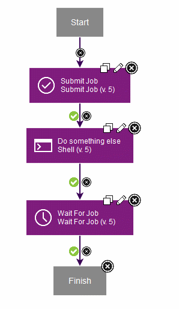

# z/OS Utility

## Usage

The following pages provide usage information about this plug-in:

* [Deployment and Rollback for z/OS component version](usage-pages/deploy-rollback.md#deployment-and-rollback-for-zos-component-version)
  * [Deploy a component version to z/OS platform](usage-pages/deploy-rollback.md#deploy-a-component-version-to-zos-platform)
    * [Component process setup for deploying component version](usage-pages/deploy-rollback.md#component-process-setup-for-deploying-component-version)
    * [Application process setup for deploying component version](usage-pages/deploy-rollback.md#application-process-setup-for-deploying-component-version)
  * [Rollback a component version from z/OS platform](usage-pages/deploy-rollback.md#rollback-a-component-version-from-zos-platform)
    * [Component process setup for rolling back a component version](usage-pages/deploy-rollback.md#component-process-setup-for-rolling-back-a-component-version)
    * [Application process setup for rolling back a component version](usage-pages/deploy-rollback.md#application-process-setup-for-rolling-back-a-component-version)
* [Rollback for z/OS component version with application template](usage-pages/rollback-with-template.md#rollback-for-zos-component-version-with-application-template)
* [Deploying by using the Job Monitor](#deploying-by-using-the-job-monitor)
* [Submitting a JCL job and then checking for status](#submitting-a-jcl-job-and-then-checking-for-status)
* [Submitting a JCL job from a template](#submitting-jcl-jobs-from-a-template)
* [MVS component template](#mvs-component-template)
* [Managing redundant versions](#managing-redundant-versions)
  * [Remove Redundant Versions](#remove-redundant-versions)
  * [Ignoring High Level Qualifiers](#ignoring-high-level-qualifiers)
* [Running MVS system commands](#running-mvs-system-commands)
* [Using custom properties in deployments](#using-custom-properties-in-deployments)
* [Deploying data sets and running CICS commands](#deploying-data-sets-and-running-cics-commands)
* [Deploying HFS files](#deploying-hfs-files)

## Running MVS system commands

The Run MVS Command step uses the Java programming interface with the System Display and Search Facility (SDSF) to run MVS system commands on the agent. To use the Run MVS Command step, you must work with your system administrator to configure security properly for the agent user account. In the following examples, protecting resources by setting the universal access authority (UACC) to NONE might prevent all users, except users with explicit permission, from accessing the protected command.

The agent user account must be authorized to use SDSF from Java and must be authorized to issue MVS slash (/) commands from SDSF. MVS commands are protected by defining a resource name in the SDSF class, as shown in the following table.

| Resource name  | Class | Access |
|----------------|-------|--------|
| ISFOPER.SYSTEM | SDSF  | READ   |

If the SDSF class is not activated yet, use following command to activate itfirst. SETROPTS CLASSACT(SDSF)

To use the Resource Access Control Facility (RACF) to authorize the use of an MVS command, issue commands similar to the commands in the following examples: RDEFINE SDSF ISFOPER.SYSTEM UACC(NONE) PERMIT ISFOPER.SYSTEM CLASS(SDSF) ID(userid or groupid) ACCESS(READ)

Additionally, the agent user account must be authorized to use the ULOG command to view command responses. MVS commands can return responses to the user console and to the user log (ULOG). The ULOG command is protected a resource in the SDSF class, as shown in the following table.

| Resource name           | Class | Access |
|-------------------------|-------|--------|
| ISFCMD.ODSP.ULOG.*jesx* | SDSF  | READ   |

To use the Resource Access Control Facility (RACF) to authorize the use of the ULOG command, issue commands similar to the commands in the following example. RDEFINE SDSF ISFCMD.ODSP.ULOG.*UACC(NONE) PERMIT ISFCMD.ODSP.ULOG.* CLASS(SDSF) ID(userid or groupid) ACCESS(READ)

Run following command to make your changes to profiles effective. SETROPTS RACLIST(SDSF) REFRESH

For more information on setting up SDSF security, see the documentation available at [System Display and Search Facility](http://www-03.ibm.com/systems/z/os/zos/features/sdsf/isflib.html "System Display and Search Facility").

The following settings show an example of how to configure the Run MVS Command step.


## Using custom properties in deployments

You can add custom properties to data sets or to members when you create component versions. The custom properties can then be used by the Generate Artifact Information step to generate commands or other input that can be used by other subsequent steps in the process.

Before you can use the Generate Artifact Information step, a component version must be deployed by using the Deploy Data Sets step.

In the following example, a custom property is used to generate IBM DB2 database commands.

The following shiplist file shows the DB2 plan name as a custom property to the DBRM data set:

```yaml
<manifest type="MANIFEST\_SHIPLIST">
<container name="TONY.MORT.DEV.LOAD" type="PDS" deployType="CICS\_LOAD">
<resource name="JKECMORT" type="PDSMember"/>
</container>
<container name="TONY.MORT.DEV.DBRM" type="PDS" deployType="DBRM">
**<property name="plan" value="TONY"/>**
<resource name="\*" type="PDSMember"/>
</container>
</manifest>
```

When you create a component version by using this shiplist file, the custom property is visible in the version artifacts view. Properties added to a data set are also visible to all members of the data set.

[](media/zos_props_1.png)

In the following deployment process, the FTP Artifacts and Deploy Data Sets steps deploy the members to the target system. The Generate Artifact Information step generates TSO commands that are then used to run the REXX BIND commands. The generated commands contain the DB2 plan name from the custom property. The generated commands are then run by the Run TSO or ISPF Command.


The Generate Artifact Information step uses the following settings:

[](media/zos_props_3.png)

Use ``${*propertyName*}`` to refer to a custom property. In the previous example, TEST.REXX(BIND) is a REXX script that accepts plan, library, and member values as parameters and then runs the DB2 DSN BIND command.

The Generate Artifact Information step generates the following output properties. In this example, the **text** property contains the generated TSO commands.

[](media/zos_props_4.png)

In this example, the Run TSO or ISPF Command step uses the following settings:


## Deploying data sets and running CICS commands

## Example: Deploying data sets and running CICS commands

In this process example, the z/OS data sets must be in the component. Also, the environment contains agents that are running z/OS. In addition to the z/OS Utility plug-in, the CICS TS plug-in must be installed. The process runs the following steps in order:

1. The [Copy Artifacts](https://urbancode.github.io/IBM-UCx-PLUGIN-DOCS/UCD/zos-deploy/steps.html) step loads the artifacts that make up the z/OS component version.
2. The [Deploy Data Sets](https://urbancode.github.io/IBM-UCx-PLUGIN-DOCS/UCD/zos-deploy/steps.html) step deploys the component version to z/OS.
3. The [Generate Artifact Information](https://urbancode.github.io/IBM-UCx-PLUGIN-DOCS/UCD/zos-deploy/steps.html) step generates a list of CICS members.
4. The [NEWCOPY Programs](https://community.ibm.com/community/user/wasdevops/blogs/ibm-ibm-devops-expert/2022/04/27/steps-to-install-ucd-702-agent-on-zos-and-ucd-serv) step, in the CICS TS plug-in, runs the NEWCOPY command on the members.

[](media/zos_cics_1.png)

In this example, the Generate Artifact Information step is configured with the following properties:


The output of the Generate Artifact Information step looks similar to the following properties:


In this example, the NEWCOPY Programs step is configured with the following properties:

[](media/zos_cics_4.png)

The execution log of the NEWCOPY Programs step looks similar to the following output:

```text
PerformNEWCOPY:

Info:NEWCOPY "JKEMLIST" succeeded.

Info:NEWCOPY "JKEMORT" succeeded.

Info:NEWCOPY "JKEBXXC2" succeeded.

Info:NEWCOPY "JKEBXXS1" succeeded.

Info:NEWCOPY "JKECSMRD" succeeded.

Info:NEWCOPY "JKMXXGB" succeeded.

Info:NEWCOPY "JKEMLIS" succeeded.

Info:NEWCOPY "JKECSMRT" succeeded.

Info:NEWCOPY "JKMXXGA" succeeded.

Info:NEWCOPY "JKECMAIN" succeeded.

Info:NEWCOPY "JKEBXXC1" succeeded.

Info:NEWCOPY "JKEMLISD" succeeded.

Info:NEWCOPY "JKEMPMT" succeeded.

Info:NEWCOPY "JKECMORT" succeeded.

Info:NEWCOPY "JKEMAIN" succeeded.

Summary:15 NEWCOPY request(s) succeeded, 0 NEWCOPY request(s) failed.
```

## Submitting JCL jobs from a template

To submit a JCL job from a template, use the [Submit Job](https://urbancode.github.io/IBM-UCx-PLUGIN-DOCS/UCD/zos-deploy/steps.html#submit_job) step, and then set up the step properties similar to the following example:

[](media/submit_job_template.gif)

To submit multiple jobs from the same template, specify multiple sets of rules in the **Replace Tokens For Each Job** field. Separate rule sets with a new line that contains only two forward slashes (//). The status of the Submit Job step is success if all of the jobs run to completion, and fail if any of the jobs fail. Multiple jobs run in sequence, and use the same settings for job output and status checking. If you select **Stop On Fail**, no subsequent jobs are run after a job fails. To submit multiple jobs that check the existence of multiple data set members, set up the step properties similar to the following example:

[](media/zos_multiplejobs.png)

In the previous example, three jobs are submitted because three rule sets are specified in the **Replace Tokens For Each Job** field. The three jobs check the JKEMPMT, JKECMORT, and JKEMLIST members in that order. The rules that are specified in the **Replace Tokens** field are used for all jobs. Because **Stop On Fail** is selected, if any job fails no subsequent jobs are submitted. Finally, the **Max Return Code** field is set to 0 so that any return code greater than 0 is considered a job failure. For example, a return code of 4 from the LISTDS command, which indicates that a member name was not found, is considered a job failure.

## Processing multiple data sets or data set members

Use the Generate Artifact Information step to process each data set or data set member in a version. In the following example, the process verifies that data set members are deployed.

[](media/zos_multipleproc.png)

The Generate Artifact Information step uses the following settings:

[](media/zos_genjobparams.png)

The Submit Job step uses the following settings:

[](media/zos_check.png)

## Deploying HFS files

A component version of HFS files can be deployed in either old format or new format of HFS directory mapping. In the old format of HFS directory mapping, it accepts only the target directory as input and during deployment, the container directories are created, and files are moved to the respective container. Mapping is in the below format`Target-Directory-path`Whereas the new format of HFS directory mapping, follows the same rule as for deploying the MVS Datasets. The mapping may contain multiple lines with each line in the below format
`Source-Container-Name, Target-Directory-path`

On contrary to old format the deployment with new format does not create a sub-directory of source container while moving to target directory.

## Deploying by using the Job Monitor

Refer [Deploying by using the Job Monitor](https://www.ibm.com/docs/en/urbancode-deploy/7.2.2?topic=SS4GSP_7.2.2/com.ibm.udeploy.install.doc/topics/zos_using_job_monitor.html) for more details

## Managing redundant versions

Redundant versions are incremental versions that are replaced by one or more subsequent incremental versions. In the following example, when Version 2 is deployed Version 1 becomes a redundant version, because all artifacts that are deployed with Version 1 are replaced by Version 2.

[](media/redundant_versions.gif)

## Remove Redundant Versions

The **Remove Redundant Versions** plug-in step removes redundant versions from the inventory. On zOS USS, it deletes the redundant version's directory and its contents that was created when the version was deployed.

## Snapshots

Redundant versions are excluded when you create a snapshot. This exclusion prevents unnecessary promotion of incremental versions to subsequent environments. To include redundant versions in a snapshot, edit the snapshot to add the redundant versions.

## Ignoring High-level qualifiers

Set the **High Level Qualifier Length** value in the component configuration to ignore high-level qualifiers during redundant version calculations and risky rollback checking.

For example, For a z/OS component version lets assume datasets are created as **BUILD.DEV.REL100.COBOL**, the third qualifier **REL100** changes for every new release.
For redundant versions calculation and prevent risky rollback, set **High Level Qualifier Length** value to **3**. This is to ignore the first **3** High level qualifiers of the dataset.

## MVS component template

The z/OS Utility plug-in includes the MVSTEMPLATE component template. The template contains default processes, which can be used directly. The template also lists the component properties and environment properties that that must be set to run z/OS deployments.

## Default processes

| Step                                               | Description                                                                                                                                                                                                                                                  |
|----------------------------------------------------|--------------------------------------------------------------------------------------------------------------------------------------------------------------------------------------------------------------------------------------------------------------|
| Deploy                                             | Deploy data sets. Version artifacts are fetched from the CodeStation repository on the z/OS system.                                                                                                                                                          |
| Deploy get artifacts using FTP                     | Deploy data sets. Version artifacts are fetched from the Codestation repository by using FTP.                                                                                                                                                                |
| Remove all versions                                | Remove all versions in an environment, including the backup created during version deployment. Use this process to start a new round of development with a clean environment. Audit history is available even if versions were removed from the environment. |
| Remove redundant versions                          | Remove redundant versions in an environment. Redundant versions are versions that are replaced completely by versions that are deployed later.                                                                                                               |
| Remove redundant versions with manual verification | Remove redundant versions in an environment. Redundant versions are versions that are replaced completely by versions that are deployed later.                                                                                                               |
| Sample JCL submission process                      | Model JCL submission on the two types of usage in this sample.                                                                                                                                                                                               |
| Uninstall                                          | Uninstall a version and restore the backup data sets.                                                                                                                                                                                                        |

## Component properties

| Name                    | Required | Description                                                                     |
|-------------------------|----------|---------------------------------------------------------------------------------|
| ucd.repository.location | true     | The location of the repository where the z/OS deployment tools store artifacts. |
| ucd.repository.host     | false    | Host name of the FTP server from which to get version artifacts.                |
| ucd.repository.user     | false    | FTP user name.                                                                  |
| ucd.repository.password | false    | FTP password                                                                    |

## Environment properties

| Name                   | Required | Description                                                                                                                                                                                                                                                                                 |
|------------------------|----------|---------------------------------------------------------------------------------------------------------------------------------------------------------------------------------------------------------------------------------------------------------------------------------------------|
| deploy.env.pds.mapping | true     | The PDS packages, and the locations to deploy them in the restore mapping table. Each line is a mapping rule with the format of From PDS,To PDS. The value can be over-ridden by a property with higher order of precedence: for example, an agent property or resource property.           |
| jes.host               | false    | Host name of the job server. Use localhost unless you need to submit the job to another z/OS system.                                                                                                                                                                                        |
| jes.user               | false    | User ID for the JES subsystem.                                                                                                                                                                                                                                                              |
| jes.password           | false    | Password for the JES subsystem.                                                                                                                                                                                                                                                             |
| jes.monitor.port       | false    | JES Job Monitor port (1-65535). The default port is 6715.                                                                                                                                                                                                                                   |
| BUZ_DEPLOY_BASE        | false    | The base location to store deployment results and backups for rollback. Each agent provides a default value. If multiple environments use the same agent, this value can be over-ridden by a property with higher order of precedence: for example, an agent property or resource property. |

## Submitting a JCL job and then checking for status

## Example: Submitting a JCL job and then checking for status

The process runs the following steps in order:

1. The [Submit Job](https://urbancode.github.io/IBM-UCx-PLUGIN-DOCS/UCD/zos-deploy/steps.html) step starts the JCL job.
2. The Shell step represents other processing steps to take while the JCL job runs.
3. The [Wait For Job](https://urbancode.github.io/IBM-UCx-PLUGIN-DOCS/UCD/zos-deploy/steps.html) step stops processing until the JCL job completes.

[](media/submit_job_wait.gif)

