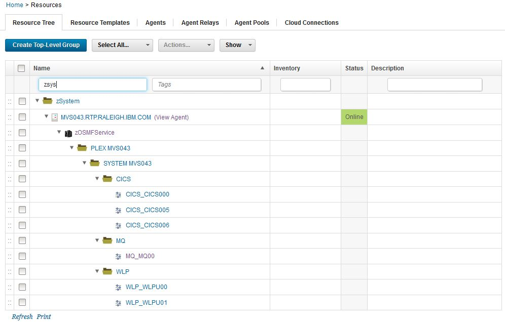

# z/OS Management Facility - Usage

## The following pages provide usage information about this plug-in

[Discovering Mainframe Software Services Instances](#discovering-mainframe-software-services-instances)
[Provisioning and Discovering Mainframe Software Services Instances](#provisioning-and-discovering-mainframe-software-services-instances)

## Discovering Mainframe Software Services Instances

* [Before you begin](#before-you-begin-discovering-mainframe-software-services-instances)
* [Discovering Software Services Instances](#discovering-mainframe-software-services-instances)
* [Software Services Instances Resources](#software-services-instances-resources)

### Before you begin discovering Mainframe Software Services Instances

* Install the current version of the z/OS Management Facility plug-in.
* Install an DevOps Deploy agent on theLPAR where z/OSMF is running.
* Verify that the Cloud Provisioning function in z/OSMF is installed and software services instances have already been provisioned.

### Discovering Software Services Instances

On theIBM DevOps Deployserver user interface, click**Resources** > **Agents**. Open the z/OS agent to be used to run discovery. Add an agent property named **zosmf.url** and set the value to the URL of z/OSMF. For example: `https://localhost/zosmf` .

Create a top-level resource group and add the agent as an agent resource under the top-level resource group. Wait for a few seconds and refresh the Resource Tree.Eventually, another resource is displayed under the agent resource. This resource is named zOSMFService.

Open zOSMFService resource and click **Configuration**>**Basic Settings**. The resource has the zOSMFServicerole, which includes several properties that are related to z/OSMF. In the**Role Propertiestable**, specify the user ID and password to be used to run discovery and click **Save**.

**Note:** The ID is an MVS user ID with proper permissions setup. To ensure the user ID is working properly, use it to log into the z/OSMF web interface and list the software services instances.

Go back to the Resource Tree view, click the**Actions**button that is associated with the zOSMFServiceresource, and then click**Configure using Software Services Instance Discovery**. The discovery step runs. A log displays to show progress.When the discovery process completes, close the log window, and refresh the resource tree.Resources that represent the software services instancesare displayed in the resource tree. Thenew resources are organized in structure `plex\system\software type\instance name`.

### Software Services Instances Resources

You may add components to the resources and add these resources to an environment to start application deployment. The resource properties contain information of the instance which can be used in a deploy process. The properties are retrieved from the z/OSMF software services instance variables.

**Tips:** Sometimes the name of the property is not what is expected by the deploy process. You can define the expected property name in the top-level folder and have it reference the value of an instanceproperty. See following graphic for an example.

## Provisioning and Discovering Mainframe Software Services Instances

Software services instances discovery can be run manually from the resource tree and automatically in an DevOps Deployprocess. This document describes a use case where a software instance is provisioned and discovered in a singleautomated DevOps Deploy process.

* [Before you begin](#before-you-begin)
* [Create a generic process](#create-a-generic-process)
* [Run the process](#run-the-process)
* [Next steps](#next-step)

### Before you begin

* Install the current z/OS Management Facility plug-in.
* Install an DevOps Deploy agent on theLPAR where z/OSMF is running.
* Verify that the Cloud Provisioning function in z/OSMF is installed anda Published Software Service template is ready to run

### Create a generic process

Create a generic process using two steps.

The first step is a **Run Published Software Service Template** step. The following example runs the CICS53 template to provision a new CICS region. The template is available from [z/OS Provisioning Toolkit](https://developer.ibm.com/mainframe/products/zospt/)

The second step is a**Software Services Instance Discovery** step. The **Query Parameters** fieldis set to **object-name = ``${p:provision/zosmf.instanceName}``** so that it will only discover the instance provisioned by the previous step. **``${p:provision/zosmf.instanceName}``** is a reference to the provisioned instance name from the previous step.

### Run the process

Create a top-level resource group. Add following properties to the group and set the appropriate values for connecting to z/OSMF.

* zosmf.password
* zosmf.url
* zosmf.user

Add the z/OS agent tobe used to the group and run the process on the agent resource.

After the process completes, refresh the resource tree.Resources that represent the provisioned CICS region are displayed in the resource tree.

### Next step

You can now provision a software services instanceand have the resources automatically created in DevOps Deploy to represent the subsystem. You can use the resource or you can further enhance theautomation. For example you can map a component to the resource, createenvironment and start initial deployments.

**Note:**If you prefer to usez/OSPTto provision software, you can replace the **Run Published Software Service Template** step with a **Shell** step and input the corresponding z/OSPT commands. You will need to parse the z/OSPT output to find the name of the instance.
