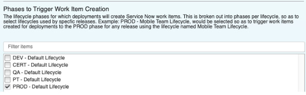
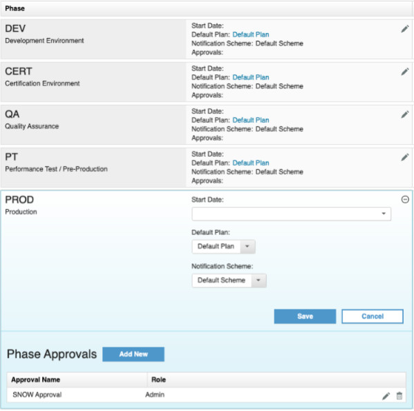
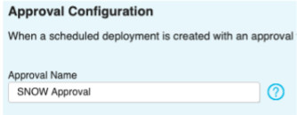
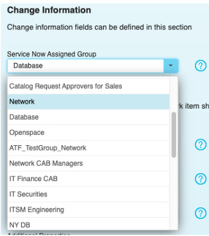
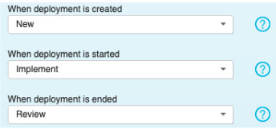
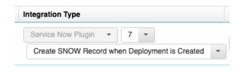
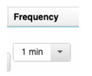
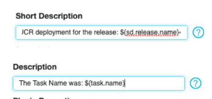
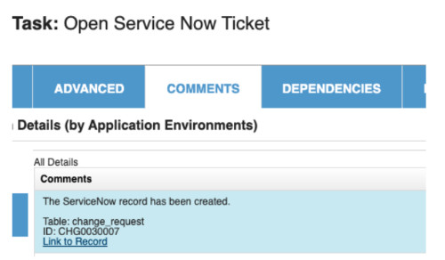

ServiceNow - Usage
==================

# Usage

### Usage

The following use cases demonstrate using the ServiceNow plug-in.
* [Use Case 1: Create SNOW records when
UrbanCode Release deployments are created](#case1)
* [Use Case 2: Fetch SNOW records and create UrbanCode Release
deployments](#case2)
* [Use Case 3: Create and update snow records as deployment tasks](#case3)

### Step palette

To
access this plug-in in the palette, click **Change**.

### Use Case 1: Create SNOW records when UrbanCode Release
deployments are created

This case describes how to create ServiceNow records when UrbanCode Release deployments are
created. This is useful when UrbanCode Release is used as the main entry point for change management activities. When a
deployment is scheduled, this creates a change request in ServiceNow. The resulting change request includes information
about the deployment and is updated as the deployment progresses and completes.

#### Set up the integration

1.
Create an integration using the Create SNOW Record when Deployment is Created step.

Provide information about the ServiceNow server.

| Name | Description |
| --- | --- |
| ServiceNow user name | The
ServiceNow user that is used to authenticate with the ServiceNow server. |
| ServiceNow password | The password
associated with the ServiceNow user |
| Table Name | The ServiceNow table for which a resource is to be created.
Generally, change\_request is the appropriate value. |
| Type Workflow | There are multiple workflows that a change
request can go through, select the type of workflow for the change request. If the dynamically generated dropdown is not
populating, check your server URL and authentication. |
| Proxy configuration | Configure the outbound proxy if
required. |
2. Select the phases to trigger the ticket creation. Not every deployment to every environment might require
a change request. With this in mind, select which UrbanCode Release phases per lifecycle to perform this action.

3. Optionally, you can configure an UrbanCode Release approval. The
ServiceNow change request can have a series of approvals that must be executed. These SNOW approvals can automatically
approve an UrbanCode Release Phase Approval. To configure, navigate to the Release Detail page of a release and add the
approval within a phase under the Release Pipeline section of the page. In the integration configuration provide the
name of the approval in the **Approval Name** field. When a deployment is created with that UrbanCode Release Phase
Approval, the approval is completed when the recurring integration detects the approvals are complete in ServiceNow.

4. Specify the
ServiceNow Assigned Group. This is a required field.

5. When a
deployment is created, started, and ended the status of the associated Service Now change request is updated. Provide
the change request status that should result from each of those events.

#### Try it out
1. Create a deployment for a selected phase in the
integration. Navigate into that deployment and after a moment you will see a link to the SNOW change request.
2.
Navigate to the SNOW change request and execute all the necessary approvals. After the integration runs (this is the
only action in this use case that requires the recurring integration to execute), the approval in the deployment that
you specified in the integration is approved automatically.
3. Start the deployment and navigate back to the SNOW change
request to notice that the status is updated to Implement.
4. Finish the deployment by executing or skipping all the
tasks and navigate back to the SNOW change request. Notice that the status is now updated to Review.

Notes

This use
case does not work on the Derby database because of Derby database limitations. This is a permanent restriction. The
Derby database is not a production supported database for UrbanCode Release.

If the status of the change request does
not update to the state you specified, check to see if anything in the change request workflow is blocking the promotion
to that state. That is, the change request must pass approvals or be put in another state first.

### Use Case 2:
Fetch SNOW records and create UrbanCode Release deployments

This use case describes how to fetch ServiceNow records
and create deployments in UrbanCode Release. This is useful when your team typically initiates change requests in
ServiceNow. When a change request is created in ServiceNow, UrbanCode Release schedules a deployment based on the inputs
of the change request. When the deployment is started and finished, the status of the change request is updated
according to your configuration.

Set up the integration

----------------------

1. Create the integration using the Fetch SNOW Records and Create Deployments step.

Provide the basic server and authentication information. Include the table for
which deployments are created. See Create SNOW records when UrbanCode Release deployments are created for property
details.

2. This use case requires some custom fields in ServiceNow. You can edit the form layout of the change
request to include new fields to indicate the Urbancode Release release and environment.

One method for adding the custom fields is to add a custom section called
`UrbanCode Release` and then adding two new fields `Release` and `Environment`.

3. Return to the UrbanCode Release integration configuration and provide the
names of the custom fields you created. The names of these fields can be confirmed if you export a SNOW change request
as XML, if you used the suggested field names above, the names are `u_release` and `u_environment`.

You can also specify a default environment, if the environment is not
provided.

4. The approval configuration is the same as the use case: Create SNOW records when UrbanCode Release
deployments are created.

5. Specify the state of the change request that would indicate that the integration should
create the deployment. Also specify the state to which the change request should be set when the deployment is started
and closed.

6. Ensure the integration frequency is not set to manual.

#### Try it out

1. Create a ServiceNow Change Request and provide valid
input to the two custom fields previously created.

2. Ensure that the
integration runs in UrbanCode Release. After a successful integration navigate to the deployments and verify that a new
deployment has been created.

3. Complete any approvals in Service
Now, run and complete the UrbanCode Release deployment, and verify the synced statuses throughout the process.

###
Use Case 3: Create and update snow records as deployment tasks

This use case demonstrates how to create tickets,
update tickets, and wait for approvals of tickets as a part of an UrbanCode Release deployment plan.

#### Set Up
Integration

1. Even though the executions of this use case are within the deployment plan, an integration to configure
the server URL and authentication is required. Create an integration using the Create SNOW Record when Deployment is
Created step.

Provide the basic server and authentication information. See
[Create SNOW records when UrbanCode Release deployments are
created](https://www.urbancode.com/plugindoc/ibmucr/servicenow/7-2/usage/create-and-updat…deployment-tasks/) for
property details.

Do not specify any phases to create change requests;
that way the only tickets created are from tasks in the deployment plan.

2. The `Plugin Task Support` feature flag
must be enabled. Feature flags are located on the System Settings page. Click **Settings** > **System Settings** to set
the feature flag. To save your setting, click **Save**.

3. Navigate to a
deployment plan and add a new **Plugin Task** type task. You can choose one of the following for the task:

* Open
Service Now Ticket
* Wait for Approval of Service Now Ticket
* Close Service Now Ticket

4. Edit the task you just created and go to the **Advanced** tab. There you
can configure the details of the ticket that is created.

The values for
the Short Description, Description, and Plugin properties can be dynamically resolved from the Scheduled Deployment (sd)
or the Task (task) as seen below. This convention follows the standard fields available on the ScheduledDeployment and
TaskExecution api entities.

#### Try it out

Whenever these tasks
execute, a comment is left with a link to the associated ServiceNow ticket.

When running the Wait for Approval of Service Now Ticket task, the task starts and remains in progress until the
approvals are complete in ServiceNow.

|Back to ...||Latest Version|ServiceNow |||
| :---: | :---: | :---: | :---: | :---: | :---: |
|[All Plugins](../../index.md)|[Release Plugins](../README.md)|[0]()|[Readme](README.md)|[Overview](overview.md)|[Steps](steps.md)|
