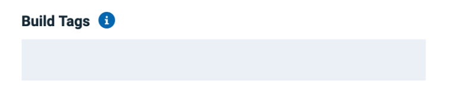
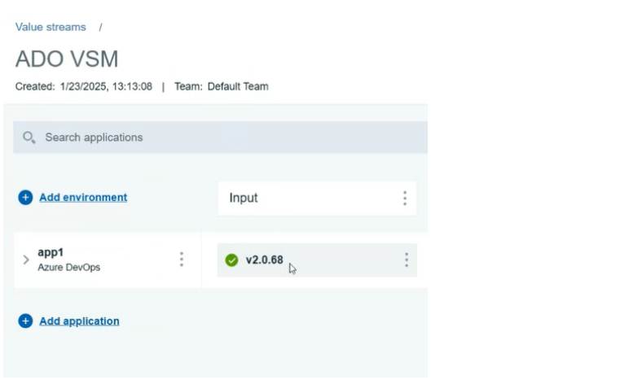
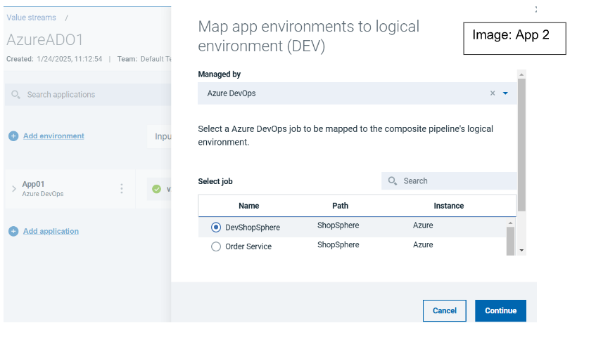
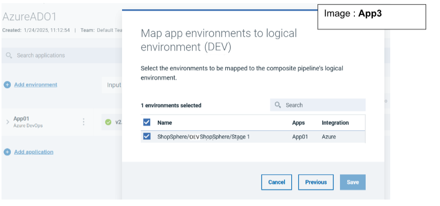
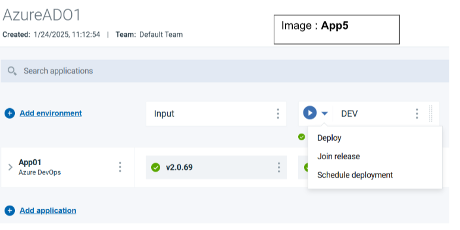
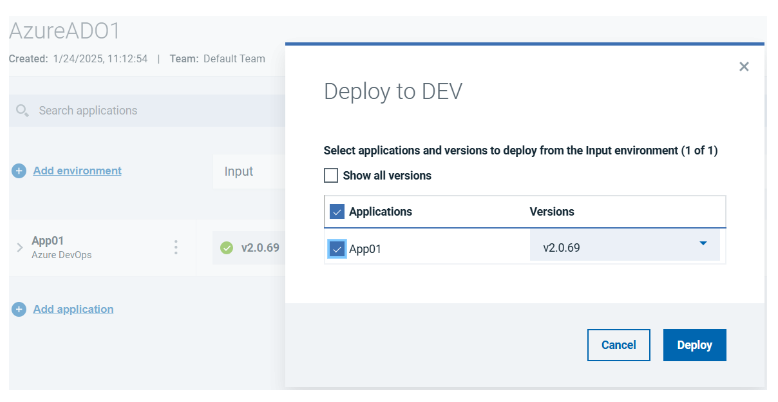
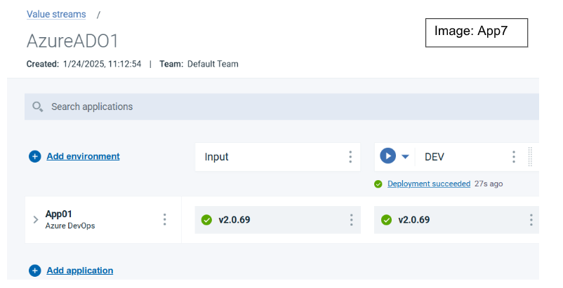

# Azure DevOps - Usage

To use the Azure DevOps plug-in, the plug-in must be loaded and an instance created before you can configure the plug-in integration. You define configuration properties in the user interface or in a JSON file.

## Integration type

The Azure DevOps plug-in supports scheduled events integration which are listed in the following table.

| Name | Description                                                                                         |
| ---- | --------------------------------------------------------------------------------------------------- |
| SyncAzureIssuesEvent | Queries the Query Azure DevOps server for new or updated pull requests and commits. |
| SyncAzureGitDataEvent | Queries the Azure DevOps server for new or updated work items. |
| SyncAzureReleaseStatus | Queries the Azure DevOps server for Sync Azure Release Status. |
| SyncAzurePipelines | Queries the Azure DevOps server for deployment data. |

## Minimum permission to integrate with Azure DevOps
The Azure Devops Account used to generate the token must have the below permission:
* Build – Read Permission
* Code – Read Permission
* Project and Team – Read Permission
* Release – Read Permission
* Work Items – Read Permission

### How to use Build Tags Field
A new hidden field named as Build Tags is added to Azure Plugin for version 4.0.29 and
later.



This field can take the comma-separated list to tags that have been added to a pipeline run.
If you provide such tags, only the pipeline runs with these specific tags will be pulled to IBM
DevOps Velocity as part of SyncAzureBuildsEvent.

```
stages:
  - stage: PreBuild
    jobs:
      - job: Tagging
        steps:
          - task: PowerShell@2
            inputs:
              targetType: 'inline'
              script: Write-Host "##vso[build.addbuildtag]IBM DevOps Velocity"

```
Here, IBM DevOps Velocity is the tag that has been added to the pipeline run.

## Integration

To install the plug-in, perform the following steps:
1. In IBM DevOps Velocity, **click Settings** > **Integrations** > **Available**.
2. In the Action column for the Azure DevOps plug-in, click Install.

There are two methods to integrate the plug-in:
* Using the user interface
* Using a JSON file

### Integrating the plug-in by using user interface.

To integrate the plug-in using the user interface, perform the following steps:
1. In IBM DevOps Velocity, **click Settings** > **Integrations** > **Installed**.
2. In the Action column for the Azure DevOps plug-in, click Add Integration.
3. On the Add Integration dialog, enter the values for the fields to configure the
integration and define communication.
4. Click Add.

### Integrating the plug-in by using JSON file
The JSON file contains the information for creating a value stream. Within the JSON file is a
section for integrations. It is in this section that plugin properties can be defined. Refer to the
JSON sample code in Configuration Properties section.

To integrate the plug-in using a JSON, perform the following steps:
1. Navigate to value stream page, and then click the necessary value stream.
2. Click  icon, and then Select Edit value stream to modify the JSON file in the
code or tree view editors.
3. Alternatively, you can also click Download JSON option to download the JSON file,
and then select the Import JSON option to upload the revised JSON file.
4. Edit the integration information in the JSON file to add the plug-in configuration
properties. Refer to JSON sample code in the Configuration Properties
section more details.
5. Click Save.

## Configuration properties

The following tables describe the properties used to configure the integration. Each table contains the field name when using the user interface and the property name when using a JSON file.

* The General Configuration Properties table describes configuration properties used by all plug-in integrations.
* The Azure DevOps Properties table describes the Azure DevOps configuration properties are unique to the Azure DevOps plug-in and define the connection and communication to the Azure DevOps server. When using the JSON method to integrate the plug-in these properties are coded within the `properties` configuration property.

### General Configuration Properties

| Name | Description                                                                  | Required | Property Name |
| ---- | ---------------------------------------------------------------------------- | -------- | ------------- |
| NA | The version of the plug-in that you want to use. To view available versions, click the **Version History** tab. If a value is not specified, the version named latest is used. | No | image |
| Integration Name | An assigned name to the value stream. | Yes | name |
| Logging Level | The level of Log4j messages to display in the log file. Valid values are: all, debug, info, warn, error, fatal, off, and trace. | No | loggingLevel |
| NA | List of plug-in configuration properties used to connect and communicate with the Azure DevOps server. Enclose the properties within braces. | Yes | properties |
|  | The name of the tenant. | Yes | tenant\_id |
| NA | Unique identifier assigned to the plug-in. The value for the Azure DevOps plug-in is `ucv-ext-azure` | Yes | type |


### Azure DevOps Properties

| Name         | Type | Description                                      | Required | Hidden | Property Name |
| ------------ | ---- | ------------------------------------------------ | -------- | ------ | ------------- |
| Access Token | Secure | The access token to authenticate with the Azure DevOps server. You can use either this property or the Password property to authenticate with the server. | No | No | accessToken |
| Organization | String | The name of the Azure organization in which the specified project exists. | Yes | No | organization |
| Password | Secure | The password used to authenticate with the Azure server. Use either this or an access token. | No | No | password |
| Project | String | The name of the Azure DevOps project from which to pull data. | Yes | No | project |
| Branch Name | String | The branch to pull commits from. | No | No | branchName |
| Proxy Password | Secure | The password used to authenticate with the proxy server. | No | Yes | proxyPassword |
| Proxy Server | String | The URL of the proxy server including the port number. | No | Yes | proxyServer |
| Proxy User Name | String | The user name used to authenticate with the proxy server. | No | Yes | proxyUsername |
| Repositories | Array | A list of repositories from which to import pull request, commit, and build data. | No | No | repositories |
| URL | String | The URL of the Azure DevOps server. | Yes | No | baseUrl |
| User Name | String | The user name to authenticate with the Azure DevOps server. | No | No | username |
| Release Definition Names (Comma Separated Values) | Array | A comma separated list of release names to fetch specific release resources ex: deployments. Note: This field is only applicable for plug-in version 4.0.45 or later | Yes | No| releaseDefinitionNames
| DevOps Velocity User AccessKey | Secure | The user access key to authenticate with the DevOps Velocity server. | No | No | ucvAccessKey |
| Build Tags (Comma Separated List) | Array | Comma separated list of tags for pushing pipeline runs as build to this server. If kept empty all the pipeline runs will be pushed as builds. | No | No | tags |
| API Limits | String | Maximum number of Azure Devops REST API calls that will be made by the plugin in a single execution. Making too many call in a short duration might result in a connection timeout at Azure Devops server. | No | No | apiLimits |
| Additional Branches (Comma Separated List) | Array | A comma separated list of additional branches to collect commits from besides the main one, leave blank if not needed. | No | No | otherBranches |

## Release orchestration
This plugin can be used to orchestrate releases in Azure Devops.
Compatibility
* IBM DevOps Velocity version 2.4.0 and later is required to support release orchestration in
Azure Devops.
* Azure Devops plugin version 3.0.1 and later supports release orchestration of Azure
Devops release pipelines.
* Azure Devops plugin version 4.0.1 and later supports release orchestration using
Azure Devops yaml pipelines.

## Orchestrating Azure release pipelines from Accelerate
The Azure DevOps plug-in syncs the repositories, builds, pipelines, releases definitions,
environments, pipeline runs, and release executions for every five minutes with to IBM
DevOps Velocity. An application is created in IBM DevOps Velocity pipeline. A pipeline
application is created in IBM DevOps Velocity and map the application in IBM DevOps
Velocity. The build that is created after mapping the application appears as version in
the Input column of the IBM DevOps Velocity pipeline.
In the following graphic,
* App1 is the application created in IBM DevOps Velocity.
* DevShopSphere is release created for the Azure Project.
* Order Service is the primary artifact in the releases in Azure project.
* V2.0.69 is the latest build number of the primary artifact created in Azure DevOps.



The application environment can be added in the IBM DevOps Velocity pipeline. For
example, DevShopSphere is the application environment added to DEV environment for the
release as shown in the following graphic.



* Stage 1 is the release environment in Azure Devops for the above release definition. The
following graphic shows the mapping the Azure Devops environment in the IBM DevOps
Velocity pipeline.



To orchestrate the deployment from IBM DevOps Velocity, select the version using the
deploy option as show in the below picture.





A new release is created in Azure Devops. The deployed version is synced with IBM
DevOps Velocity within 5 minutes of deployment as show in the below picture.



### Notes
Plugin supports the release orchestration of:
* Scripted yaml pipeline for build and deployment
* Scripted yaml pipeline for build and release pipeline for deployment
* Designer UI yaml pipeline for build and deployment
* Designer UI yaml pipeline for build and Release pipeline for deployment
Plugin does not support release orchestration if the source code is not in Azure, i.e, if the
source code is in GitHub or BitBucket, release orchestration from IBM DevOps Velocity is
not possible.

## Automation Tasks
You can create an automation task within a release to build and deploy the applications in Azure DevOps.

### Adding automation tasks to a release
After the plugin is integrated automated tasks are available to add as a task within a release.

* Verify that the Azure Devops server is connected to the IBM DevOps Velocity.
* On the Create Task page, select the automation task from the Type field drop-down list.
* Complete the properties required for the task.
* Click Save.

|Back to ...||Latest Version|Azure DevOps |||
| :---: | :---: | :---: | :---: | :---: | :---: |
|[All Plugins](../../index.md)|[Velocity Plugins](../README.md)|[4.0.45-File 1 ](https://raw.githubusercontent.com/UrbanCode/IBM-UCV-PLUGINS/main/files/ucv-ext-azure/ucv-ext-azure%3A4.0.45.tar.7z.001)[and 4.0.45-File 2](https://raw.githubusercontent.com/UrbanCode/IBM-UCV-PLUGINS/main/files/ucv-ext-azure/ucv-ext-azure%3A4.0.45.tar.7z.002)|[Readme](README.md)|[Overview](overview.md)|[Usage](usage.md)|
